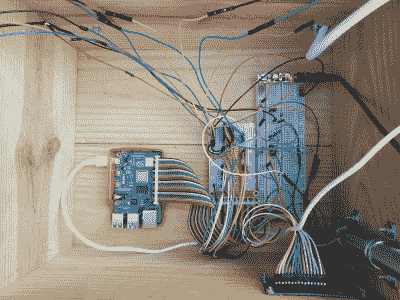

# 如果你得到了它，就种下它，让它活下去

> 原文：<https://hackaday.com/2020/06/19/plantm-if-you-gotm-and-keepm-alive/>

在周围摆放一些植物是活跃你的生活和/或工作空间的好方法。它们看起来很漂亮，你可以看着它们生长和变化，一些种类的植物可以积极地改善房间的空气质量。但是让我们面对现实吧——即使是最简单的也需要一个基本的护理水平，而这个水平很容易被放弃。毕竟，这些可怜的东西不能大声喊着要水喝，也不能站起来给自己找一个更阳光的地方。

【Ine hoce dez】厌倦了看着自己的植物死去却不知道为什么。两个主要的罪魁祸首涉及水和光，尽管也可能有其他问题，如土壤 pH 值和细菌。[平衡很容易出错，那么为什么不将一切自动化呢？](http://www.instructables.com/id/Plantm/)

Plant'm 是一个为学校项目设计的完整的便携式软件包。土壤湿度传感器通过树莓皮控制浇水计划，水从高架水箱中自动泵出。

这盏灯是为了补充阳光，而不是取代它。但这才是这个植物盒的真正魅力所在——如果植物枯萎或出现焦斑，你可以拿起它，尝试不同的地方。

为你的植物准备了阳光，但却不记得浇水了？将一辆旧的 Keurig 改装成自动滴油器。