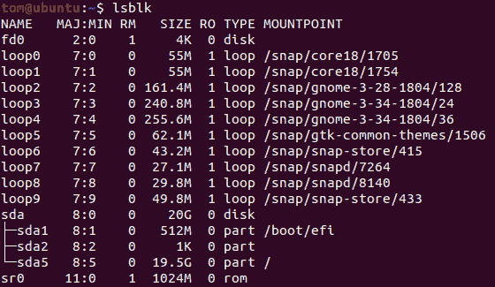
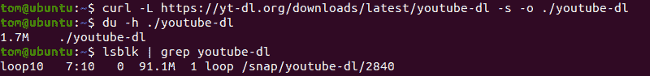
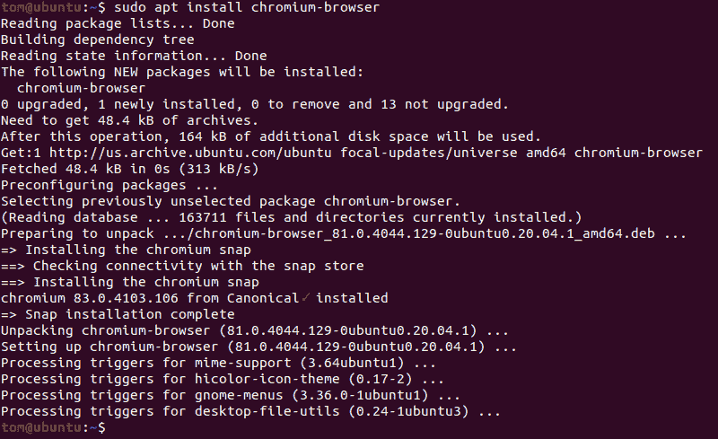

# 快照包是怎么回事？

> 原文：<https://hackaday.com/2020/06/24/whats-the-deal-with-snap-packages/>

谁能想到软件打包软件会引起这么一场轩然大波？但 snap 就是这种情况。由 Canonical 开发的这款软件是为了更快、更容易地在 Ubuntu 系统上安装最新版本的软件，它最终在更大的 Linux 社区中引发了一场激烈的争论。对于比较随意的用户来说，snap 只是一种尽快获得他们想要的软件的方式。但是对于关心自由和开源软件意识形态的用户来说，这是朝着专有的“围墙花园”类型迈出的危险的一步，这种类型的“围墙花园”可能是最初驱使他们使用 Linux 的原因。

也许 snap 最大的反对者，当然也是最受媒体关注的，是 Linux Mint。在 6 月 1 日发行版官方博客上的一篇文章中，Mint 创始人 Clement Lefebvre 非常明确地表示，Ubuntu 剥离版不支持新的软件包格式，也不会将其包含在基础安装中。此外，他宣布 Mint 20 将通过软件包管理器主动阻止用户安装 snap 框架。它仍然可以手动安装，但这一举动被视为防止未经用户明确同意将其添加到系统中的一种方式。

Clement 抱怨的简短版本是 snap packager 从专有的 Canonical 特定源安装。如果您想要分发快照，您必须在 Canonical 上设置一个帐户，并在那里托管它。虽然底层软件仍然是开源的，但 snap packager 打破了软件分发也是开放和免费的长期传统。这无疑使安装对于新手用户来说变得简单，对于规范的维护者来说更容易维护，但是它也剥夺了选择的自由和软件包来源的多样性。

## 一个包统治他们所有人

为了理解这种情况，我们可能应该后退一步，看看快照实际上是什么。简而言之，它们是一个容器化的软件包，包括给定程序运行所需的库。这个想法是开发者可以发布一个基本上可以在任何现代 Linux 系统上工作的 snap，而不必创建特定于发行版的包。从理论上讲，这节省了开发人员的时间和精力，并且确保了即使是更多利基发行版的用户也可以访问他们想要的软件。

自然，像这样分发软件也有不利的一面。首先，对于同一个程序，snap 包总是比传统包大，因为所有的依赖项都需要与它一起发布。由于许多程序自然具有相同的依赖关系，这意味着安装了许多快照的系统将不必要地在冗余数据上浪费存储空间。虽然现在即使是入门级系统也包括了 TB 级硬盘，但这可能不像过去几年那样令人担忧。

Mounted snap packages on a default Ubuntu 20.04 install.

快照包运行起来也比较慢，部分原因是它们实际上是压缩的文件系统映像，需要在执行之前安装。从系统维护的角度来看，有些用户觉得这个元素特别烦人，因为您安装的每个 snap 包实际上都显示为一个挂载的文件系统。

实际上有一些关于给挂载的 snap 包添加一个特殊标志的讨论，这样像`mount`或`lsblk`这样的普通工具就不会显示它们，但是很明显这导致了它自己的问题。毕竟，能够确定它们占用了多少磁盘空间是有价值的。

例如，让我们来看看一个通用工具的 snap 包与直接安装它的比较:

如你所见，差别是巨大的。如果我们直接从开发者的网站下载`youtube-dl`，脚本只占用磁盘 1.7 MB。但是同一程序的 snap 包重达令人难以置信的 91 MB。很明显，随着安装更多的快照，这个问题会变得更加复杂。

也就是说，这种“通用”的 Linux 包无疑是有需求的。足够多的是，至少有两种在类似原理下运行的其他竞争方法，Flatpak 和 AppImage。

## 铬的崩溃

从系统资源的角度来看，容器化的包显然不是理想的。另一方面，如果这意味着他们可以访问流行程序的最新版本，而不必等待它们到达发行版的本地软件包库中，那么许多人会非常乐意承受性能损失。用户应该可以根据自己的需要自由决定他们想走的路线。

这也是 Canonical 对 Ubuntu 20.04 中 Chromium 包的处理如此麻烦的原因。让我们仔细看看当您试图通过`apt`安装它时会发生什么:

当我们要求系统安装原生包时，我们实际上收到的是快照。用户没有选择，也没有警告。如果他们不够关注，他们甚至不会意识到发生了什么。冒着听起来过于戏剧化的风险，这是颠覆。

可以肯定的是，Canonical 有充分的理由希望快速发布 Chromium。他们可以推出适用于所有版本的单个快照，而不是为每个受支持的 Ubuntu 版本构建版本。对于老版本的 LTS(长期支持)Ubuntu 来说尤其如此，否则这些版本可能会由于过时的系统库而卡在老版本的浏览器上。

通过对 Chromium snap 使用这种“隐形”安装方法，他们可以确保这个过程对用户来说尽可能地简化和无痛。事实上，大多数人可能甚至不会注意到发生的变化。

但是对于那些注意到的人来说，这是一件大事。许多用户离开专有操作系统就是为了摆脱这种行为。这些人想成为他们自己电脑的仲裁者，他们不会轻易接受代表他们做出的重要决定，甚至连警告都没有。当 Clement Lefebvre 承诺 Mint 的未来版本不会在没有事先同意的情况下安装 snap 包时，他想到的就是这些用户。

## 奔向未来

虽然 Canonical 对收回不受欢迎的决定并不陌生，但 snap 包几乎肯定会继续存在。当您的整个公司都围绕着提供对多个版本的 Linux 发行版的支持而构建时，容器化软件包的物流优势就太大了。相反，对快照有强烈感觉的用户将不可避免地成为少数(如果有发言权的话)。Canonical 设计 snaps 是为了解决维护像 Ubuntu 这样的大型多面发行版的独特挑战，它完全按照预期工作。

也就是说，snap 包似乎不太可能被更大的 Linux 社区所接受。目前，存储库后端实际上是专有的。虽然 Canonical 确实允许公司[创建 Snap Store](https://docs.ubuntu.com/core/en/build-store/) 的“品牌”版本，但这只是一个表面上的改变，不允许你运行自己的服务器。因此，即使另一个发行版(如 Mint)决定采用 snap 包格式，他们也必须依赖 Canonical 来提供将包分发给用户的基础设施。这个单点故障注定会成为 Ubuntu 之外的一个争论点。