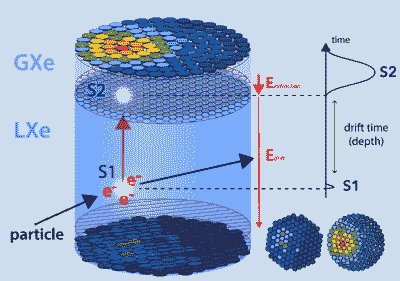
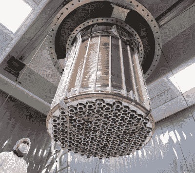
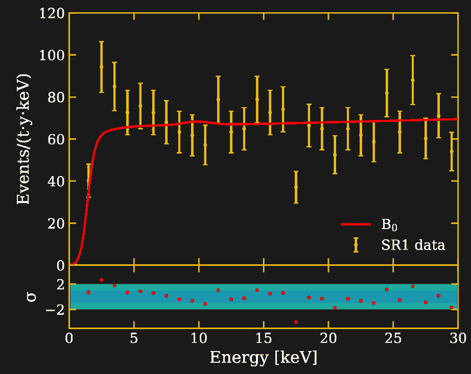

# 软骨头死了，太阳轴子万岁！

> 原文：<https://hackaday.com/2020/07/06/the-wimp-is-dead-long-live-the-solar-axion/>

几十年来，科学家们一直在地下深处建造探测器来寻找暗物质。现在这些实验中的一个，XENON1T 探测器，[在他们的数据中发现了一个意想不到的信号。](https://arxiv.org/abs/2006.09721)尽管信号并非来自暗物质，但它仍可能会彻底改变物理学。

自 20 世纪 80 年代以来，大多数科学家认为，失踪质量问题最可能的解释是一些尚未发现的弱相互作用大质量粒子(WIMP)。他们还认为，如果你建造一个足够大和足够灵敏的探测器，我们应该能够捕捉到这些不断流过地球的粒子。因此，自 20 世纪 90 年代初以来，我们一直在隧道和矿井中放置由超纯材料制成的探测器，在那里它们可以免受宇宙辐射和天然放射性的影响。

几十年来，由于屏蔽和识别上述背景的技术越来越先进，这些探测器的灵敏度提高了约一千万倍。到目前为止，他们还没有发现暗物质，但这并不意味着高端传感装置将被闲置。

## 目前还没有暗物质

不幸的是，除了一个长期以来难以令人信服的说法之外，WIMP 搜索仍然一无所获。尽管如此，搜索仍在继续，每个人都希望 WIMPs 就在眼前，因为实验将很快达到灵敏度极限，这是由于中微子的背景。最近，人们对这个领域是否已经死亡产生了模糊的看法，一些人认为[我们应该分散对暗物质的搜索](https://arxiv.org/abs/1810.01668)，而不是只关注弱作用粒子。

探测 WIMPs 的希望越来越渺茫，这也激发了进行这些实验的合作者去思考其他有趣的物理搜索。毕竟，拥有一个超级敏感的探测器不仅可以让你搜索 WIMPs，还可以搜索其他奇异粒子和罕见的核衰变，另外还可以做一些有趣的中微子物理。拥有一个广泛的物理项目有助于获得资金，并让你的博士生忙碌起来。今年早些时候，世界上最敏感的暗物质实验 XENON1T 能够测量 Xe-124 中的双电子俘获衰变。这是有史以来测量到的最罕见的衰变，半衰期约为 10 年 22 年(T2 ),比宇宙的年龄长了 12 个数量级。

## 探测液态氙中的粒子

Detection principle of the XENON1T detector.
Credit: [E. Shockley](https://www.dropbox.com/s/vrq49tldjdfvnjh/shockley20200617.pdf?dl=0)

The XENON1T detector showing the bottom array of light sensors and copper rings that shape the electric field.
Credit: [XENON1T collaboration](http://science.purdue.edu/xenon1t/wp-content/uploads/2020/06/p1190664m.jpg)

XENON1T 探测器是一种所谓的双相时间投影室(TPC)。它由一个充满惰性气体氙的圆柱形容器组成，氙被冷却到液态。在液体之上，也有气相，在两者之间施加电场。每当一个粒子在液体中相互作用时，它就会产生闪光(S1 ),位于容器顶部和底部的光传感器阵列可以检测到这种闪光。此外，在粒子相互作用中产生的电荷被电场扫到顶部，并在进入气体层时产生另一种闪光(S2)。根据信号 S1 和 S2 之间的时间差，可以重建粒子相互作用的 z 位置(高度),同时顶部和底部阵列看到的光的分布允许该阵列确定 xy 位置。此外，由粒子沉积的能量可以从两个闪光的组合强度中推断出来，而它们的 S2/S1 比提供了一些关于相互作用粒子类型的信息。后者可以区分粒子是否与氙原子的电子相互作用，如β衰变和γ射线的放射性，或者粒子是否从氙核反弹，如 WIMPs 或中子。

## 意外的信号

虽然[早期发表的 WIMP 搜索](https://arxiv.org/abs/1805.12562)不幸没有揭示任何信号，但在他们的最新分析中，XENON1T 合作更密切地关注了通常被忽视为背景的电子反冲数据。如上所述，大多数这类事件来自氙和周围物质的放射性污染。该背景通过蒙特卡罗模拟进行建模，并通过单独的测量进行约束，例如通过之前对材料放射性的筛选。当合作伙伴查看数据并将其与背景模型进行比较时，他们看到了以下情况。

Energy spectrum observed by XENON1T. The red line shows a fit to the data with the background model. The lower section indicates the deviation between data and model in units of standard deviations. Credit: [XENON1T collaboration](http://science.purdue.edu/xenon1t/wp-content/uploads/2020/06/20061704.png)

数据显示在 1 到 7 keV 的能量之间有过量的事件，峰值在 2 keV 左右。通过对该能量区域中的事件进行计数，并将其与来自背景模型的预期事件的数量进行比较，可以得到 3.5-sigma 波动。这意味着对于给定的背景模型，观察到许多事件的概率仅为 0.02%。虽然这听起来像是排除一个统计波动是安全的，但实际上在粒子物理学中有许多具有类似意义的过剩，这些过剩后来消失了。最突出的例子是 LHC 的 [750 GeV 双光子过剩，其显著性高达 3.9 sigma，并导致超过 500 篇文章的作者身份，但结果证明只是统计上的侥幸。尽管如此，XENON1T 的结果需要对数据进行一些解释，合作研究了三种可能性。](https://en.wikipedia.org/wiki/750_GeV_diphoton_excess)

## 有人掉了手表吗？

根据奥卡姆剃刀理论，最有可能但也是最无聊的解释是某种未知的背景。事实证明，氚的β衰变，氢的不稳定形式，有两个额外的中子，具有类似于观察到的过剩的形状。氚也是激发自发光手表中磷光体的物质。一小部分氢原子，大约 10 ^(-18) ，是大气中宇宙射线自然产生的氚。因此，XENON1T 探测器内约 60 ppb 的氢或水浓度可以解释观察到的过量，尽管合作伙伴认为实际浓度应该低约 100 倍。

## 太阳的轴子

对该信号更令人兴奋的解释是那些涉及新物理学的解释，其中之一将是对太阳轴子的探测。轴子是一种假想的粒子，以一种品牌的洗衣液命名，被假定用来解决粒子物理学中的“微调”问题。轴子可能也是仅次于 WIMPs 的第二大暗物质候选者。然而，暗物质轴子的质量非常小，需要一种完全不同的探测器技术来搜索，其中包括微波腔。但是 XENON1T 可以探测到的质量更大的轴子可以通过不同的过程在太阳中产生，例如 [Primakoff 效应](https://en.wikipedia.org/wiki/Primakoff_effect)。统计分析表明，数据有利于轴子信号，其显著性比背景模型高 3.2 sigma。如果氚被添加到背景中，轴子信号仍然是有利的，但是具有 2.1 sigma 的降低的显著性。

## 中微子不是那么标准

信号的第二个有趣解释来自我们已经知道存在的粒子，即中微子。很像 WIMPs，中微子只有微弱的相互作用，因此很少出现在探测器中。事实上，它们已经在背景模型中被考虑，但是它们的贡献是微小的。然而，在当前粒子物理学的标准模型之外，有一些理论提出了低能中微子的更高的相互作用概率，这是由这些粒子比通常更高的磁矩引起的。用这个非标准中微子模型拟合数据，给出了与轴子模型相似的统计意义。但是在这种情况下，添加氚成分将显著性降低到只有 0.9 sigma。

## 冷却恒星带来的问题

有一个问题应该让我们对信号的新物理解释持怀疑态度，那就是它们与天体物理观测结果存在矛盾。太阳轴子和中微子磁矩的性质受到对恒星冷却速率的研究的限制，恒星会通过这些粒子的发射损失额外的能量。这些约束与从 XENON1T 数据中获得的属性相矛盾。另一方面，粒子物理学家倾向于不太重视天体物理的限制，因为他们的模型中包含不确定性。此外，一些天体物理观测指向了与轴子相容的额外的恒星冷却源，即使参数不同。

如果信号被证实来自新物理学，影响将是巨大的。这将是自发现中微子振荡以来第一次证实超越标准模型的物理学，因此甚至超过了希格斯玻色子的发现和引力波的探测。好消息是，我们不应该等待太久，直到情况得到澄清，因为 XENONnT，LZ 和 PandaX-4T 实验目前正在竞相建造下一个最敏感的 WIMP 探测器。看起来 XENONnT 将会制作游戏，因为他们的探测器已经在调试了。氙的含量大约是它的三倍，背景的含量大约是它的六分之一，只需要收集几个月的数据就可以确认这个信号。与此同时，理论家们已经开始疯狂出版新的物理模型来解释过剩，都希望这一次的结果会持续下去。