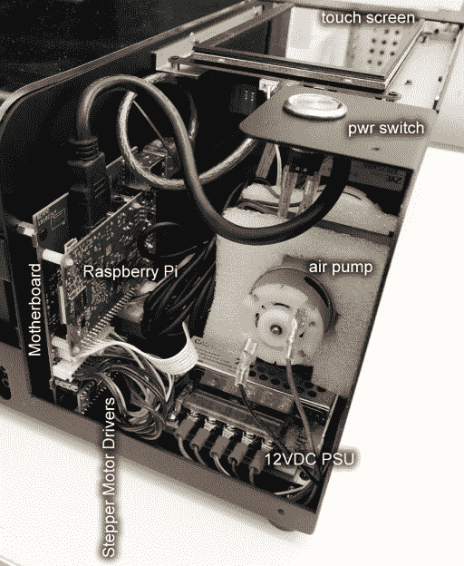

# 打开通量光束激光切割机上的防护罩

> 原文：<https://hackaday.com/2020/06/22/popping-the-hood-on-the-flux-beamo-laser-cutter/>

虽然 K40 为大众带来了实惠的激光切割，但毫无疑问，要达到低于 400 美元的价格点需要做出很大牺牲。有一个原因，我们已经看到这么多的升级和改进的基础模型机，但价格很难抱怨。也就是说，对于不介意多花点钱来获得更完整的开箱即用体验的用户来说，还有其他选择。

其中之一是来自 FLUX 的 beamo。[【Frank Zhao】最近买了一台价值 1900 美元的激光切割机](https://eleccelerator.com/beamo-laser-cutter-review/)，因为他对 K40 上做出的妥协并不满意。具体来说，他非常喜欢内部水冷系统的想法。奇怪的是，关于使用花园软管和水桶来冷却激光器的事情似乎令人不快。对我们来说幸运的是，他有技术眼光和必要的空闲时间对他的新玩具进行拆解和客观分析。

 这个故事的简短版本是[弗兰克]不仅对他得到的结果感到高兴，而且发现这台机器设计和制造得很好。所以如果你想找人发泄，抱歉。但是你会发现对 beamo 的每一个子系统都有条不紊的审视，包括注释图片和黑客读者渴望的技术细节。

我们尤其喜欢他试图确定未来可能难以采购的零件；看起来二氧化碳激光管可能是专有的，但其他一切看起来相当果冻。这包括运行该节目的树莓派 3B，以及用于界面的现成触摸屏 HDMI 显示器。[Frank]确实注意到 FLUX 不愿意给他登录 Pi 并四处查看的凭证，但是通过直接访问 SD 卡，这并不能阻止任何人想要进入。

在某种程度上，激光切割机今天的情况类似于几年前的桌面 3D 打印机。便宜的机器偷工减料太多，以至于升级和修复几乎是必须的，而且 T2 自己造机器通常比 T4 购买类似规格的商业产品便宜。虽然 beamo 对于普通爱好者来说仍然有点太贵，但很高兴看到这种口径的机器至少已经超过了 5 位数的范围。