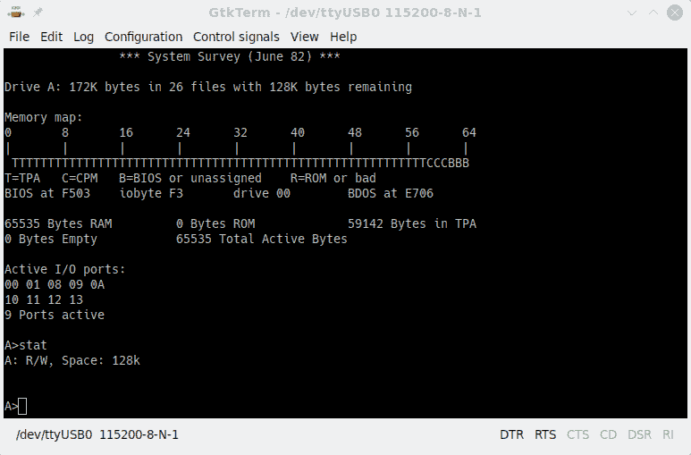
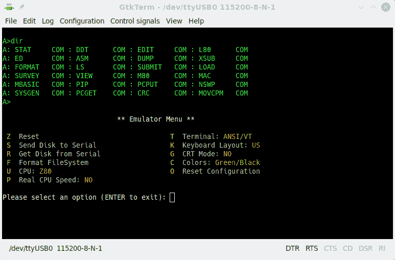
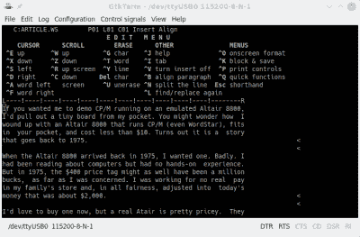

# ESP32 牛郎星模拟器获得分裂人格

> 原文：<https://hackaday.com/2020/08/20/esp32-altair-emulator-gets-split-personality/>

如果你想让我在一个仿真的 Altair 8800 上演示 CP/M，我会从口袋里拿出一块小板子。你可能想知道我怎么会有一台运行 CP/M(甚至 WordStar)的 Altair 8800，它可以放在你的口袋里，价格不到 10 美元。原来这是一个可以追溯到 1975 年的故事。

当 Altair 8800 在 1975 年上市时，我想要一台。很糟糕。我一直在阅读有关计算机的书籍，但没有实践经验。但在当时，就我而言，400 美元的价格标签可能是 100 万美元。我在我家的店里工作，没有实际工资，尽管平心而论，换算成今天的钱大约是 2000 美元。

我现在很想买一个，但是一个真正的牛郎星现在比那时还要贵。它们也占据了大量的桌面空间。当然，有复制品，我也有一些。我甚至帮忙解决了文斯·布瑞尔的克隆体的问题，我很喜欢。然而，布瑞尔计算机有两个问题。首先，驱动一个串口需要一点工作(它使用一个 VGA 和一个 PS/2 键盘)。第二，虽然它比真正的牛郎星小，但它仍然很大——这是它漂亮的前面板的副产品。

因此，要快速向某人炫耀 CP/M，你需要拿出一个大盒子，找到一个 VGA 显示器和 PS/2 键盘——这两者都正在成为消失的商品。我做了一些修改，使串口工作，但它仍然是一个很大的推车左右。你可以用 SIMH 或 Z80pack 这样的模拟器来安装软件，但现在你需要找到一台可以安装软件的电脑，而不是 VGA 显示器和 PS/2 键盘。我真正想要的是一个能够启动 CP/M 的简单便携的设备。

## ESP32 解决方案

FABGL 库允许 EPS32 驱动 VGA 显示器，并使用 PS/2 键盘提供类似终端的功能。它还涵盖了相当多的其他功能，如使用闪存文件系统或外部存储卡。其中一个例子是从另一个开源项目改编的 Altair 8800 仿真。VGA32 板可与库配合使用，非常便宜。这需要一点工作，但 Altair 仿真在板上运行良好，所以我花了 10 美元买了一台适合我口袋的 Briel 计算机。唯一的问题是它仍然需要一个 VGA 显示器和一个 PS/2 键盘。

我想稍微修改一下代码，这样我就可以使用串行端口，由于仿真器的设计很好，它不仅相对容易，而且非常简单，可以支持两种模式——你可以驱动 VGA，也可以通过 USB 电缆使用普通的串行终端程序。

## 仿真

在我开始修改之前，让我们先看看在我开始修改之前的仿真。fabrizio——FAB GL 中的 FAB——肯定提出了一个不错的设计。主 Arduino 草图文件组织了 Altair 的配置，它包含了可以以只读或读写方式挂载的磁盘映像。

我遇到的唯一问题是仿真使用了一些 Arduino IDE 通过库管理器安装的库中没有的特性。该经理声称拥有与 GitHub 上的版本相匹配的 1.8 版本，但是在构建示例时仍然存在未解析的符号。

解决方案是删除现有的库，以 ZIP 文件的形式下载整个 GitHub 库，然后让库管理器从存档中安装。之后，一切都好了。如果您想进行安装，不妨从 [my fork](https://github.com/wd5gnr/FabGL) 开始，这样就可以获得更新后的 Altair 示例代码。

下一个抽象层在/src 目录的 machine.cpp 文件中。这个文件有一个硬件抽象层，用于不同文件中的实际 CPU 仿真。machine.cpp 文件包含管理内存、磁盘驱动器、I/O 设备和实际运行程序的代码。

CPU 代码分为两部分。有一个 8080 仿真最初来自维亚切斯拉夫·斯拉文斯基和一个 Z-80 仿真由克林·方。有修改，但总的来说，这些文件只是仿真逻辑。

当您运行代码时，它会尝试查找 SD 卡，但如果没有找到，它会使用内部闪存进行磁盘驱动器仿真。它有所有的引导程序代码，操作起来很像一个真正的 Altair，当然，没有前面板。有一个仿真菜单，你可以用键盘上的暂停键调出。虽然很明显，如果没有 PS/2 键盘连接，这不会给我们带来太多好处。

从仿真菜单中，您可以转储和读取穿孔和阅读器设备中的数据。但是，CP/M 磁盘也有一些实用程序，可以用来将 XModem 文件来回传输到您的 PC。您还可以选择 8080 vs Z80 CPU 并设置仿真速度。

## 调查

我开始研究代码，看看添加串口有多难。原来，该配置具有串行端口设置，但将其用作 CP/M 穿孔/读取器设备。在代码中，有三行代码将不同的流连接到 SIO0、SIO1 和 SIO2 设备。控制台设备(SIO0 和 SIO1)设置为 FABGL 提供的终端流。SIO2 使用标准串行流。

这是一个好迹象，果然，终端流与串行流兼容。作为一个简单的实验，我只是将终端引用改为串行。系统启动后，通过串行终端给了我一个 CP/M 提示符。

[](https://hackaday.com/wp-content/uploads/2020/06/info.png)

这留下了一些小问题。没有 PS/2 键盘，就无法进入仿真菜单。此外，仿真菜单是硬连线到终端的。解决这两个问题相当容易。

## 修复仿真菜单

VGA32 板上只有一个用户按钮，所以用它来调用串行端口上的仿真菜单是有意义的。修改调用它的代码并不难(在 machine.cpp 中):

```

IRAM_ATTR int Machine::nextStep(CPU cpu)
{
    auto keyboard = fabgl::PS2Controller::instance()->keyboard();
    static int  inmenu=0;
    if (m_menuCallback && keyboard->isVKDown(VirtualKey::VK_PAUSE))
        m_menuCallback(0);

    // check for menu
    if (!digitalRead(USER_BUTTON))
    {
        if (inmenu==0)
        {
            inmenu=1;
            m_menuCallback(1);
            inmenu=0;
        }
    }

```

通过这一更改，仿真菜单回调获得了一个额外的参数，该参数的设置取决于入口方法。问题是，你必须在主文件中进行更改。我把菜单用来读取键盘的代码分解成一个 getChar 函数。它会出现在终端，直到你按下一个键，但串行端口不会，所以它需要一点点的变化，使工作正常。

[](https://hackaday.com/wp-content/uploads/2020/06/emu.png)

为了最大限度地减少代码更改，我将所有对终端的引用都更改为控制台，并将这一行添加到 emulator_emu 函数的开头:

`Stream &CONSOLE=stream?(Stream &)Serial:(Stream &)Terminal;`

使用引用意味着我不必把所有的点都变成箭头，如果我使用指针的话就会变成箭头。

## 双重人格

我想做的最后一个改变是允许原始代码工作，这样您仍然可以使用 VGA 和键盘。我想在仿真菜单上做一个新的项目，但是决定再次使用用户按钮。启动时，代码查看按钮的状态。按钮向上时，电路板以串行模式启动。如果按钮被按下，板设置 VGA 终端并等待按钮释放:

```

if (!digitalRead(USER_BUTTON))
{
    streamsel=0;
   // TTY
   SIO0.attachStream(&Terminal);

   // CRT/Keyboard
   SIO1.attachStream(&Terminal);</pre>

   // Serial
   SIO2.attachStream(&Serial);
}
else
{
    streamsel=1;
    // TTY
    SIO0.attachStream(&Serial);

    // CRT/Keyboard
    SIO1.attachStream(&Serial);

    // Serial
    SIO2.attachStream(&Serial);
}
// wait for button release
while (!digitalRead(USER_BUTTON));

```

## 开源乐趣

[](https://hackaday.com/wp-content/uploads/2020/06/wordstar.png) 这是一个很好的例子，告诉你如何在他人的工作基础上再接再厉。模拟器来自不同的来源，Fabrizio 在提供可重用组件方面做得很好。修改代码来做我想做的事情非常简单。

我是在用 WordStar 写这篇文章吗？也许吧。请记住，您要么需要正确的终端仿真，要么希望将 WordStar 磁盘安装到一个读写磁盘上，这样您就可以运行 WSChange 并选择您拥有的终端类型。

对于几块钱来说，这是拥有一台有很多选项的可启动 CP/M 计算机的好方法。这个想法也不局限于 ESP32，因为你当然可以使用 Arduino 将一些东西放在一起。这可能与[从零开始建造真的东西](https://hackaday.com/2020/01/02/prolific-videos-show-altair-8800-recreation/)不太一样，但肯定要便宜得多。