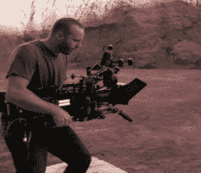

# 虚拟现实技术有助于将一个遥远的星系带到我们的电视上

> 原文：<https://hackaday.com/2020/08/27/vr-technology-helps-bring-a-galaxy-far-far-away-to-our-tv/>

虚拟现实通常是一种孤立的个人体验，与电影屏幕甚至客厅电视的共享群体体验截然不同。但是这些娱乐世界比大多数观众意识到的更加紧密地交织在一起。视频游戏引擎在幕后的电影和电视制作中扮演着越来越重要的角色，现在他们正大张旗鼓地出现在镜头前，制作曼达洛人电视剧。

在这种情况下，大的是四分之三圆柱形 LED 阵列，直径 75 英尺(23 米)，高 20 英尺(6 米)。但是覆盖在墙壁和天花板上的发光二极管并不像时代广场的一些装置那样指向外面。这个被称为“体积”的装置向内指向，为在其中工作的摄像机和工作人员显示背景图像。这是一个身临其境的 LED 背景和舞台环境。

在舞台上融入投影图像是一种至少可以追溯到 1933 年的《金刚》的技术，但它非常有限。为了避免打破这种脆弱的幻觉，灯光和摄像机的运动必须非常严格。最近，在后期制作中，制作人员更喜欢用电脑图像代替绿色屏幕。它消除了大多数相机运动和照明的限制，但花费了大量的金钱和时间。对于演员来说，在巨大的绿色背景下令人信服地表演他们的角色也更加困难。该卷通过将计算机生成的图像放在布景上，并通过视频游戏引擎虚幻进行实时渲染，解决了所有这些问题。

利用最近为现实游戏开发的动态照明功能，调整照明以与其中的物理场景融合。  3D 位置追踪器在概念上类似于 VR 头戴式耳机上的追踪器，附着在主摄像头上。通过精确跟踪相机的运动，虚幻引擎确保相机看到的部分体积([视锥](https://en.wikipedia.org/wiki/Viewing_frustum))以必要的视角进行渲染，以保持无论相机如何瞄准时的幻觉。这种效果在动作中最为明显，从 YouTube 上发布的四分钟短片 ILMVFX[*开始，这是曼达洛人*](https://www.youtube.com/watch?v=gUnxzVOs3rk) 的虚拟制作。(嵌在下面。)音量也是明星一部 22 分钟[第四集:*科技*](https://www.disneyplus.com/video/8112cabc-5ed9-4176-b0f8-b4baa0ab15f1) 之 *[迪士尼图库:星球大战之曼达洛人](https://www.disneyplus.com/series/disney-gallery-star-wars-the-mandalorian)* 。(需要 Disney Plus 订阅。)

没有讨论开发和构建该卷的费用，但这将是一笔昂贵的前期成本，预计从长远来看，将以更快和更便宜的生产形式得到回报，使这个研究项目与 ILM StageCraft 旗下的其他[项目保持一致。这是有道理的，因为他们正在运营一项流媒体服务，需要不断提供新内容来留住订户。这本书为现实的虚拟现实游戏提供了一个引擎，并使它们适应电视制作，它开辟了以前大预算大片的专属领域。尽管这部电影本身需要迪士尼的巨额资金，但这项技术的预算却低得多。虚幻引擎](https://www.ilm.com/hatsrabbits/ilm-stagecraft/)发布的一个[演示剪辑展示了一个假想的摩托车广告的小得多的规模应用。](https://www.youtube.com/watch?v=Hjb-AqMD-a4)

但是，尽管它看起来很大，尽管它消除了许多限制，但它仍然有自己的限制。例如，其 LED 阵列的分辨率不够高，不足以在今天的 4K HDR 生产流程中占据中心位置，为了避免莫尔效应，被降级为中长距离失焦。制作这本书的人说，他们希望这只是一个长期发展过程中的第一个版本，他们邀请其他人来试验这个新想法，共同推动行业向前发展。我们预计，独立电影制作人已经在研究如何在比迪士尼更少的预算中实现这一概念，他们需要招募熟悉 led 和 3D 跟踪电子设备的黑客朋友来实现这一目标。我们迫不及待地想看到结果。

 [https://www.youtube.com/embed/gUnxzVOs3rk?version=3&rel=1&showsearch=0&showinfo=1&iv_load_policy=1&fs=1&hl=en-US&autohide=2&wmode=transparent](https://www.youtube.com/embed/gUnxzVOs3rk?version=3&rel=1&showsearch=0&showinfo=1&iv_load_policy=1&fs=1&hl=en-US&autohide=2&wmode=transparent)

