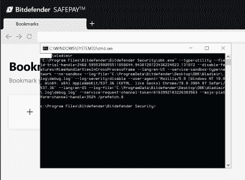

# 本周安全:Bitdefender、Ripple20、Starbucks 和 Pwned 密码

> 原文：<https://hackaday.com/2020/06/26/this-week-in-security-bitdefender-ripple20-starbucks-and-pwned-passwords/>

[Wladimir Palant]似乎在独自讨伐安全软件中的安全问题。这个名字可能不会马上被认出来，但在他的其他恶名中有一个是 originating Adblock Plus，我们对它又爱又恨。(看，用广告拦截器上网，但对你信任并想支持的网站禁用它，比如 HaD)。

本周，[他公布了 Bitdefender](https://palant.info/2020/06/22/exploiting-bitdefender-antivirus-rce-from-any-website/) 的一个相当严重的缺陷。该披露以对 Bitdefender 的高度赞扬开始:“安全方面的 Bitdefender Antivirus 是我迄今为止见过的最好的防病毒产品之一……”即便如此，他发现的漏洞是严重的。恶意网站可以触发任意应用程序的执行。该问题在 22 日发布的更新中得到修复。

Image by Wladimir Palant, CC BY-SA 4.0

这个漏洞很有趣。首先，Bitdefender 使用一种专门添加到 web 浏览器中的 API，使安全软件能够在不执行 HTTPS 连接的中间人解密的情况下工作。当检测到问题时，Bitdefender 会用自己的错误消息替换潜在的恶意页面。

由于这种实现方式，浏览器会将此错误信息视为所请求站点的合法内容。如果这是一个静态页面，那就不是问题了。然而，Bitdefender 提供了一个选项来加载所请求的页面，并通过在错误页面中嵌入令牌来实现这一点。当用户按下按钮加载页面时，Bitdefender 会在传出的请求中看到匹配的令牌，并允许该页面。

这可以通过 AJAX 调用来利用。恶意网页对同一个域进行`XMLHttpRequest`调用，并操纵响应，因此 Bitdefender 会注入一条错误消息。由于是同一个域，恶意页面可以访问该响应的内容，这意味着安全令牌被泄露了。这些令牌可以用来触发 Bitdefender 的 Safepay 浏览器的启动。这本身并不可怕，但真正的问题是 Safepay 浏览器是使用攻击者提供的 url 启动的。`request.send("data:text/html,nada --utility-cmd-prefix=\"cmd.exe /k whoami & echo\"");`空格没有得到正确的转义，因此可以插入命令行参数，从而导致任意执行。

### Ripple20

JSOF 刚刚发布了他们对 Trek TCP/IP 协议栈的部分研究，但他们正在利用这一点来获取电子邮件地址，这是一种我觉得令人反感的策略，坦率地说，任何安全公司都应该这样做。谢天谢地[一旦你知道在哪里可以找到 PDF 文件](https://www.jsof-tech.com/wp-content/uploads/2020/06/JSOF_Ripple20_Technical_Whitepaper_June20.pdf)。

Trek 生产的 IP 堆栈可以用作实时操作系统的一个元素，甚至可以在缺少完整操作系统的嵌入式设备上使用。该软件堆栈已经部署在世界各地的物联网设备上。这就是 JSOF 研究人员所说的“供应链因素”。他们在这个软件堆栈中发现了 19 个独立的漏洞，其中四个是关键的远程代码执行(RCE)问题。

(我觉得我必须再次批评 JSOF，因为他们把这些称为零日漏洞。虽然它们在首次被发现时可能是零日漏洞，但 JSOF 经历了一个协调的披露过程这一事实意味着它们不再是零日漏洞。这似乎是试图炒作他们的研究，而不是基于事实。)

JSOF 对我的批评作出了回应，并为他们的辩护提出了一些合理的观点。我在下面附上了他们的回答。

> “JSOf 仅使用电子邮件发送一次性的电子邮件来加入我们所有研究和内容的邮件列表。订阅邮件是显式的，订阅者必须再次插入他们的电子邮件并点击订阅。我们已经收到了对此流程的良好反馈。
> 
> 我们认为，将漏洞描述为零日漏洞正确地描述了发布时的情况和当前的持续情况，即许多设备没有补丁可用，许多设备仍然没有补丁，预计将有更多的供应商和设备发布咨询和补丁”

到目前为止，仅发布了两个漏洞的详细信息:CVE-2020-11896 和 11898。第一个是 RCE，第二个是信息泄露。这两个漏洞都源于对碎片化的 [IP-in-IP 隧道数据包](https://en.wikipedia.org/wiki/IP_in_IP)的不正确处理。显然，目标设备不需要配置 IP 隧道，但它需要 IP 隧道支持。不清楚这种配置有多常见或不常见，但只要存在分段和隧道支持，就只需要一个开放的 UDP 端口。

当接收分组时，当分组片段的长度超过分组报头中指示的长度时，调用函数来修剪多余的接收数据。可以操纵这个函数，以便处理比预期更多的数据。多余的数据被复制到已分配缓冲区的末尾之外，从而导致可预测的结果。要真正实现 RCE，还需要一些巧妙的额外步骤，所以请阅读这篇文章了解更多细节。

有趣的是，[思科刚刚发布了一份咨询报告](https://tools.cisco.com/security/center/content/CiscoSecurityAdvisory/cisco-sa-treck-ip-stack-JyBQ5GyC)，详细介绍了他们对 Ripple20 漏洞进行分类的初步工作。到目前为止，似乎还没有针对易受攻击的思科产品的补丁，这凸显了这一组特定的错误可能带来的挑战。

### 安全引导旁路

Wireguard 的 Jason A. Donenfeld 发现了 Linux 内核锁定模式中的一个有趣的缺陷。内核锁定是 EFI 安全引导方案的一个扩展，它可以确保未签名的内核模块不会被加载，甚至不会被 root 加载。正如你所想象的，[在 Linux 内核中获得这个特性是一场艰苦的战斗。](https://www.zdnet.com/article/linux-to-get-kernel-lockdown-feature/)

该漏洞是一个 EFI 变量，即使使用内核锁定策略，也可以写入该变量，从而插入 ACPI 表。这实质上意味着将代码注入预引导过程，指示引导机器将内核锁定策略设置为 disabled。所有这些工作的幽默之处在于，Donefeld 的测试用例正在加载 Wireguard 模块。光是让他的 VPN 加载，似乎就有很多工作要做。

### 搜索星巴克 API

[Sam Curry]必须经常打开浏览器的 DevTools 窗口，因为[他在购买星巴克礼品卡时碰巧注意到正在处理的 API 调用](https://samcurry.net/hacking-starbucks/)。作为一个好奇的、有安全意识的人，Sam 决定花些时间探索一下正在使用的 API。他很快确定 API 正在使用面向互联网的前端代理 API 调用进入星巴克内部网络。经过反复试验，发现了以下 API 端点:

`/bff/proxy/stream/v1/users/me/streamItems/`

`web\..\.\..\.\..\.\..\.\..\.\..\.\search\v1\Accounts\`

它从来没有打算公开访问，但一些聪明的路径遍历工作使它成为可能。这个端点允许 Sam 搜索 Starbucks 系统中的每个用户，所有 1 亿条记录。

这确实代表了相当大的问题，所以该发现被迅速报告，并在 24 小时内修复。没有任何证据表明易受攻击的端点是被独立发现或利用的。萨姆确实因这一发现获得了 4，000 美元的赏金。

### Pwned 密码，版本 6

[Troy Hunt]不断出现，本周是因为他发布了第六版的 Pwned 密码服务。他给[写了一篇关于更新](https://www.troyhunt.com/pwned-passwords-version-6/)的博文，这次更新增加了超过 1700 万个新密码。对于我们这些不熟悉这项服务的人来说，这是一个网页，你可以在那里输入你的密码，并查看它是否在数据泄露中被泄露。是的，你没看错，它的意图是让你在别人的网络服务上输入你的密码。是的，这太疯狂了。 [r/netsec Reddit 线程](https://www.reddit.com/r/netsec/comments/hc25fq/pwned_passwords_version_6/)对此既有[的许多乐趣](http://bash.org/?244321)，也有如何在不信任任何 Troy 代码的情况下使用该服务的建议。

玩笑归玩笑，这项服务使用 k 匿名保护你的密码。它是这样工作的。您的浏览器接受您输入的密码，生成一个 SHA1 散列，然后将该散列的前五个字符发送给服务。返回以这五个字符开头的哈希列表，浏览器中运行的代码检查返回的列表中是否包含完整的 SHA1。它很聪明，应该是安全的，而且我仍然不可能把一个重要的密码输入那个网站。相反，我更喜欢由[Ben Wiederhake] 编写的简单 python 脚本[。它足够短和简单，我们所有人都可以在运行它之前通读源代码。](https://github.com/BenWiederhake/pwned_passwords/blob/master/pwned_passwords.py)

(编者注:我偶尔会用 Pwned 密码。这有利于*验证*你的*非关键*密码不容易被破解。例如，通行证，所以可以随意使用它登录论坛。但是你真正重要的密码应该是唯一的、长的、随机生成的，因此甚至不需要检查。`head -c 8 /dev/urandom | base64`大功告成。如果你愿意，安全可以很简单。)