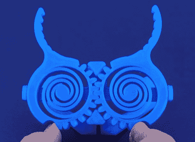
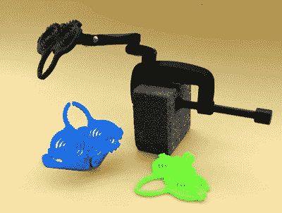
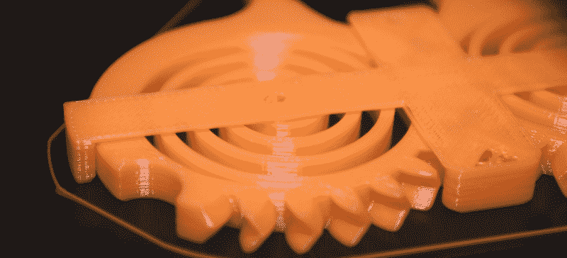
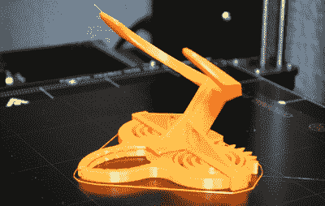
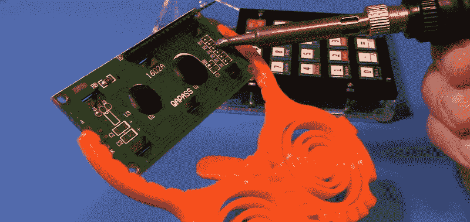

# 印刷 It:就地印刷 PCB 夹具

> 原文：<https://hackaday.com/2020/07/15/printed-it-print-in-place-pcb-gripper/>

*Printed It* 的目标是展示真正拥抱桌面 3D 打印所提供的可能性的创作。最明显的例子是可以快速且廉价地打印出来的设计，它们是商业产品的有效替代品。但是正如之前的系列文章所显示的，也有技术上的考虑。它仅仅是可以通过传统方式生产的东西的复制品，还是设计真的受益于 3D 打印的独特性质？

一个完美的例子是由 SunShine 制造的[印刷电路板夹具。这种设计能够在没有任何额外元件的情况下固定 PCB(或者真的，你想要的任何东西)。把它从床上拉起来，然后让它工作。虽然不得不添加一个橡皮筋或普通的弹簧几乎不会带来不便，但对于一个真正 100%可打印的设计来说，总有一些东西可以说。](https://www.thingiverse.com/thing:4445190)

 这个秘密就是将双平面螺旋弹簧集成到装置的钳口中。虽然桌面 3D 打印中使用的大多数普通热塑性塑料相对较硬，但弹簧的设计方式使得它们可以在标准 PLA 中打印。钳口的背面有啮合在一起的齿，因此弹簧的能量结合起来提供夹紧力。锯齿被添加到夹爪上，以抓住 PCB 的边缘并帮助稳定它。

从视觉上来说，它确实很引人注目。这个设计很大程度上避免了直角，给了它一个近乎生物的外观。许多人把它比作螳螂的头，或者某种外星科技。

毫无疑问，这种设计也利用了 3D 打印的优势；没有其他方法来生产复杂的联锁组件，尤其是不使用任何紧固件。总之，这个设计是*打印出来的*的理想候选。但是仍然有一个问题需要回答:它真的有用吗？

## 明智地选择

PCB 夹持器有两种不同的型号，所以在预热挤压机之前，你需要做一个非常重要的决定。一个版本有一个集成支架，其设计方式可以使 PCB 与工作表面成大约 45 度角。没有办法调整支架(除了加热塑料和弯曲它)，但这是一个相当舒适的角度，所以你可能不会觉得有必要。

 另一个版本放弃了集成支架，支持 GoPro 风格的安装。有大量的可印刷和商业安装和支架选择使用这种类型的附件，这使得这种版本的夹持器更加通用。当然，你实际上需要*拥有*那些配件。没有支架，这个版本的手爪甚至不能自己站立。

那么你应该打印哪一个呢？如果你只是想玩玩这个机械装置，并在你的工作台上放一个有用的小工具，那么集成支架版本可能是最好的选择。不利的一面是打印的时间要长一些，但至少打印完成后它是完全独立的。另一方面，如果你想真正让手爪工作，并愿意为它购买或打印一个铰接安装，GoPro 版本显然是更好的选择。

## 挑战极限

众所周知，这种就地打印的设计对于调试不良的打印机是不宽容的，但 SunShine 已经尽了最大努力来确保尽可能多的人能够运行这种设计并获得可接受的结果。所有的公差都是健康的 0.3 毫米，所以即使是入门级打印机也不应该有太多的时间。

No room for support here.

这并不是说这个设计没有挑战性。为了使该机制正常工作，在切片器设置中关闭所有支持材料生成是至关重要的。你需要对你的打印机有信心，以应对一些相当极端的悬置和桥接，即使它们乍看起来似乎不可逾越。床的粘附也很重要，因为即使是轻微的翘曲也可能使最终的机械装置不能工作。

 如果你决定用集成支架版，你真的会大开眼界。为了确保没有人不小心弄坏了他们的弹簧装置，SunShine 不得不将倾斜的底座设计成即使没有支架也能正常打印。更简单的方法可能是只设计一个底座，你可以把它连接到 GoPro mount 版本的夹子上，但这有什么挑战呢？

相反，他使用了我在 3D 打印设计中见过的最极端的悬垂。在大约 70 度，这远远超出了正常的“安全”范围的无支撑悬垂，但令人难以置信的是，它似乎工作得很好。它肯定不是完美的，仔细观察你会发现表面有些不规则，但对于这样一个实用的组件来说，这是完全可以接受的。

## 时间和材料

在 0.2 毫米的层高度下，PCB 夹具的集成支架版本在大约 4.5 小时内完成，GoPro 版本在不到 3 小时内完成。当然，你的里程数可能会有所不同，但这应该会给你一个预期的想法。以更高的分辨率打印可能会稍微清理一下支架的底部表面，但我个人认为不值得花费额外的时间。

《阳光》杂志建议用标准的 PLA 印刷这个设计，但我也在 PETG 印了一个版本。PETG 的玻璃化转变温度比 PLA 高得多，我希望这有助于防止长时间焊接带来的任何问题。PETG 也更灵活一点，这似乎是一个好处。

但是碰巧的是，更有弹性的材料实际上是一个错误。虽然夹子打印得很好，但弹簧显然比 PLA 对应物弱得多。ABS 可能会在柔韧性和耐温性之间取得良好的平衡，但其易变的性质可能会使这种复杂的印刷变得困难。

## 施加压力

要明确的是，我认为这是一个非凡的设计，阳光只应得到他在这里所取得的成就的赞扬。这很可能会成为那些“必须拥有”的照片之一，人们会这样做只是为了看看这个机制是如何工作的。如果你正在寻找一个非传统设计的好例子，这种设计通过负担得起的家庭 3D 打印成为可能，这是最好的。

作为一个实用的工具，有一些非常明显的问题。即使用相对较硬的 PLA 印刷，弹簧也没有太大的强度。对于较小的板来说尤其如此，因为弹簧看起来不会卷回足够远，从而不会真正对钳口施加任何力。使用较大的 PCB 肯定会更好，但这会带来不同的问题。在下巴上用了几次较大的板子后，弹簧已经变弱到不能自己完全闭合的程度。

但是，即使你找到了尺寸合适的 PCB，该机制本身仍然有很大的作用。烙铁或探针不需要很大的压力就可以将钳口推离对齐位置，并向后摇动电路板。那些触摸更温和的人可能会有不同的感觉，但我个人认为这是一个节目停止。

最后，我认为这是一个伟大的设计，展示了你的新 3D 打印机可以做什么。但我不指望用它做太多焊接。如果你只是想印刷一些在你工作时能固定 PCB 的东西，[一个更传统的设计会是一个更好的选择](https://hackaday.com/2018/01/24/printed-it-rubber-band-pcb-vice/)。如果你需要一些看起来很酷的东西来在当地的创客集会上拿着板子，这就是你要的。