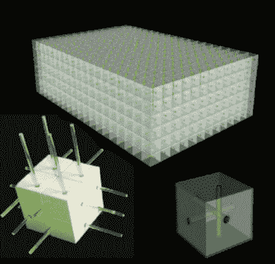

# 走向 3D 打印的中微子探测器

> 原文：<https://hackaday.com/2020/06/30/towards-a-3d-printed-neutrino-detector/>

熔融沉积成型(又称 3D 打印)等附加制造技术通常用于快速原型制作。另一个优点是，它可以制造出复杂得无法用数控铣削等传统制造方法制造的形状。现在，3D 打印甚至已经进入了粒子物理学领域，因为由欧洲核子研究中心(CERN)领导的一个国际合作小组正在开发一种新的塑料闪烁体生产技术，其中涉及添加制造。

闪烁体是一种荧光材料，可用于通过电离辐射产生的闪光进行粒子检测。塑料闪烁体可以通过向透明聚合物(如聚苯乙烯)中添加发光体来制造，通常通过注射成型等传统技术来生产。

Design of the ND280 scintillation detector. The scintillator cubes are read out by wavelength shifting fibers. One end of the fiber is viewed by a photosensor, another end is covered by a reflector.
Credit: [S. Fedotov et al.](https://arxiv.org/abs/2005.11048)

为了未来的升级， [T2K](https://t2k-experiment.org/) 中微子振荡实验的 ND280 探测器将使用大约 200 万立方厘米的聚苯乙烯基闪烁体立方体，总质量为 2 吨。这种探测器的组装将是一项极其繁琐的任务，通常需要利用许多研究生的劳动力来完成。为了简化组装，目标是 3D 打印单个“超级立方体”，它由许多由光学反射器分隔的独立立方体组成。

如上图所示，研究人员使用 FDM 打印机成功生产了闪烁体立方体，其光输出可与商业塑料闪烁体媲美。接下来，需要进一步优化闪烁体参数，并且必须开发用于光学隔离各个模块的反射器材料。

3D 打印塑料闪烁体并不是全新的。韩国的研究人员也用商业 DLP 打印机生产了塑料闪烁体。我们希望看到这项技术进一步发展，直到每个人都可以在家里打印自己的 [DIY 闪烁探测器](https://hackaday.com/2019/07/19/diy-scintillation-detector-is-mighty-sensitive/)。