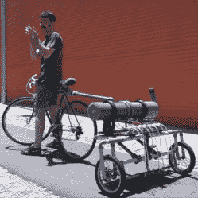

# 没有什么是凭空而来的

> 原文：<https://hackaday.com/2020/06/27/nothing-comes-from-nowhere/>

你是如何想出新点子的？尽管有时它们看起来像是突然出现，但它们不会凭空出现。事实上，我们都有储备丰富的心理工具箱，上面写着“这个东西可以用来做那个”和“如果你想到达那里，就从这里开始”。

一个令人难以置信的“新”想法的发生器是简单地把旧的想法放在一起，并意识到两个或三个链可以让你到一个新的地方。这只是发生在我听迈克和我自己在本周的黑客日播客的时候。

这是电梯营销。你可以把我们上周四展示的类似于[播放器——pianoesque MIDI 桶形钢琴](https://hackaday.com/2020/06/18/less-rock-more-roll-a-midi-barrel-piano/)的东西，与我们上周五展示的[街头绘画自行车拖车](https://hackaday.com/2020/06/19/message-in-a-bottle-bicycle-trailer-on-a-mission/)混合在一起。你得到了什么？一卷纸，普通孩子可以在上面画画，卷在自行车后面，有一个油箱，他们可以用自行车打气筒加压，当他们在人行道上滚动时，会喷射出他们艺术的像素化版本。

现在我怎样才能让这一切成真？我的一个邻居有一辆报废的自行车拖车…

但是明白我所说的想法了吗？我只是把两个已有的想法放在一起摩擦，在这种情况下，它们就冒出了火花。我有一个我周围所有资源的心理目录，其中一些已经到位。作为好的原始想法的源泉，这就是为什么我在 15 年前开始阅读 Hackaday，以及为什么它仍然是像我们这样的人每天必读的书。非常感谢每一个分享的人！阅读更多 Hackaday！

This article is part of the Hackaday.com newsletter, delivered every seven days for each of the last 200+ weeks. It also includes our favorite articles from the last seven days that you can see on [the web version of the newsletter](https://mailchi.mp/hackaday.com/hackaday-newsletter-649368). Want this type of article to hit your inbox every Friday morning? [You should sign up](http://eepurl.com/gTMxQf)!