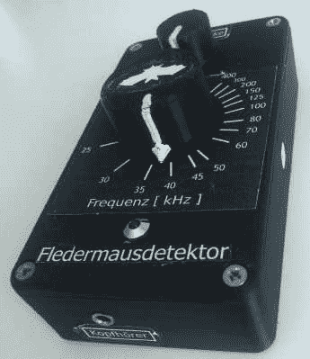

# 蝙蝠说了什么？用这个外差探测器调谐

> 原文：<https://hackaday.com/2020/06/27/what-does-the-bat-say-tune-in-with-this-heterodyne-detector/>

蝙蝠是迷人的动物，尽管围绕着它们的都是神话和恐怖，但它们真的让人想起迷失在夜空中的醉酒鸟，而不是它们经常被描绘成的吸血动物。当然，有些确实属于这一类，与真正的鸟类不同，蝙蝠不会用它们的歌声来取悦我们——至少不会以我们人类听得见的方式。但是多亏了蝙蝠探测器，我们仍然可以探测到它，最近【马塞尔】自己做了一个外差蝙蝠探测器。

The bat detector (and an insight to the beauty of German language, where a bat is a *flutter mouse)*

该探测器由 555、MCP6004 运算放大器和 4066 模拟开关以及一系列无源器件组成，并整齐地包装在一个 3D 打印的外壳中，带有一个电位计来设置检测的音量和中心频率。蝙蝠信号本身由 MEMS 麦克风拾取，其频率范围[Marcel]适合这项任务。他的文章还包括了关于外差的所有数学细节，以及每个元件是如何发挥作用的。由此产生的音频可以通过耳机输出来收听，在组装一个适配器后，也可以从他的智能手机上录制。他的文章中增加了一个例子，你也可以在休息后看看。

如果你想自己试一试，[Marcel]把所有的设计文件和一些 LTSpice 模拟放在项目的 GitHub 页面上。如果你对蝙蝠探测器感兴趣，并想阅读更多关于它们的内容，[跟随【帕特·威特曼】进入那个兔子洞](https://hackaday.com/2019/10/17/worried-about-bats-in-your-belfry-a-tale-of-two-bat-detectors/)，或者看看[这个用 Python 制作的](https://hackaday.com/2017/08/10/we-should-stop-here-its-bat-country/)来了解更多关于软件的东西。

<https://hackaday.com/wp-content/uploads/2020/06/bat_sample.mp3?_=1>

[https://hackaday.com/wp-content/uploads/2020/06/bat_sample.mp3](https://hackaday.com/wp-content/uploads/2020/06/bat_sample.mp3)

(横幅图片由[签名人 Allerslev](https://pixabay.com/users/smallerslev-15390151/) 制作)