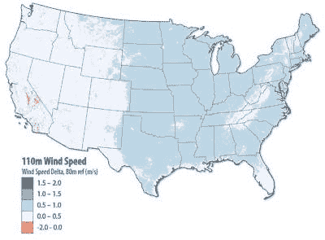
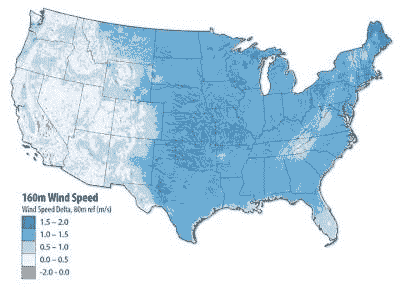
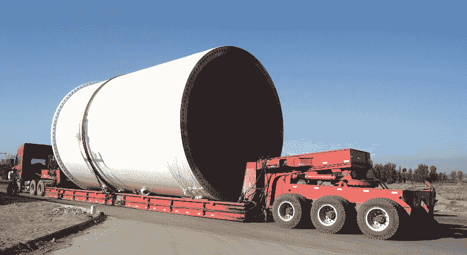

# 3D 打印更大的风力涡轮机

> 原文：<https://hackaday.com/2020/07/06/3d-printing-bigger-wind-turbines/>

几十年前，一个年轻得多的我和我爸、我哥一起坐在车里，在高速公路上兜风，做着各种各样的事情。我们大概都坐在前座，没有一个人系安全带；那是更简单的时代。当我们从一座立交桥下经过时，我爸爸说:“你知道为什么这些路上的立交桥这么高吗？”六岁的我当然没有，但很明显爸爸有，而且有话要说，所以我们只是摇摇头，等着上课。“因为核导弹就是这么大。”然后，他解释了当时仍处于起步阶段的美国州际公路系统是如何设计的，以确保武装部队可以在全国范围内移动，因此立交桥需要允许大负载的卡车通过。

这在当时是一个有趣的教训，多年来，我一直对美国州际公路系统的远见和工程印象深刻。当然，它远非完美，只是在最近，该系统的规格才开始对似乎与立交桥尺寸完全无关的事情产生影响，即风力涡轮机的大小和效率。

## 越高越好

从表面上看，将风的动能转化为电能的能力似乎与艾森豪威尔政府时期土木工程师的设计决策没有多大关系。但是在处理风力发电时，大小，或者更具体地说，高度很重要。风力涡轮机的轮毂离地面越高，风力就越稳定，速度也越快。国家可再生能源实验室的一项研究绘制了全国地面以上 110 米和 160 米的风速图。与 80 米高的风相比——这大约是如今大型风力涡轮机的平均高度——差别是惊人的。

 

如果风力涡轮机可以被提升到 160 米高，该国的大片土地可能会被用于风能生产。NREL 估计，更高的涡轮机可以多发电 45%。

## 前方有座矮桥

因此，对更高涡轮机的需求是显而易见的，但是将涡轮机建得更高会产生其他问题。塔越高，底座就需要越宽，以支撑上面机器的巨大重量，并抵抗风施加在上面的负荷。目前 80 米涡轮机的底部直径约为 4.5 米，略低于州际公路规定的最低公路立交桥高度(16 英尺，或 4.9 米)。当被放在一辆低矮的拖车上，或者放在一辆为这项工作量身定做的拖车上时，塔的最低部分刚好擦过一些立交桥，创造了一些有趣的时刻。

Wind turbine tower transporter with rear steering. Source: [Shandong Steer Machinery Co., Ltd.](https://steermachinery.com/product/en/Chinese-made-wind-tower-transport-semi-trailer-wind-blade-tower-trailer-hydraulic-control-wind-tower-semi-trailer-steer-machinery-semi-trailer.html)

对这种大型塔架基础部分的需求，显而易见的答案是忘记在工厂制造它们，直接在现场建造。虽然这是可能的，但建筑经济学却与之背道而驰。制造如此巨大零件的工厂里充斥着制造这些零件所需的更大的机器。那里的工人是熟练的技工，他们在受控的条件下生产能够承受巨大负荷的精密零件。期望在二月中旬在北达科他州的玉米地里进行如此精密的加工是很难的。

## 现场挤压

然而，事实证明，在工地上建立风力涡轮机塔架工厂实际上是可能的。通用电气与建筑材料公司 LafargeHolcim 和建筑 3D 打印公司 COBOD 合作，最近宣布了 3D 打印高达 200 米高的风力涡轮机塔架下部的计划。他们的第一个原型是一个十米高的挤压混凝土锥形圆柱体，于 2019 年底在 COBOD 的哥本哈根工厂打印，使用该公司的 BOD2 模块化龙门打印机打印。

 [https://www.youtube.com/embed/_bpOLSWtE1U?version=3&rel=1&showsearch=0&showinfo=1&iv_load_policy=1&fs=1&hl=en-US&autohide=2&wmode=transparent](https://www.youtube.com/embed/_bpOLSWtE1U?version=3&rel=1&showsearch=0&showinfo=1&iv_load_policy=1&fs=1&hl=en-US&autohide=2&wmode=transparent)

BOD2 打印机最初设计用于打印整个结构，从房屋到小型办公楼，现场只需最少的熟练工人。根据 X 轴和 Y 轴的 2.5 米模块的配置方式，BOD2 可以打印高达 14 米乘 50 米的结构，因此它应该足够大，足以打印最大的风力涡轮机塔架的基础部分。一旦基底部分在现场印刷到直径变窄到小于 4.5 米的高度，传统的预制部分将可能被运输到现场并在挤压基座的顶部组装。

显然有很多工程要做，以确保这种混合方法将支持这样的大型风力涡轮机将经历的负载。但这似乎是对一项技术的巧妙利用，坦率地说，在我们看来，这项技术总是没有能力建造足够吸引人的建筑，让人们真的想在里面生活和工作。这样一个实用的应用程序似乎是大规模 3D 打印的完美用例，我们渴望看到它在长期内是否有所回报。