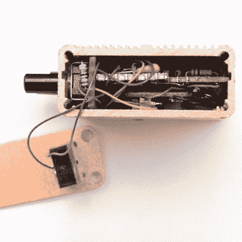

# 模拟噪声发生器，对抗其他噪声

> 原文：<https://hackaday.com/2020/07/06/analog-noise-generator-fighter-of-other-noises/>

一种混乱的无意义的嗡嗡声让人类大脑摆脱了通常的抓住模式的驱动力，这有时可能是一件受欢迎的事情。当耳塞不够用时，无意义的背景噪音——就像一台调到废弃频道的旧电视——可以帮助淹没分心的事物和其他侵入的声音。正如[mitxela]解释的那样，这可以通过一个带有白噪声的 MP3 文件来实现，这是一个非常适合大多数实际用途的解决方案。然而，他发现自己想要一个更精致的硬件噪声发生器，带有模拟控制来微调输出，[因此 Rumbler 诞生了](https://mitxela.com/projects/rumbler)。

It’s a tight fit, but it does fit.

Rumbler 不仅仅是一个白噪声发生器。白噪声有一个平坦的频谱，但来自 Rumbler 的噪声更接近红色或布朗噪声。不同的[颜色的噪声](https://en.wikipedia.org/wiki/Colors_of_noise)有特定的定义，但 Rumbler 的输出实际上只是白噪声，经过一些低通滤波器处理，以创建更接近于听起来令人愉快的背景隆隆声的输出，而白噪声更像是平坦的静态噪声。

为什么要这么做呢？主要是因为建造东西很有趣，但也有一种观点认为，这更好地阻挡了邻近人类活动的滋扰声音。当远处的音乐(或电视，或谈话，或喊叫)穿过墙壁进入耳膜时，高频比低频衰减得更厉害。这就是为什么人们可以很容易地听到附近聚会音乐的低音，但歌词却无法在穿越墙壁和窗户的过程中保存下来。来自 Rumbler 的噪声只是更适合那些更持久的较低频率。

[Mitxela]的文章中有很多关于模拟设计和原型制作的有用技巧，所以即使你不打算制作自己的模拟噪声盒，也可以读一读。想亲自听听隆隆声吗？在页面底部有一个嵌入的音频样本，所以去看看吧。

对于白噪声的真正现代应用，请查看用于窥探智能扬声器的[寂静锥](https://hackaday.com/2019/01/17/win-back-some-privacy-with-a-cone-of-silence-for-your-smart-speaker/)。