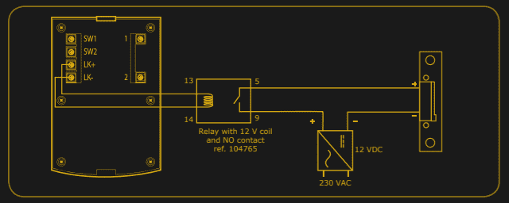

# 用 12 伏电压打开邻居的前门

> 原文：<https://hackaday.com/2020/07/01/pop-open-your-neighbors-front-door-with-12-volts/>

社区中的许多人对商用智能家居设备的安全性持怀疑态度，这是有充分理由的。这并不像你必须看很远才能找到实现不佳的系统的例子，或者被制造商抛弃而没有关键安全更新的产品。但是，这个视频门铃的设计缺陷真正让人们明白，一些公司对他们客户的安全性考虑得多么少。

 正如[Savvas]所解释的，在休息后的视频中演示的，如果你想进入一个装有这种脆弱门铃的家庭，你需要做的就是把它从墙上取下，并用 12 伏 DC 击中它。

令人难以置信的是，连接到房子内部电子锁的终端在单元的背面是完全可触及的。他们甚至给它们贴上标签，以防盗贼忘记哪根电线是哪根。这甚至不像是用某种奇怪的安全螺丝固定的东西，这只是一个普通的菲利普斯。

在视频中，[Savvas]甚至展示了他使用一个连接到快速充电 USB 电池组的小工具来获得一个适合打开这些锁的便携式 12 VDC 电源。有趣的是，[是基于他在 Hackaday 评论](https://hackaday.com/2017/03/04/unlocking-12v-quick-charge-on-a-usb-power-bank/#comment-4199744)中读到的一个技巧。在这些传奇的页面上写下你的下一个评论时要考虑的事情。

[Savvas]说，他已经联系了该公司，以了解他们对此事的看法，但到目前为止，还没有收到回复。我们并不惊讶，这是产品执行中的一个根本性缺陷。显然，他们想制造一种易于安装的设备，不需要在房子里安装任何额外的电子设备，这是这种过度简化不可避免的最终结果。更有理由[推出自己的智能门铃](https://hackaday.com/2019/05/13/video-doorbell-focuses-on-quality-aesthetic/)。

 [https://www.youtube.com/embed/gtnDg_UzcPE?version=3&rel=1&showsearch=0&showinfo=1&iv_load_policy=1&fs=1&hl=en-US&autohide=2&wmode=transparent](https://www.youtube.com/embed/gtnDg_UzcPE?version=3&rel=1&showsearch=0&showinfo=1&iv_load_policy=1&fs=1&hl=en-US&autohide=2&wmode=transparent)

