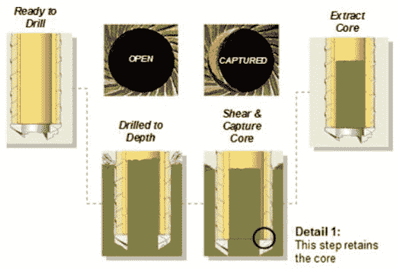
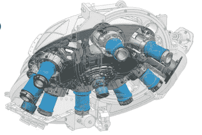
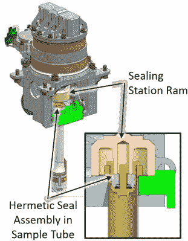
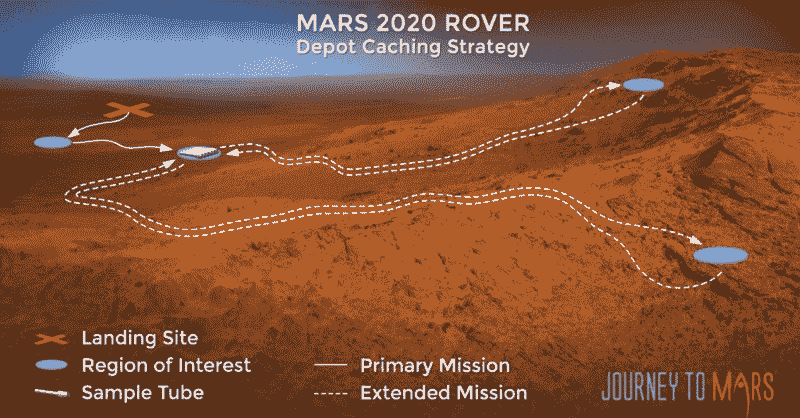

# 火星上的地理藏宝:毅力如何在返回地球的同时封存火星样本

> 原文：<https://hackaday.com/2020/07/30/geocaching-on-mars-how-perseverance-will-seal-martian-samples-with-a-return-to-earth-in-mind/>

随着火星 2020 任务大约 20 天的发射窗口迅速临近，下一个红色星球大任务的宣传列车真的越来越多。而且有很好的理由——火星 2020 任务已经进行了十年的大部分时间，正如我们今年早些时候报道的，它运送到火星表面的漫游车，自命名为毅力，将是有史以来最复杂的此类设备之一。

“珀西”——得了吧，这是一个自然的昵称——是一个移动实验室，能够探索火星表面，寻找生命曾在那里找到过的证据，并为我们自己去那里做必要的基础工作。核动力漫游者布满了科学仪器，假设它幸存于 2012 年的[“七分钟恐怖”](https://www.youtube.com/watch?v=h2I8AoB1xgU)以及它的孪生兄弟好奇号，我们应该开始看到一些惊人的结果回来。

在之前的火星探测任务中，没有哪一次能更好地回答这个基本问题:“我们是孤独的吗？”但是，无论毅力有多强，能把多少科学装进一公斤价值数百万美元的东西里去火星，这是有限度的。因此，美国国家航空航天局决定让“坚持”号不仅有能力收集地质样本，而且有能力将它们打包并存放在地球表面，以等待未来的任务，该任务将把它们带回地球进行进一步的研究。这是大胆和前瞻性的想法，它不像以前尝试过的任何东西。从很多方面来说，毅力号的样本处理系统是漫游者的存在理由，也是这次深潜的主题。

## 三合一机器人

美国宇航局已经完成了与公众沟通火星 2020 任务的令人钦佩的工作，部分外联活动包括最近的视频，展示了进入样本处理系统的一点工程设计。老实说，尽管这个视频很吸引眼球，但它只是激起了我的食欲。发生的事情太多了，我必须了解更多。

为了了解一点内幕，我向凯利·帕尔姆求助，他是 JPL 的工程师之一，见下面的视频。作为 Sample Caching System (SCS)的集成和测试负责人，这些天她非常忙，但是她友好地回答了我的问题，并帮助我了解了构建和测试如此复杂的设备需要做些什么。

 [https://www.youtube.com/embed/MFyv8mtRPCA?version=3&rel=1&showsearch=0&showinfo=1&iv_load_policy=1&fs=1&hl=en-US&autohide=2&wmode=transparent](https://www.youtube.com/embed/MFyv8mtRPCA?version=3&rel=1&showsearch=0&showinfo=1&iv_load_policy=1&fs=1&hl=en-US&autohide=2&wmode=transparent)

首先，SCS 实际上不只是一个，而是三个独立的机器人，每个都有一组特定的工作。SCS 的“业务端”是安装在车辆前部的 2 米长的机械臂。就像之前的好奇号一样，这个手臂携带了一个炮塔，上面装满了科学仪器、传感器和相机，以及钻探火星岩石和采集样本所需的工具。但与其前身不同的是，岩石钻的设计是研磨岩石并产生可以通过机载仪器轻松分析的粉末，毅力钻专门用于获取核心样本，一旦样本返回，既适用于机载研究，也适用于地面实验室。

机械臂转塔上的钻头是一种非常通用的工具。在钻头旋转架的帮助下(下面会有更多的介绍)，钻头可以安装用于不同工作的钻头。钻机能够以简单的旋转模式或冲击模式运行，类似于锤钻。一个小型车载净化氮气罐用于轻轻清除取芯作业产生的灰尘。

Detail of the core break-off and retention system. Source: [Honeybee Robotics](https://honeybeerobotics.com/wp-content/uploads/2013/12/IEEE_2014_Mars2020_Honeybee-Robotics.pdf)

使用圆柱形钻头在岩石中取心到有限的深度提出了一个问题:如何准确地取出岩心？在地球上，答案将是使用第二个工具来撬动取芯钻头移除后留下的岩石圆柱体。虽然类似的东西肯定也可以在火星上工作，特别是有一个机械臂供你使用，但美国宇航局提出了一个更聪明的系统。

根据 2014 年由一家名为蜜蜂机器人的公司进行的设计测试，将核心从母岩中释放出来并封装在样本管中是一个一步到位的过程，样本管将在地球上的实验室中重新打开。位于取芯钻头内部的是一个钛样本管。在取芯过程中，取样管的轴线和取芯钻头相互对齐，这样，随着钻井的进行，取样管可以在岩心上滑动。在适当的深度，样品管稍微离轴旋转，在岩心样品的底部施加足够的力，使其脱离母岩。岩芯由取芯钻头内侧的唇缘固定，允许岩芯从钻孔中取出，岩芯已经在钛样品管中，岩芯将保留在其中，直到样品返回任务。

## 用活塞密封

The bit carousel, which transitions bits and samples from vertical to horizontal with just a single axis of rotation. Source: [Mars 2020 Mission](https://sites.nationalacademies.org/cs/groups/ssbsite/documents/webpage/ssb_180772.pdf) by Ken Farley

钻头转盘是样品缓存过程中的下一个机器人。钻头传送带位于漫游者底盘的前部，外表看起来很简单——只是一个旋转的炮塔，将钻头运送到毅力号腹部的储存处。但它在复杂性方面的不足被其巧妙的设计所弥补。旋转木马的主体是一个轮子，其边缘有多个工位。每个工位相对于转子轴成 45°角，转子轴本身与底盘的长轴成 45°角。这些角度的组合意味着，只需用一个电机旋转转盘，试管就可以从垂直状态转变为水平状态。当然，有大量的传感器和致动器确保一切正常，但设计的简单性真的很重要。

Sample tube sealing system. The seal (yellow) is dropped into the sample tube, and a ferrule (gray) is driven down a guide rod to expand the seal into the tube walls. Source: Redmond, Laura *et al.* “Design of Robust Sealing Mechanism for Mars 2020 Sample Tubes,” *[J. Spacecraft and Rockets](https://arc.aiaa.org/doi/10.2514/1.A34681)*

在水平和垂直方向之间转移工具和样本的能力对于样本缓存任务至关重要，因为负责存储所有东西的机器人位于月球车底盘的前部。样品处理臂(SHA)看起来有点像半导体工厂中流行的 SCARA(选择性柔顺关节机械臂)机器人。SHA 能够访问样本缓存区内的多个位置，并在这些位置和钻头转盘显示区之间进行传输。为了清理占据隔间大部分空间的仪器和样本管，SHA 有一个额外的 Z 轴，以便整个东西可以下降到漫游者底盘的底部边缘以下。除了 42 个用于核心和风化层样本试管的储存仓，SHA 还可以储存大量工具和附件，以及用于对样本进行初步分析的仪器，如体积评估和成像。

一旦样本管被填满，它需要被密封起来，以确保里面的东西能够在火星表面存活一段不确定的时间，并经受住最终返回地球的严酷考验。密封必须在不污染样品的情况下进行，因此不能使用粘合剂，也不能加热，以免样品受到极端温度的影响。

要密封样本试管，SHA 会将其送到七个密封分配器中的一个。一个杯形塞通过分配器落入管的开口端。然后，堵塞的管被移动到密封站，该密封站使用电机驱动的压头将锥形套圈沿着塞子内部的导杆向下驱动。随着套圈被向下压，塞子的边缘扩张，将塞子外圆周上的尖齿推入样本管的内壁。最终结果基本上是盖子和样品管之间的冷焊结合，气密地密封该管并保护样品免受污染。

## 退回给发件人

一旦样本被密封在钛石棺中，它就可以被放置在火星表面。我能找到的大多数任务简介都提到了“仓库缓存”的使用，毅力号从不同的感兴趣的地区反复返回到一个单一的位置来存放样本管。这非常有意义；对于未来的样本回收任务来说，找到一大堆 42 根钛管可能比四处寻找被丢弃的单根钛管要容易得多。

Like geocaching, but on Mars. The Depot Caching strategy to be used at Jezero Crater. Source: [NASA](https://mars.nasa.gov/mars2020/timeline/surface-operations/)

尽管如此，在毅力之后，无论机器人被派去清理，都有它的工作要做；由于 SHA 无法到达地面，试管将不得不被丢弃，这意味着回收机器人可能无法找到有序堆叠的样本试管。无论“毅力”号沿着什么样的轨迹前进，都需要敏捷地拾起并安全地装载每一个珍贵的样本管，不管它的方向如何，可能是在从风吹的浮土中挖出样本管之后，还需要智能来自动完成这一切。

如果运气好的话，毅力号将很快踏上前往火星的旅程，无论是在发射时还是在二月份着陆时，我们都会粘在座位上等待结果。我们还将关注返回任务的进展，这可能会更具挑战性，需要更酷的工程来完成。

特色图片:[美国宇航局/JPL 加州理工](https://mars.nasa.gov/resources/24760/mars-2020-with-sample-tubes-artists-concept/)