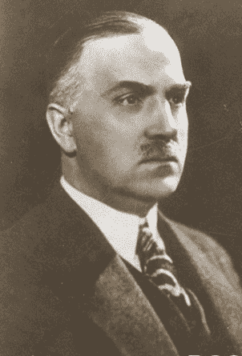
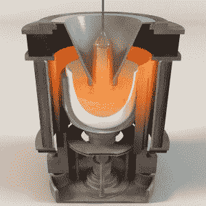
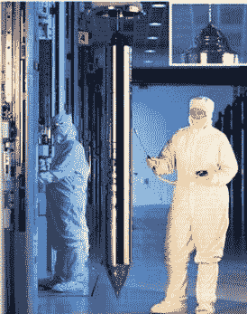

# 扬·切克劳斯基和硅革命

> 原文：<https://hackaday.com/2020/07/22/jan-czochralski-and-the-silicon-revolution/>

如果你回到上个世纪初，试图让普通人相信，任何海滩上的沙粒都会成为 100 年内价值数千亿美元的产业的基础，他们可能会认为你疯了。除了粗糙、恼人之外，沙子无处不在，让任何人相信它的价值都是很难的，除非你的对话者是一个房地产梦想家，对海边房产的未来价值有所了解，并有很大的耐心。

快进到我们的时代，我们都知道来自普通石英砂的材料的价值:硅，特别是超纯化的硅晶体，最终成为我们赖以构建生命电路的晶片。从海滩到芯片铸造厂的旅程是漫长而不明显的，如果没有一个不起眼的波兰学生和曾经的药剂师的洞察力，这是不可能的，他发现了使信息时代成为可能的过程:Jan Czochralski。

## 那些不会教书的人

1885 年出生在现在的波兰克西尼亚，但当时是普鲁士帝国的一部分，扬·查克劳斯基很早就显示出化学方面的天赋。化学天才的情况似乎总是如此，他家实验室的一次早期实验导致了爆炸。他的父亲是一名木匠，他希望简有一天能成为一名教师，但尽管他热爱化学，或者正因为如此，简的成绩很差，足以将他排除在职业道路之外。作为一种选择，他离开了家，在一家药店找了份工作，发誓一旦他变得富有和出名，就回到他的家乡。

Jan Czochralski, circa 1910

简继续自己的研究，并在德国迅速发展的化学工业中从事了一系列工作。当他申请并被柏林夏洛滕堡技术学校录取时，他基本上是自学的，在那里他将专攻冶金学。此后不久，作为德国电气巨头 AEG 公司新任命的化学工程师，他开始研究铝在电子领域的应用，这在当时是一种奇特而昂贵的材料。

Czochralski 的职业生涯因其冶金研究的价值和发表研究成果的程度而飞速发展。他的工作被频繁引用，以至于有一天他会成为被引用最多的波兰科学家之一，当名单上包括玛丽·斯科多瓦斯卡·居里和斯塔尼斯瓦夫·乌兰这样的名字时，这是一个不小的成就。他的名气越来越大，以至于亨利·福特在 1923 年主动向他示好，让他掌管整个工厂。Czochralski 礼貌地拒绝了。

## 心不在焉的教授？

对于一个如此热衷于化学冶金领域并致力于此的人来说，对于一个据说像切克劳斯基一样有条不紊的人来说，具有讽刺意味的是，他最著名的东西，以及这个肯定会成为他最重要遗产的发现，却是一个意外的结果。据说，1916 年，切克劳斯基在他的工作台上做冶金实验笔记。他全神贯注在笔记本上，没有注意到他没有把笔浸入墨水池，而是把它浸入一个熔化的锡坩埚中。这个故事可能是虚构的，因为锡的熔点是 232 摄氏度，像切克劳斯基这样谨慎的实验者不太可能会如此漫不经心地拿着一罐熔化的金属，但是不管钢笔是如何进入锡中的，结果都很有趣。

当他抽回笔时，一根细小的锡须从熔化的金属池中被拉了出来。出于对线的性质的好奇，直拉法分析了它，惊讶地发现它是一个单晶。他继续试验这项技术，用各种毛细管代替笔尖，并加入晶种为晶体形成提供成核点。他很快就能制造出直径达 1 毫米、长达 1.5 米的各种金属的单晶。除了锡，他还用他的方法制造了铅和锌的晶体细丝。

切克劳斯基在 1917 年正式报告了他的发现，尽管最初有人对“切克劳斯基方法”进行了大量的实验，但接连不断的世界大战的干扰使这项工作在很大程度上变得默默无闻。他的余生继续在化学工业中工作，并在有生之年看到贝尔实验室的研究人员——总是贝尔实验室——在 20 世纪 40 年代末重新发现了他的过程，并将其应用于他从未想到过的材料，如硅和锗，因为他们开始发明半导体工业。

## 播种

CZ-process cutaway showing quartz crucible and growing boule. Source: [WaferPro Products](https://waferpro.com/about-silicon-wafers/)

用于生产单个巨大硅晶体(或称晶棒)的直拉法工艺的细节与原始方法仅在微小细节上有所不同，当然在生产规模上也有所不同。硅晶棒的生产是在感应炉中进行的，该感应炉具有精确的温度控制，并且可以提供惰性气氛，例如氩气。当石英坩埚装入超纯(99.9999%，或百万分之一的非硅分子)多晶硅时，该过程开始。熔炉被加热到大约 1500 ℃,同时坩埚缓慢旋转。

当多晶硅熔化后，将提拉棒放入熔融硅池中。提拉棒的末端带有精确取向的硅籽晶，作为结晶的成核点。以与坩埚相反的方向旋转的提拉棒在缓慢拉出之前在熔融硅中停留一段短时间。此时熔融硅已经开始结晶，并且提拉棒开始在与籽晶相同的方向上积累结晶硅的锥体。

 [https://www.youtube.com/embed/8QKzS_w_Ko0?version=3&rel=1&showsearch=0&showinfo=1&iv_load_policy=1&fs=1&hl=en-US&autohide=2&wmode=transparent](https://www.youtube.com/embed/8QKzS_w_Ko0?version=3&rel=1&showsearch=0&showinfo=1&iv_load_policy=1&fs=1&hl=en-US&autohide=2&wmode=transparent)

最终，生长中的晶体达到其最大直径，晶棒变得更加圆柱形。毛坯的直径通常可以达到 300 毫米，尽管目前正在进行 450 毫米直径的原型加工；理论最大值为 675 mm 是可能的，但尚未达到。晶棒在拉出时会继续成长，单晶矽会悬挂在拉杆上，最终重达数百公斤。上面的视频很好地概述了整个过程，从石英岩砂生产多晶硅到晶锭形成，再到将晶锭加工成晶片的迷人细节。

## 不仅仅是硅

Completed monocrystalline silicon boule. Source: [WaferPro Products](https://waferpro.com)

直拉法不仅用于硅晶体。使用该方法可以生长合成宝石，包括红宝石、蓝宝石、石榴石和尖晶石。另一方面，这种方法远不是制造单晶硅锭的唯一方法。

浮区工艺也是由贝尔实验室开发的，它使用射频能量来加热多晶硅棒内的一个区域。它可以生产更高纯度的硅，因为直拉法的石英坩埚中的熔体不会暴露在氧气中。还有 Bridgman-stock barger 法，它基本上是直拉法的颠倒版本。

然而，归根结底，扬·切克劳斯基偶然发现的晶体生长技术经受住了时间的考验，因为大约 90%的硅晶片是从用他的方法生长的晶棒上切割下来的。