# 感兴趣的输入:Infogrip 蝙蝠和弦键盘

> 原文：<https://hackaday.com/2020/08/18/inputs-of-interest-the-infogrip-bat-chording-keyboard/>

我想，通过研究奇怪而有趣的键盘，我会发现更多奇怪而有趣的键盘，这不会让我感到惊讶。这是 Infogrip 的 BAT 个人键盘，这是我在研究[data hand 键盘](https://hackaday.com/2020/04/20/inputs-of-interest-the-differently-dexterous-datahand-directionalizes-digits/)时偶然发现的东西，我认为这是一个很酷的东西。

当我偶然发现一个价格合理的二手球棒时，我抓住了它，尽管它没有任何手册或软件，甚至没有一根线。就像我说的，合理的价格。我查了一下这些键盘，发现你可以花比我多得多的钱买到新的。

[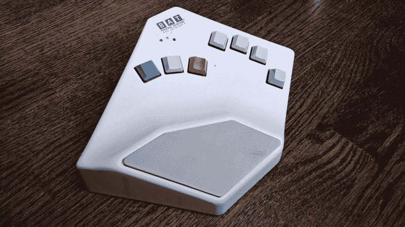](https://hackaday.com/wp-content/uploads/2020/07/BAT-beauty-shot.jpg)

My gently used BAT in all its angular glory.

[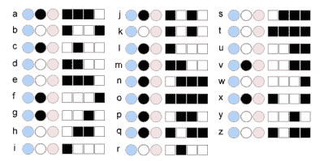](https://hackaday.com/wp-content/uploads/2020/07/BAT-lowercase-alpha.png)

The lowercase letter chords use either the middle thumb key or no thumb key. Image via [Infogrip](https://www.infogrip.com/docs/bat-guide/right-hand/launch.html)

那么这个东西是什么呢？这是一个和弦键盘，旨在被任何不能使用常规键盘或需要速度的人用作标准的 PC 输入设备。蝙蝠的和弦计划经过了多年的研究，是与美国宇航局斯坦尼斯航天中心联合开发的。

你不需要在普通键盘上伸出手指，一次按一个键来拼出单词，而是同时按下组合键，就像在钢琴上弹奏和弦一样。

你应该用你的拇指弹奏红色、灰色和蓝色的琴键，然后把另外四个放在其余的琴键上。所有的字母键都有或没有灰色拇指键，所有的数字、符号和修饰键都通过红色和蓝色层访问。

你为什么想要这个？嗯，如果有足够的时间来学习和弦，你可以做一个标准的 104+键盘只用七个键就能做的任何事情。你永远不需要向下看，即使是那些奇怪的很少使用的按键，唯一会移动的手指是你的拇指。所有这些减少的手/手指/手腕运动对身体来说会更容易。

[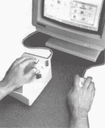](https://hackaday.com/wp-content/uploads/2020/07/BAT-CAD.jpg)

The BAT lets you CAD like a madlad. Via [Bill Buxton](https://www.microsoft.com/buxtoncollection/a/pdf/bat%20newsletter.pdf)

蝙蝠也是部分可编程的宏垫，从我收集的信息来看，主要卖点是你可以在 CAD 程序之类的程序中快速输入快捷键，因为你可以一只手放在鼠标上。

球棒有左手型和右手型两种，可以单独使用也可以一起使用。想象一下，如果你把所有的事情都协调起来*和*双手分担打字任务，你打字会有多快！唯一的麻烦是学习所有这些不同的手指组合，尽管他们说不需要那么长时间。

那么它为什么被称为蝙蝠呢？传说这是因为该公司成立于路易斯安那州的巴吞鲁日，还因为一对并排坐着的蝙蝠看起来像一只蝙蝠。

## 连接器检查器

这个版本的 BAT 似乎来自可用性时间线的中间——20 世纪 90 年代末。它有一个 AT 端口和 5 针迷你 DIN，我最初从卖家的图片上误认为是 PS/2。哎呦！

[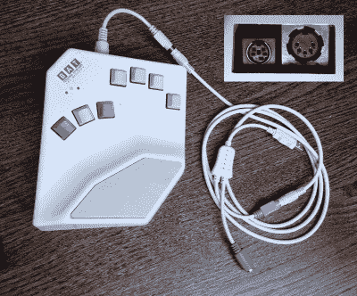](https://hackaday.com/wp-content/uploads/2020/07/BAT-connectors.jpg)

At least all three of the cords are beige.

我做的第一件事是给公司发电子邮件，询问更换电源线的事宜。我以为这些键盘还在生产，因为他们有新的键盘，看起来很像这个，但是是黑色的，使用 USB。我收到了一位代表的电子邮件，他告诉我 Infogrip 倒闭了，他们公司正在出售新的旧股票，直到卖完为止。

我从 mini DIN 端开始我最初的跳线搜索，我的想法很简单，这是一种更新的技术。是的，但事实证明迷你吃饭线并不常见，也很难找到——至少我可以在另一端使用终结线。

BAT 从 RS-232 串行端口开始，然后发展到我现在的这种 AT/5 引脚迷你 DIN 版本，然后在 21 世纪初的某个时候发展到 USB-Boxy。当我发现一个便宜的 AT 到 PS/2 转换器和同样便宜的 PS/2 电缆与那些 PS/2 到 USB 电缆之一一起使用时，我放弃了寻找迷你 DIN，在 2000 年代初，你不能摆动球鼠标而不触及。这似乎有效，至少部分有效。我的系统识别它，并宣布它可以使用。我可以让所有的 led 亮起，但我尝试的所有和弦都不会在我尝试过的任何文本编辑器中产生输出。如果我能找到一根 AT 转 PS/2 线，我可能会更幸运。

## 参观和拆卸

不使用一段时间，很难对一款设备做出公正的评价。到目前为止，我还没有做到这一点。但从表面上看，这款球棒给人的感觉是，它是为尽可能好的用户体验而设计的。

[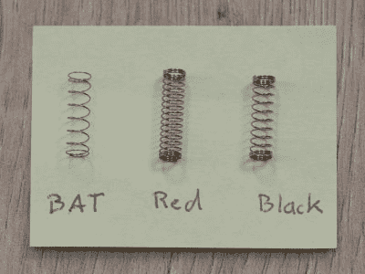](https://hackaday.com/wp-content/uploads/2020/07/BAT-red-black-springs-deskthority-1.jpg)

The BAT’s keys take very little actuating force because of the springs. Image via [Deskthority](https://deskthority.net/wiki/BAT_Keyboard)

像这样的键盘的意义在于，你永远不必低头看你的手。为了帮助解决这个问题，红色和蓝色的拇指键都有归位突起，而灰色的没有。

所有的键帽似乎都是向后安装的，与正常情况下成 180 度——根据我找到的图片，这就是 Infogrip 想要的样子。这样，按键的轮廓非常低，更容易操作。小指键比其他键高，以说明小指有多短和脆弱。在每个键帽下面，有三层 1/8”厚的泡沫来吸收打字时的震动。

蝙蝠的按键开关是樱桃色的 MX 黑色，经过特别轻的弹簧改造，使它们比红色的按键开关更容易启动。我不明白他们怎么能让这个键盘打字更容易或更舒服，除非手腕支撑是凝胶而不是泡沫，或者它有可调节的帐篷来改变打字角度。

我不明白为什么它有一个硬币电池，特别是考虑到 Infogrip 的这篇故障排除博客文章建议完全移除电池，因为“你不需要它，它会导致问题”。有人知道或者愿意推测一下吗？我确实尝试了这一点，以及硬复位序列，但它仍然表现相同的方式。

 [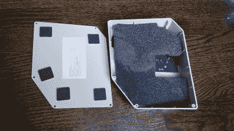](https://hackaday.com/2020/08/18/inputs-of-interest-the-infogrip-bat-chording-keyboard/bat-just-inside/)  [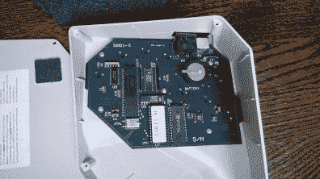](https://hackaday.com/2020/08/18/inputs-of-interest-the-infogrip-bat-chording-keyboard/bat-pcb-in-place/)  [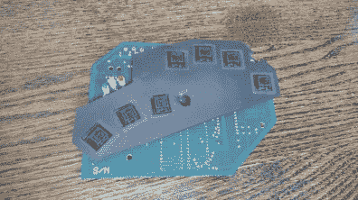](https://hackaday.com/2020/08/18/inputs-of-interest-the-infogrip-bat-chording-keyboard/bat-pcb-key-side/)  [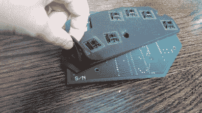](https://hackaday.com/2020/08/18/inputs-of-interest-the-infogrip-bat-chording-keyboard/bat-foam-layers/)  [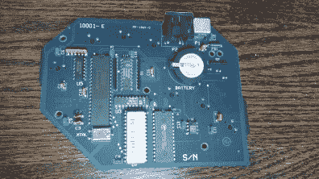](https://hackaday.com/2020/08/18/inputs-of-interest-the-infogrip-bat-chording-keyboard/bat-pcb-rear/)  [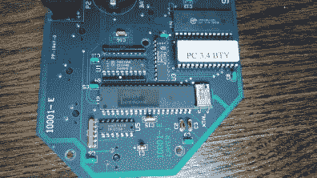](https://hackaday.com/2020/08/18/inputs-of-interest-the-infogrip-bat-chording-keyboard/bat-pcb-controller/) 

## 这会成为我新宠的输入设备吗？

我会试着让这个键盘正常工作。但是如果这没有发生，我想它会成为一个很棒的宏板，特别是如果我想出自己的和弦快捷键方案的话。机箱中有足够的空间来设计适合按键开关尺寸的电路板。

由于我的手很小，在拇指键下面可能有足够的空间放一个轨迹球，在其他键下面放一些鼠标按钮和滚轮。我正在设计一个 5 键的宏垫，它将位于我的轨迹球鼠标的正前方，但是将轨迹球鼠标和宏垫结合成一个 track-ro 的想法很有诱惑力。我们会看到它如何发展。