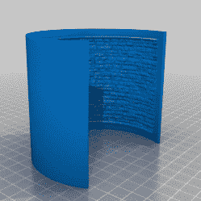
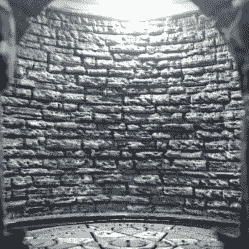
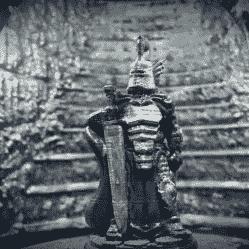

# 石膏像的新(误)用:微型立体布景

> 原文：<https://hackaday.com/2020/07/06/new-misuse-for-lithophanes-miniature-diorama-backgrounds/>

有什么比 3D 打印的微型照片更好的呢？[当然是迷你立体模型中的微缩模型照片](https://www.thingiverse.com/thing:3496240)。[OrionDeHunter]展示了一种聪明的技术，它与旧时代的照片舞台和绘画背景有一些共同点，并(错误地)使用 3D 打印的石版画来实现它。[OrionDeHunter]所做的是使用一个弯曲和彩绘的 lithophane 作为背景的替身，结果看起来很棒！

石膏像*旨在*从背后照亮以显示图像，薄的区域显示为亮，厚的区域显示为暗，但当涉及到像砖墙这样的高对比度图案图像时，制作好的石膏像的相同东西恰好也可以制作出正常意义上的非常好的 3D 模型。不需要 3D 扫描或摄影测量。

基本过程是这样的:OrionDeHunter 没有从头开始创建一个砖墙的 3D 模型，而是简单地用一个在线工具将一个砖墙(或楼梯)的图像转换成一个弯曲的岩画。然后，lithophane 的 STL 模型被 3D 打印、绘制，并用作可切换的背景。当微距拍摄时，弯曲的背景看起来恰到好处，并允许一些受控的照明。这是一个巧妙的技巧，在这个项目中得到了很好的应用。一些演示其工作原理的样本图片正在制作中。

3D model of curved lithophane

A painted lithophane makes a convincing brick wall

Other images like these stairs can work, too.

石膏像最初是用大理石或薄瓷器制作的，但是 3D 打印技术为这项技术注入了现代元素。进取的黑客甚至[也发现了添加颜色的方法](https://hackaday.com/2019/08/20/lithophanes-ditch-the-monochrome-with-a-color-layer/)。