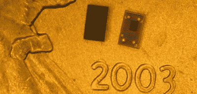

# 你自己的开源专用集成电路:天行者-PDK 计划在 2020 年推出第一款 130 纳米晶圆

> 原文：<https://hackaday.com/2020/06/30/your-own-open-source-asic-skywater-pdf-plans-first-130-nm-wafer-in-2020/>

你可能已经听过 [Maya Posch 的文章](https://hackaday.com/2020/06/25/creating-a-custom-asic-with-the-first-open-source-pdk/)关于[谷歌和 SkyWater Technology 的第一批开源 ASIC 工具](https://github.com/google/skywater-pdk)。它设想增加使用开源工具设计定制芯片(专用集成电路)的机会，并通过现有的芯片制造设施实现。我的第一个想法？流片的成本是多少？也就是说，我如何将设计呈现在屏幕上，并将实际部件拿到手中？我请谷歌的蒂姆·安塞尔(Tim Ansel)解释更多关于该项目的目标，以及我将如何得到我的零件。

目标非常简单。蒂姆和他的合作者希望看到硬件像软件一样开放。团队成员以直接合作或间接合作的方式构建彼此的工作成果，这种模式已经产生了许多非常强大的软件。Tim 在让人们对 FPGA 开发感兴趣方面取得了一些成功，并为此帮助开发了开放工具。定制 ASICs 是下一个合乎逻辑的步骤。

## 谁需要开源 ASICs？

当然，FPGAs 和 ASICs 并不能解决所有问题。我们不禁注意到，你看到的一些例子——包括我们的例子——有时对学习来说比实际应用更好。例如，学习 FPGA 上的状态机的经典例子是交通灯。为什么不呢？每个人都知道它应该做什么，它有清晰的状态逻辑，如果它能感应到车辆和行人人行横道按钮或基于时间表的变化，你可以让它变得简单或复杂。

然而，如果你真的是在建造一个交通灯，在 FPGA 中做就没什么意义了。即使是最简单的微控制器也能胜任这一任务，而且在购买和工程成本方面都要便宜得多。

ASICs 占据了一个相似的位置，但有一点点不同。从好的方面来看，它们应该比类似的 FPGA 密度更高、速度更快、耗电更少。这是有意义的，因为 ASIC 是一种 FPGA，其中互连是由专用金属线制成的，而不是通常可配置的。您还可以精确地放下您想要的电路，或者至少从各种单元中进行选择，而不是必须使用 FPGA 架构师决定您需要的任何单元。你甚至可以在数字电路中加入模拟单元。

从负面来看，ASICs 不适合马虎的人。历史上，对 ASIC 进行流片是非常昂贵的。所以你有一系列的零件，但是——哎呀——你忘记了计数器需要重置为一个非零数字。在 FPGA 中，这是一个小麻烦；您只需改变配置，尤其是现在一次性可编程 FPGAs 在某些应用之外很少见。即使你不得不扔掉一个 FPGA，并对另一个编程，它们通常也不是很贵，除非它们是抗辐射的或非常大的器件。

如果你在 ASIC 上犯了这样的错误，你就有大麻烦了。你不能改变你所拥有的部分。你必须有一个新的一批建立新的前期成本。在商界，这种错误可能会断送你的职业生涯。

不过，Tim 明确表示，他的目标受众不是专业的建筑定制 ASICs。是我们。想要创造定制集成电路的黑客和修补者。可能还会有一些学生市场，尽管学校通常已经有了使其可行的交易。

然而，蒂姆确实指出，许多学校的交易都与学生必须签署的保密协议密切相关，因此开放工具可能会刺激新的发表的研究，这将是一件好事。尽管如此，我感觉他们认为大部分的兴趣将来自我们的社区。

值得注意的是，这种工艺使用的 130 纳米工艺并不是尖端技术。Skywater Technologies fab 由 Cypress Semiconductor 于 1991 年在明尼苏达州布鲁明顿市建造。Tim 表示，专业设计人员已经远离了这些大型几何图形，我们的设计人员可能不得不在此过程中重新发现一些丢失的知识，以充分利用基于更大工艺制造的 IC。但是，现有的基础设施是使这个项目更实惠的一大部分。

## 那么你是如何得到它们的呢？

Tim 对杰出的细胞库以及每个细胞库如何针对不同目的(例如，高密度、低功耗或高速度)进行调整有很多要说的。然而，我们想知道如何得到真正的零件。显然，一些细节还在研究中。

Chip scale devices on a penny by [Cp82](https://commons.wikimedia.org/wiki/File:UNIO_WLCSP_and_SOT23_Device_on_Penny.jpg) CC-BY-SA 3.0

11 月，他们计划订购一个有 40 个插槽的多项目晶片。他们还不知道是否他们将不得不乞求和恳求得到 40 个设计，或者他们是否将不得不从所有可能的候选人中筛选出最好的。如果你是这 40 人中的一员，你将得到大约 10 平方毫米的空间来玩，并最终拥有大约 100 到 300 个采用芯片级封装(CSP)的芯片。在附带的照片中，你可以看到一个典型的 CSP 坐在一枚美国硬币上。

有一些规定。您将在 GitHub(或类似的公共存储库)上提交您的设计，因此您的设计将是开源的。这意味着，即使你不是这 40 人中的一员，你也已经把你的芯片展示给了全世界。铸造厂会自动检查你的设计是否符合特定的技术标准。在这一早期阶段，他们似乎还没有一个确定的计划来决定如何选择第一轮的设计。据推测，如果进入者很多，事情进展顺利，2021 年将会有更多的晶圆。

仍有许多未解之谜。你能付钱把你自己的磁带拿出来吗？如果是，那还要开源吗？如果你做了一些，然后想要更多呢？那要花多少钱？这还为时过早，我们还不知道这些问题的答案，但随着时间的推移，细节会逐渐浮出水面。

## 钥匙

就像我前面说的，ASICs 并不适合每个人，当然也不适合那些边走边测试和调试的人。验证对于成功的 ASIC 项目至关重要。这意味着这在很大程度上将取决于可用的模拟工具和可用模型的质量。花费大量的时间和金钱得到的 IC 不能以你需要的速度工作，比你预期的消耗更多的功率，或者根本不能工作，这是令人心碎的。

很多时候，在尝试使用 ASIC 之前，FPGA 可以用来验证部分或全部设计。当那起作用时，它就很有效。然而，由于两种技术之间的差异，这并不像将 ASIC 视为固定的 FPGA 那么简单。从手动布线电路到 PCB，你可能会遇到同样的问题。逻辑上它们是一样的。但我们都知道，由于不同的特点，这种转变可能会有问题。这里也是同样的问题。如何测试模拟电池？时钟分布会一样吗？并且 ASICs 具有在验证阶段难以模仿的速度或功率要求。

Tim Ansel [今天做了一个在线演讲](https://www.youtube.com/watch?v=EczW2IWdnOM)正式宣布了这个项目。查看有关流程节点本身和用于设计流程节点的工具的更多详细信息:

 [https://www.youtube.com/embed/EczW2IWdnOM?version=3&rel=1&showsearch=0&showinfo=1&iv_load_policy=1&fs=1&hl=en-US&autohide=2&wmode=transparent](https://www.youtube.com/embed/EczW2IWdnOM?version=3&rel=1&showsearch=0&showinfo=1&iv_load_policy=1&fs=1&hl=en-US&autohide=2&wmode=transparent)

那么你会尝试自己设计 IC 吗？我以前参与过 ASIC 开发，但是我仍然可能有兴趣做我自己的个人项目，只是为了能够完成所有的步骤。请在评论中告诉我们你想设计什么样的 IC，或者让我们看看其他人的设计。

标题图像:Peellden/ [CC BY-SA 3.0](https://commons.wikimedia.org/wiki/File:12-inch_silicon_wafer.jpg)