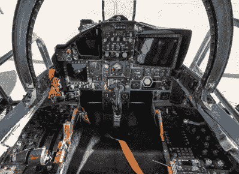
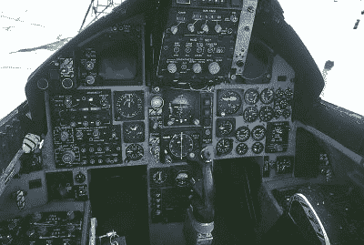
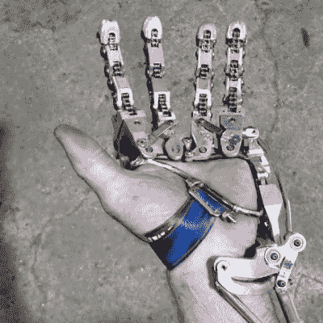

# 黑客日链接:2020 年 7 月 5 日

> 原文：<https://hackaday.com/2020/07/05/hackaday-links-july-5-2020/>

还记得二月份参宿四的喧嚣吗？就此而言，你还记得二月吗？如果你知道，你可能会想起猎户座中的红巨星正在逐渐变暗，一些人认为这是即将发生超新星的预兆。这显然没有发生，但我们现在似乎有了周期性变暗的解释:[恒星上的一个巨大的黑点](https://news.sky.com/story/betelgeuse-has-dimmed-60-ahead-of-potentially-imminent-supernova-12017859)。“巨大”并不能开始描述这个东西，它覆盖了一颗恒星表面的 70%,如果它取代了太阳，它将超越木星。这种变暗最初被认为是恒星在经历垂死挣扎时被吹走的灰尘，但没有找到证据，而在太赫兹范围内的直接观察表明，巨大的恒星斑导致了表面温度的降低。我们只是认为参宿四如此之大，以至于我们实际上可以观察到它是一个圆盘，而不是一个光点，这真是太酷了。至少现在是这样。

F-15c cockpit

F-15a cockpit

如果你认为你已经看到了一些具有挑战性的用户界面，那就等着看 F-15C 老鹰的驾驶舱吧。作为人机界面新系列的一部分，Ars Technica 邀请了 Andrea Themely 上校(美国空军退役。)来参观她已经飞行了 1100 多个小时的战斗机。记住，鹰式战斗机于 1976 年开始服役，并不断更新最新的航空电子设备——将视频与 F-15A 驾驶舱的[蒸汽表进行比较——它的驾驶舱仍然是一个非常繁忙的地方。已经尽可能地减少飞行员的负担，按照功能对控制进行分组，并使用颜色编码——不要碰黄色和黑色的东西！—以及触觉反馈的使用。这是对我们很少有人能看到的工作场所的一次迷人的深度探索，我们期待着该系列的其余部分。](https://en.wikipedia.org/wiki/McDonnell_Douglas_F-15_Eagle#/media/File:F-15_Eagle_Cockpit.jpg)

来自西雅图的坏消息，那里的活电脑:博物馆+实验室正在关闭商店。公告只说他们“暂时”关闭，所以至少有一些希望，一旦新冠肺炎的经济衰退结束，博物馆会回来。我们希望它们会反弹；这真的是一个伟大的博物馆，展出了许多令人惊叹的硬件。PNW 老式计算机节在它的第一年就在那里举行了，这个活动[我们报道过](https://hackaday.com/2018/02/17/great-beginnings-for-vintage-computing-in-seattle-vcf-pnw/)，并对未来寄予厚望。我们对这些教育和文化机构抱有最好的希望，但我们不禁对他们的未来感到一丝担忧。

 所以你的左手被部分截肢，只剩下拇指和手掌。这提出了一个有趣的难题:你还没有失去足够多的东西来用假肢替换手，但你仍然没有任何手指。这似乎就是发生在伊恩·戴维斯身上的事情，所以他自己造了一个部分假肢来代替他的手指。他的 YouTube 频道没有太多背景故事，但从我们所能收集到的信息来看，他已经完成了几项设计，其中大部分是肌肉机械的，而不是肌电的。通过一系列复杂的连接，他不仅能控制手指的开合，还能张开手指。可以说，这一切都在手腕上——他的输入手势都来自于他的手相对于固定假肢的前臂的弯曲和伸展。这导致了非常有力的抓握——比头对头测试中的肌电手强得多。他的作品的酷的因素刚刚超出了规模。我们期待着更多来自伊恩，并希望有足够的背景资料，他已经完成了一个完整的故事。