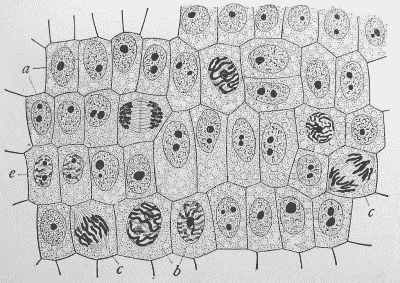
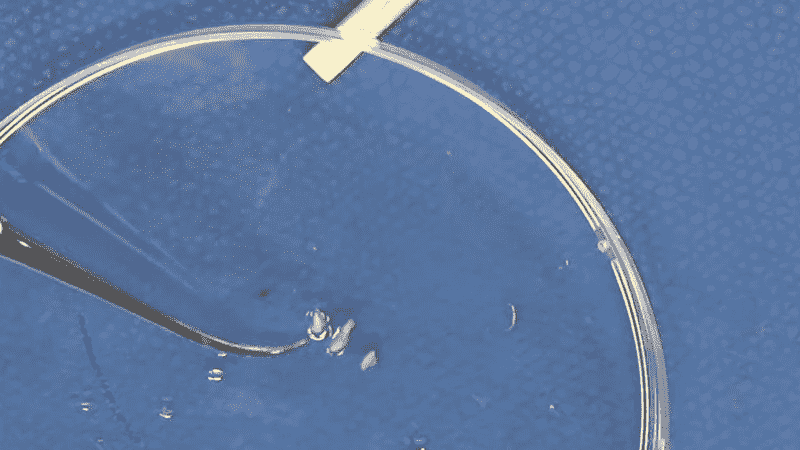
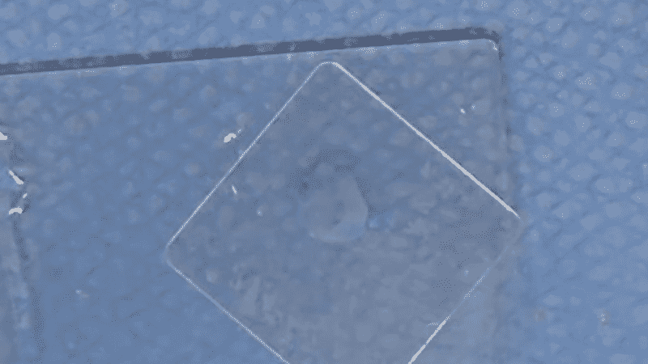

# 视频:比尔畜群看有丝分裂

> 原文：<https://hackaday.com/2020/07/09/video-bil-herds-looks-at-mitosis/>

我在初中时热爱我的科学课程；我们学着制造电池，研究分子如何结合形成我们周围的世界，基本上我对我们在事物发展过程中所处的位置有了一个了解，尽管那时还没有发现夸克。

在与我儿子的交谈中，我发现他的学校系统中没有多少科学学习材料的预算，就像我们当年一样，他几乎没有做过实际动手实验，这让我记忆犹新。其中一个实验是在显微镜下观察并画出有丝分裂的各个阶段。这在当时对我来说是惊人的，并将看到细胞分裂的奇迹铭记至今，就像我亲眼看到木星的一颗卫星的影子一样！

现在我不得不停下来告诉你，我不正常，或者至少不被认为是一个典型的 60 年代在印第安纳州农村河边长大的年轻人。这是我的骄傲和快乐。这是我在一年级或二年级时得到的礼物，我很喜欢它。在它的后期使用起来很恐怖，因为镜头移位了，如果可能的话，聚焦架变得更松了，内部镜头上积满了灰尘；然而我喜欢它，直到今天我还拥有它！当我写这篇文章时，我意识到这是我拥有的最古老的东西。(那个和附带的书)。

今天，我们有更好的工具，而且很容易得到。我想鼓励你和他们一起做一些科学研究。(不要只看你的焊点！)[看看关于通过显微镜看到洋葱细胞有丝分裂的视频](https://youtu.be/eFteIAMgsT4)，然后在下面和我一起了解更多关于这个话题的信息！

 [https://www.youtube.com/embed/eFteIAMgsT4?version=3&rel=1&showsearch=0&showinfo=1&iv_load_policy=1&fs=1&hl=en-US&autohide=2&wmode=transparent](https://www.youtube.com/embed/eFteIAMgsT4?version=3&rel=1&showsearch=0&showinfo=1&iv_load_policy=1&fs=1&hl=en-US&autohide=2&wmode=transparent)

## 什么是有丝分裂？

显微镜是一个很好的生物学工具，观察有丝分裂是一个很好的起点。有丝分裂是细胞分裂以产生更多细胞，从而使组织可以生长。事实证明，洋葱和大蒜的新鲜根的尖端在一个集中的区域有快速的组织生长，使得观察细胞分裂的各个阶段是值得的。为了准备这篇文章，我开始在一类水中种植葱和洋葱，并等待它们的顶端喷水。

> *米向妹子名词生物学*
> 
> 1.  一种细胞分裂类型，产生两个子细胞，每个子细胞都具有与母核相同的染色体数目和种类，是普通组织生长的典型特征。

我想不出比亲眼目睹细胞分裂更好的例子，来见证使生命成为可能的复杂奇迹之一。

## 用照相机观察

我儿子拥有一台比我的旧的小破车好得多的望远镜，但相对来说，他买它的价格和我的价格一样。更重要的是，我可以用相机代替他的一个目镜，并与他人分享我看到的东西——在这种情况下就是你。这是我“在我的时代”从未想象过能够做到的事情。

 实际上，我的硬件实验室里有几台显微镜，两台专用于协助表面贴装组装，但我儿子的显微镜可以放大 2000 倍！那就是我用来制作这些图片的东西。

## 我们要找的是

基于细胞分裂的生命有能力从 DNA 分裂和复制的能力开始制造重要组织细胞的新副本。随着这一过程的继续，整个染色体通过分裂复制，两个新的细胞代替原来的细胞形成。默认情况下，不同的生物体有不同数量的染色体，今天显微镜下的洋葱有 16 条染色体排列成 8 对，默认情况下，人类有 23 对染色体。染色体的数量并不一定意味着有机体的复杂性，例如，狗有 78 条染色体，而人类有 46 条。

Major Events in Mitosis [Image source: [NIH Science Primer](https://en.wikipedia.org/wiki/File:Major_events_in_mitosis.svg")]

## 阶段

 

洋葱细胞处于有丝分裂的不同阶段【图片由[埃德蒙·b·威尔逊](https://commons.wikimedia.org/wiki/File:Wilson1900Fig2.jpg)

有丝分裂的一些主要阶段有:

**前期**或“之前”阶段。即使事情开始发生，细胞看起来仍然非常类似于非复制细胞。

前中期是细胞核的细胞壁破裂的地方，细胞分裂的行为接管了整个细胞。使用这种级别的显微镜，这是它真正开始可见的地方。

**中期**或“旁边”,名副其实，当各种力量向相反方向拉动时，染色体在细胞中心附近并排排列。这在现实生活中看起来很酷。

后期(T1)或“之后”是它开始看起来像新的孪生细胞的时候。

**末期**或“结束”。努夫说。

## 滑走

为了准备观察洋葱组织，我首先将它浸泡在温盐酸中。如果你认为这听起来像是我在像我们自己的胃一样消化组织，那你就对了。细胞停止活动，有时被称为“固定”。细胞壁外部的一堆物质被消化或软化，使我们能够专注于细胞的内容。这也使得染料更容易进入细胞，并将组织捣碎到足以看到一层细胞。

我打算用富尔根染色剂，我想我有一些。我没有。我最终使用了亚甲蓝，这是一种旧的备用染料，也是我年轻时最初使用的染色剂。这些幻灯片并不像我希望的那样清晰，但是我的儿子仍然获得了自己制作幻灯片的经验。

## 粉碎根

下一步是小心翼翼地将软化的根组织尽可能压平，以尽可能接近一层细胞。通常我这样做的时候会弄破幻灯片盖，偶尔会导致手指在幻灯片上流血，但今天几乎完美了。

也就是说,“mash 方法”只有这么多的扁平化，通过目镜观察的部分体验是不断调整焦距，因为主题仍然有一定的三维空间。

从下面的图片中可以看出，我们捕捉到了有丝分裂的所有主要阶段，我的洋葱已经为一个有价值的事业而牺牲了。

此幻灯片需要 JavaScript。

## 结论

我喜欢我的显微镜，现在仍然如此，它代表了我自学和学习的能力，而且比没有它我能看到的更多。它也让我把我的好奇心集中在一个隐藏的领域，是我年轻时探索科学的早期门户。