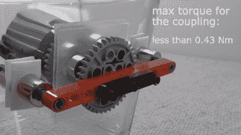

# 磁力耦合使这艘乐高潜艇不漏水

> 原文：<https://hackaday.com/2020/07/07/magnetic-couplings-make-this-lego-submarine-watertight/>

虽然在某些地区你很难分辨，但北半球现在是夏天，似乎总是会出现需要游泳池进行充分测试的项目。[Brick Experiment Channel]的最新作品[是一个几乎完全由乐高](https://www.youtube.com/watch?v=MdfUSNzc0Xk)制成的潜水器，就是这样一个项目，它让我们渴望天气让潜水变得明智而不是自杀。

 下面视频中的潜艇是对[版本 1](https://hackaday.com/2019/07/28/lego-powered-sub-built-in-a-water-jug/) 青睐的【砖块实验通道】的“罐中潜艇”方法的重大改进。这种容器不是从专门设计的不盛水的容器开始，而是一个宜家食品容器，有一个坚固的玻璃主体和一个带硅胶密封的柔性盖子。这一次，他没有穿透船体寻找传动轴并试图密封它们，而是建造了巧妙的磁力联轴器。

联轴器将扭矩从内部的马达传递到外部的齿轮和支柱。第一个版本使用注射泵压载舱来控制深度，这个版本使用垂直推进器。柔性盖子被证明是该方案的一个问题，因为随着深度的增加，它往往会倒塌，从而阻止潜艇浮出水面。这是解决了一些乐高支撑和铅丸压载调整用来保持潜艇中性浮力。

这看起来像一个夏天的乐趣，即使你没有足够的乐高玩具，它也可以很容易地适应其他材料。还有很多其他有趣的[BEC]乐高积木可以查看，其中一些我们已经介绍过了，包括[一个乐高无人机](https://hackaday.com/2020/01/15/lego-drone-finally-takes-off/)和[一个扑克牌射手](https://hackaday.com/2020/03/07/vanquish-your-foes-with-lego-playing-card-machine-gun/)。

 [https://www.youtube.com/embed/MdfUSNzc0Xk?version=3&rel=1&showsearch=0&showinfo=1&iv_load_policy=1&fs=1&hl=en-US&autohide=2&wmode=transparent](https://www.youtube.com/embed/MdfUSNzc0Xk?version=3&rel=1&showsearch=0&showinfo=1&iv_load_policy=1&fs=1&hl=en-US&autohide=2&wmode=transparent)

感谢提示，[Vox]！