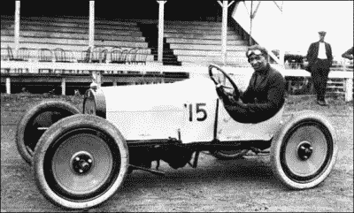
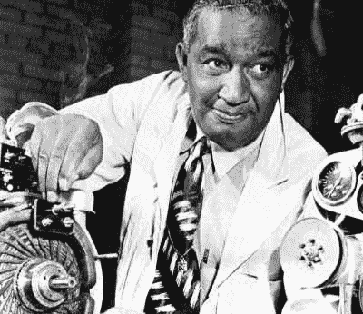
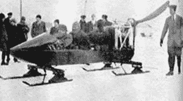
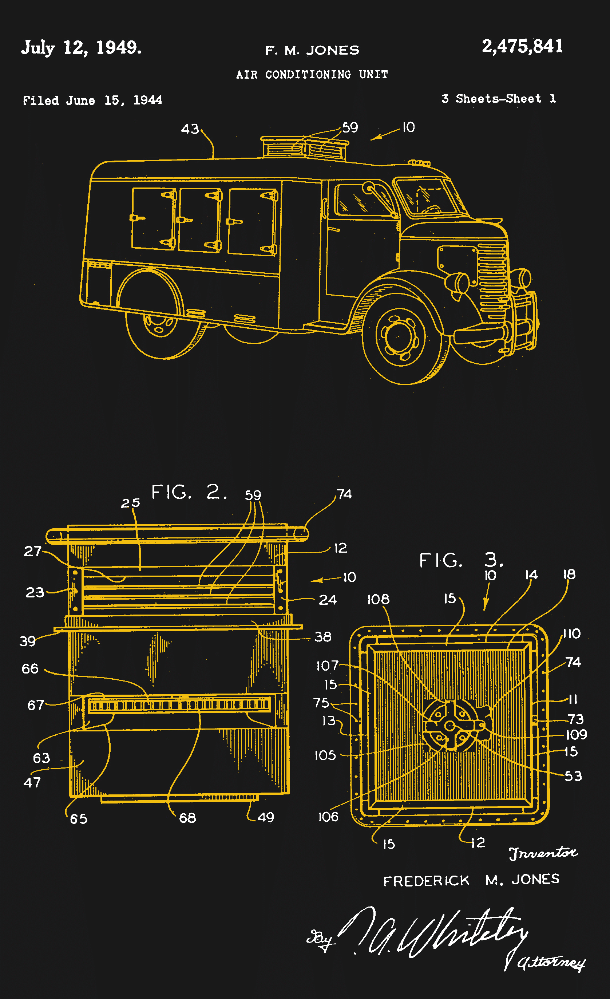
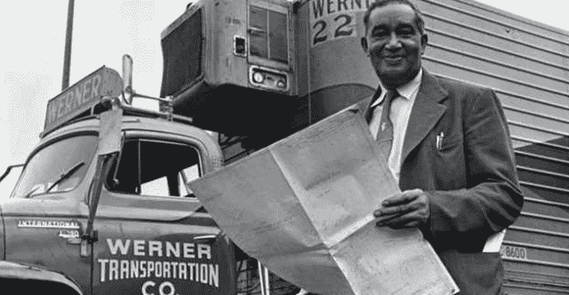

# 一年四季的新鲜食物？你应该感谢弗雷德里克·麦金利·琼斯

> 原文：<https://hackaday.com/2020/08/04/fresh-food-year-round-you-can-thank-frederick-mckinley-jones/>

当你还是个孩子的时候，夏天最确定的迹象之一就是听到冰淇淋车在附近爬行的快乐声音。你不担心那辆神奇的卡车是如何冷藏冰淇淋的，只担心它在你的街道上滚动，星星排成一行，你的父母给你钱买一个巨大的冰淇淋饼干三明治，边缘卷着小小的巧克力片。

在移动冷藏的早期，冰淇淋车和其他食品运输工具首先依靠冰，然后是干冰来保持易腐食品的低温。有人最终发明了电动冷却系统，但这些系统必须定期在发电站充电。还有一个寿命很短的机械系统，但它非常容易受到道路振动的影响。

在弗雷德里克·麦金利·琼斯出现之前，移动冷藏技术刚刚起步，易腐食品的来源极其局限和有限。20 世纪 40 年代初，弗雷德里克为第一个实用的卡车自动制冷系统申请了专利，它彻底改变了食品和药品的运输和储存。

## 寒冷的童年

Fred drives a race car that he built. Image via [The Black Inventor Online Museum](https://blackinventor.com/fred-jones/)

弗雷德里克·麦金利·琼斯经历了大多数人认为是艰难的人生开端。他于 1893 年出生在俄亥俄州辛辛那提，母亲是黑人，父亲是爱尔兰人。弗雷德里克的母亲在他还是个婴儿的时候就抛弃了他，他的父亲艰难地独自抚养他长大。

当没有孤儿院接受七岁的弗雷德里克时，他的父亲把他送到河对岸肯塔基州的一个天主教牧师那里生活。两年后，他父亲去世了。

小弗雷德从一开始就是个补锅匠，喜欢摆弄他父亲的怀表。牧师鼓励弗雷德对机械感兴趣，并让他在教堂礼拜时修理会众的汽车。

弗雷德一直和牧师住在一起，直到他 11 岁时辍学离家出走，回到河对岸的辛辛那提。他在一家汽车修理厂找到了一份看门人的工作，到 14 岁时，他已经成为一名机械师，并开始为他的老板制造赛车。不到一两年，老板就因为他上班时赛车而解雇了他。

## 杂工弗雷德

Fred with a refrigeration unit he designed. Image via [Star Tribune](https://www.startribune.com./from-tiny-hallock-to-huge-inventions/369538631/)

从那以后，弗雷德四处走动，打零工来养活自己。一天晚上，他主动提出在一家旅馆修理锅炉，以换取一个房间和几顿饭，尽管他没有使用锅炉或所需工具的经验。弗雷德干得非常出色，旅馆老板给他提供了一份工作，在他家位于明尼苏达州哈洛克的大农场当机械师。弗雷德收拾好行李，再次搬家。

这个农场对弗雷德来说是一个绝好的机会。一名在那里工作的工程师帮助他学习，并最终获得了工程执照。不久之后，弗雷德被征召参加第一次世界大战。一旦军官们看到了他的能力，弗雷德的机械技能很快就大受欢迎，他被要求在各种设备和车辆上工作。很快，弗雷德被提升为中士。

战争结束后，弗雷德回到了哈洛克的农场。他在业余时间通过阅读图书馆书籍和参加邮购课程自学新技能，如电子学。弗雷德作为一名勤杂工和问题解决者在镇上很快出名，多年来他为镇上建造了许多东西，包括镇上第一个广播电台的发射机。

Fred built a snowmobile to help doctors make house calls. Image via [ShipEx](https://shipex.com/2019/04/24/fredrick-jones-and-the-thermo-king-how-one-man-shaped-refrigerated-trucking-and-shaped-the-way-we-live-today/)

在一位镇上的医生抱怨不得不一直推着病人走到 x 光设备前后，弗雷德制造了一台便携式 x 光机。他还通过将滑雪板安装在飞机机身上，并在背面增加一个螺旋桨，建造了可以说是第一辆雪上汽车。目的？帮助医生在雪地里出诊。

有声电影出现后，哈洛克唯一的剧院无力升级设备，弗雷德制造了一台可以同步电影和声音的机器。这项发明引起了明尼阿波利斯一位名叫约瑟夫·努莫罗的电影业商人的注意，他于 1930 年雇用了他。

## 酷之王

The first practical system for mobile refrigeration. From [US Patent 2,475,841A](https://patents.google.com/patent/US2475841)

但是定义弗雷德遗产的问题是作为一个即兴评论出现的。Numero 的一个高尔夫球友向他抱怨一辆运家禽的卡车一夜之间被卡住了。所有的冰都融化了，整批货物都毁了。Numero 只是在向 Fred 讲述这个故事，但他还是很认真地对待这个问题。

问题是双重的；车辆缺乏运行制冷系统所需的动力，汽车应用中存在的振动使得现有的制冷不可行。

弗雷德的方法是发明一个单独的装置，安装在任何封闭空间的屋顶上，由冷却装置和驱动它的电机组成。这使得它既紧凑又易于修理。使用专用发动机解决了动力问题，通过使用恒温控制电机(他[获得了专利](https://patents.google.com/patent/US2477377))制冷装置是自动的。有了弗雷德的解决方案，Numero 退出了电影行业，这样两人可以一起进入制冷行业。他们创办了美国热电控制公司，后来被称为热电王。

弗雷德的发明及时到来，在二战中发挥了巨大作用。美国国防部选择了弗雷德的一个移动制冷装置用于整个武装部队，它们出现在从 B-29 驾驶舱到野战医院的任何地方。这个想法很快扩展到飞机和货车上，我们今天都受益匪浅的冷藏运输链就这样诞生了。

Fred with a Thermo King refrigerated truck. Image via [World Kings](http://worldkings.org/news/world-almanac-event-academy/worldkings-on-this-day-july-12-2018-frederick-mckinley-jones-receives-a-patent-for-an-air-conditioning-unit-for-trucks-helping-to-change-long-haul-carriage-of-food-and-blood-in-1940)

疾病迫使弗雷德在 20 世纪 50 年代末从 Thermo King 退休，他于 1961 年死于肺癌。他是第一个获得国家技术奖章的非洲裔美国人，他于 1991 年被追授。

多年来，弗雷德里克·琼斯没有得到他应得的所有荣誉，原因有几个。他没有为他早期的发明申请专利。但是，他也是一个半黑人，在 20 世纪早期的美国发明了很多东西。无论他去哪里，人们都怀疑他的能力，但一旦看到他的能力，他们通常会变得温和起来。弗雷德是一个白手起家的人，很明显，他总是采纳自己的建议:愿意工作，愿意读书和学习来丰富你的生活，永远相信自己。