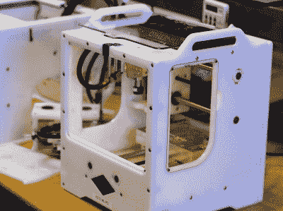

# 矮脚鸡工具印刷电路板厂得到一个凶猛的新续集

> 原文：<https://hackaday.com/2020/07/07/bantam-tools-pcb-mill-gets-a-ferocious-new-sequel/>

当第一台 Bantam Tools 的铣床着陆时，它将 PCB 原型制作放在了最前沿，为在几分钟内旋转出电路板提供了顺畅的软件和硬件管道。现在，矮脚鸡工具公司的人回来了，他们将这些见解融入到一台新机器中，这台新机器使切割铝成为一流的特征。虽然从他们的公告页面上还看不到机器的详细信息，但知道 Bantam Tools 花了几年时间将学生的教室变成硬件原型让我们放心，我们得到了很好的照顾。现在让我们透露一些关于这个野兽的秘密。

## 建设中的重大转变

Othermill made from HDPE

这台机器的传统可以追溯到几年前另一家机器公司的设计[，被称为 Othermill](https://hackaday.com/2016/08/02/the-othermill-vs-import-a-technical-comparison/) 。它由高密度聚乙烯制成的紧凑结构设计而成。这样做使机器相当轻便，易于用减法工具从大板材制造，更不用说给它一个可爱的 A+午餐盒美学。2017 年，Bre pett is——MakerBot 的创始人和 Glowforge 的投资者——收购了该公司，将名称改为 Bantam Tools，并将重点转移到专业桌面铣削。

今天的产品正式名称为 Bantam Tools Desktop 台式数控铣床，将工作区域扩大到 3 英寸×9 英寸×7 英寸。这种变化需要更坚硬的结构，设计团队不惜代价选择厚钢线性运动组件安装在坚固的铝框架中。就像以前的模型一样，Bantam Tools 的新机器将得到一个完整的外壳，使其成为教室和办公室的友好设备。

仔细观察结构本身，机器框架借用了激光切割组件平板快速成型的 T 型槽技术。然而，与激光切割塑料接头不同，铝框架应该足以抵抗日常操作中这些接头上的任何应力。这种结构也让我们怀疑机器是由工厂车间的工人摆正并与独立的固定装置对齐的。在这种设置中，机器的精度来自使用基准的装配过程，而不是制造零件的机器的精度，这保持了组件的简单和制造费用的降低，而不损害机器制造精密零件的能力。

## 软件封装

让我们坦率地说。切割铝是很难的，尤其是在高速使用微型工具的情况下。如果不认真考虑刀具的进给量和速度，我们很容易留下一大堆碎片、一小堆金属屑和一个永远无法完成的零件。但是不要害怕。在过去的几年里，Bantam Tools 采用了复杂精密的两层电路板铣削工艺，并通过简化的软件工作流程对其进行了简化。怎么会？封装。

通过将越来越多的机器行为委托给软件，并接受各种常见的文件格式，新手和专家都可以很容易地使用最终的机器。随着越来越多的人成为多面手，封装成为关键。这有助于我们这些不整天磨磨蹭蹭的人，变得和那些日复一日磨磨蹭蹭的人一样有能力制造零件。

随着他们新模型的到来，Bantam Tools 承诺了一套热衷于做完全相同事情的新软件工具。像他们的 2.5D *自动凸轮*这样的功能，可以将 2D SVG 转换成刀具轨迹，正好说明了用户简单性的原则。我相信，他们以前的经验可以吸收一些关键元素，使切割铝如此棘手，并简化它们，隐藏复杂性，并提供良好的整体用户体验。

## 更强大的车库、办公室和黑客空间

作为热切的旁观者，我们很高兴地看到 Bantam Tools 从早期的 [MTM-Snap 原型](https://hackaday.com/2011/06/02/snap-together-pcb-mill/)，到听说[自举硬件创业](https://hackaday.com/2017/12/08/danielle-applestone-building-the-workforce-of-2030/)的喜忧参半，[听说早期成功的 PCB 原型机](https://hackaday.com/2015/03/27/hands-on-othermill-review-grinds-out-sparkling-results/)，到他们最新的[更名](https://hackaday.com/2017/09/06/other-machine-co-changes-name-logo-apparently-nothing-else/)。我仍然有同样的渴望看到一个团队的新设计，他们将巨大的梦想包装成微小的机器。但是你怎么看？请在评论中告诉我们。