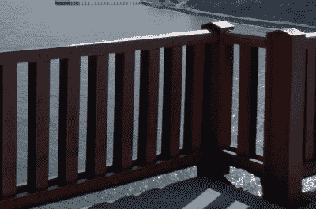

# 三重水上的桥:金门大桥如何开始歌唱

> 原文：<https://hackaday.com/2020/07/08/bridge-over-trebled-water-how-the-golden-gate-bridge-started-to-sing/>

整个春天，从马林县到普雷斯迪奥的一些湾区居民注意到了一种持续的、不可替代的高音。六月初，声音达到了一个新的峰值，怪异噪音的录音传遍了推特和脸书。不久之后，负责这座标志性吊桥维护的机构金门大桥、高速公路和交通区揭开了谜底:声音是由强风吹过大桥新安装的人行道栏杆的板条引起的。虽然没有提供更具体的解释，但这种声音很可能是风的声音，当风吹过尖锐的边缘时产生的噪音，导致空气中出现微小的谐波漩涡。

金门大桥栏杆的改造是自 1997 年以来一直在进行的多阶段改造中最新和最引人注目的部分。1989 年洛马普列塔发生 6.9 级地震后，金门大桥、公路和交通区(以下简称“该区”)开始为这座标志性的大桥做准备，以应对在其有希望的长寿命中可能遇到的风力和地震荷载。尽管这座桥已经经受住了海湾强劲东风的冲击，并被小地震震得嘎嘎作响，但新的分析技术和施工方法可以帮助这座桥抵御任何未来的横向载荷。改造的第一和第二阶段分别针对马林高架桥(桥的北引道)和 Fort Point 拱门。第三阶段，也是当前阶段，解决主跨问题。

## 桥梁对抗的不仅仅是重力

 吊桥是用来支撑自身重量以及它所承载的所有汽车和行人的重量。桥面由垂直吊杆支撑，吊杆从俯冲的悬索上垂下。这些完全受拉的悬索将它们的重量转移到塔中(通常有两个)，压缩并将力传递到地面。

悬索桥在抵抗这些重力方面非常有效，但像所有其他地上结构一样，它们也必须抵抗风吹或地面震动时施加在其上的水平力。当风垂直吹向桥跨时，桥面会像晾衣绳一样在微风中摇摆。在极端情况下——最明显的是 1940 年塔科马海峡大桥的倒塌——风中路面的摇摆会引发反馈循环，最终导致大桥自身扭曲。(考虑到塔科马海峡的坍塌，金门大桥[在 20 世纪 50 年代用一系列桁架](https://www.goldengate.org/exhibits/resisting-the-twisting/)加固，以帮助提供额外的抗扭刚度。)

## 抵抗风(躲避风)

虽然金门大桥已经安全地抵御了 80 年来从西部吹向旧金山湾的大风，但工程师们仍然担心大桥横向系统的长期可行性。该地区的公共事务经理 Paolo Cosulich-Schwartz 表示，该桥目前在每小时 68 英里的风速下是安全的，但该地区有时会遇到每小时超过 100 英里的大风。因此，任何阻力或暴露的横向表面积的减少都将有利于桥梁的横向系统。

用更苗条的东西取代原来的矮胖的行人栏杆是减少暴露在风中的表面积的相对简单的方法。这项工作可以在路面上完成，不需要临时脚手架，甚至不需要中断大桥的大部分交通。即使是这种看似微小的修改，当延伸到整个桥梁长度时，也会有显著的结构效益:新的栏杆减少了数千平方英尺的暴露表面积，这意味着可能减少数十万磅的横向风荷载。

然而，新栏杆的设计不仅仅是空气动力学方面的考虑。Cosulich-Schwartz 解释说:“当桥梁工程师设计最初的栏杆时，他们希望行人有安全感，但他们也希望驾车者能够欣赏西边海洋和东边旧金山市的壮丽景色。所以他们想出了这种坚固的板条设计，但当你高速行驶时，它们看起来是透明的。”[新栏杆](https://www.thedrive.com/news/33921/now-the-golden-gate-bridge-sings-an-apocalyptic-hum-when-its-windy-out)必须满足原始设计的功能和美学要求，同时还要减少表面积。

Old railings

New Railings [via [Marin Independent Journal](https://www.marinij.com/2020/06/30/golden-gate-bridge-officials-say-singing-phenomenon-was-unforseen/)]

施工前，该区对新的路面进行了风洞分析，包括对最西边栏杆的修改(可见于[金门大桥区的风洞测试视频](https://www.youtube.com/watch?v=PYS6Z3pbmsA)，在大约 2:53 标记处的左侧)。然而，二十分之一比例的测试并没有提供足够精细的结果来预测栏杆会在大风中尖叫。“在我们的研究和分析中，我们发现会有一些声音，但没有任何一点表明我们会听到 6 月 5 日听到的声音的水平和程度，”Cosulich-Schwartz 转述道。

## 三重水上的桥

> 你可能听过这个声音:
> 
> 金门在鸣笛。💨[pic.twitter.com/ItOMTm8Z08](https://t.co/ItOMTm8Z08)
> 
> —布罗迪巴西(@ BrodieNBCS)[2020 年 6 月 6 日](https://twitter.com/BrodieNBCS/status/1269349433172389888?ref_src=twsrc%5Etfw)