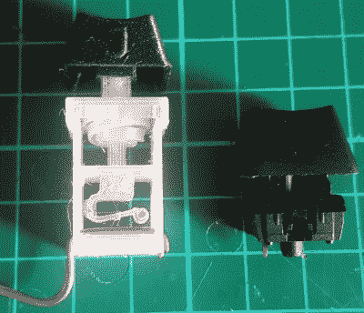

# 3D 打印一个宏垫，开关等等

> 原文：<https://hackaday.com/2020/07/09/3d-printing-a-macro-pad-switches-and-all/>

如今，在 3D 打印外壳内构建宏垫已经不是什么新闻了。添加 3D 打印键帽也是如此。但是如果你像[詹姆斯·斯坦利]一样，真的把开关打印出来，我们不得不承认这完全是另一回事。

 现在你可能想知道【詹姆斯】是如何设法打印出一个机械键盘开关的，它只有你花园里的樱桃那么大。简单的回答是他没有。虽然他的印刷开关与传统开关的占地面积相同，但它们的高度却是传统开关的两倍。

如果没有印刷的弹簧，开关可能会做得更小，但使用“真正的”开关会使目的落空。尽管我们确实想知道[的机械设计是否可以通过使其成为光学开关](https://hackaday.com/2019/11/18/optical-keyboards-have-us-examining-typing-at-light-speed-ish/)来简化。

但是印刷开关真的经得起日常使用吗？[James]也想知道同样的事情，所以他建造了一个测试平台，可以点击开关，并计算在它们停止工作之前有多少次迭代。这一测试似乎表明，这些按键要么会由于某些机械缺陷而迅速失效，要么会持续几十万次按压。所以假设你早早剔除了无用的东西，你应该会有很好的状态。

自然，每个印刷开关内部都有一些铜片作为实际触点。但除此之外，你需要自己构建一个可打印的 pad，只需要一个支持 USB-HID 的微控制器，如 Arduino Pro Micro。如果你用的是 ESP32，[你甚至可以把它做成蓝牙](https://hackaday.com/2020/02/13/emulating-a-bluetooth-keyboard-with-the-esp32/)。

 [https://www.youtube.com/embed/uHkOPBxnLtM?version=3&rel=1&showsearch=0&showinfo=1&iv_load_policy=1&fs=1&hl=en-US&autohide=2&wmode=transparent](https://www.youtube.com/embed/uHkOPBxnLtM?version=3&rel=1&showsearch=0&showinfo=1&iv_load_policy=1&fs=1&hl=en-US&autohide=2&wmode=transparent)

