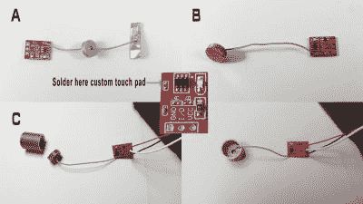

# 是钟表卷土重来的时候了

> 原文：<https://hackaday.com/2020/07/10/its-time-for-watch-clocks-to-make-a-comeback/>

除了孟菲斯设计的各种色彩和几何影响，巨大的手表时钟是我们在 80 年代最喜欢的东西之一。我们一直想要一个，坦率地说，我们仍然想要。显然，[Kothe]也是如此。但是，不同于一些引人注目的斯沃琪风格，[Kothe]走了一条书呆子路线，建造了一个巨大的卡西欧 F-91W 挂在墙上。

 它不仅看起来棒极了，从闹钟到秒表再到背光屏幕，它拥有原版的全部功能。嗯，除了水的阻力。表壳是 3D 打印的，皮带扣和纽扣也是。[Kothe]可能印了带子，但它们对床来说太大了。相反，它们由激光切割泡沫制成，并刻有所有细节。

里面有一个 7 英寸的触摸显示屏，一个实时时钟模块和一个 Arduino Mega，让一切都滴答作响。为了让每个印刷按钮都能工作，[Kothe]巧妙地用一些铜带扩展了触摸传感器模块的输入板。我们认为，如果它模仿卡西欧的一款计算器手表，只会更棒，但这可能要求太高了。休息之后，花几秒钟时间观看演示。

喜欢你的时钟不像时钟？了解这款基于吃角子老虎机的击晕器的内部工作原理。

 [https://www.youtube.com/embed/r_1-9a8SJyw?version=3&rel=1&showsearch=0&showinfo=1&iv_load_policy=1&fs=1&hl=en-US&autohide=2&wmode=transparent](https://www.youtube.com/embed/r_1-9a8SJyw?version=3&rel=1&showsearch=0&showinfo=1&iv_load_policy=1&fs=1&hl=en-US&autohide=2&wmode=transparent)

