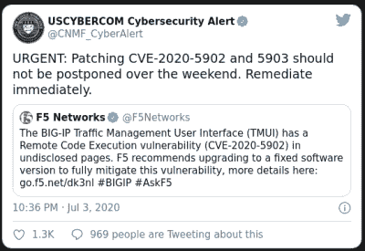

# 本周安全:F5、新型勒索软件、Freta 和数据库灾难

> 原文：<https://hackaday.com/2020/07/10/this-week-in-security-f5-novel-ransomware-freta-and-database-woes/>

上周的大事件是 F5 的 BIG-IP 设备出现了问题。一个相当小的路径遍历漏洞使得未经身份验证的用户能够调用旨在限制为经过身份验证的端点。这种攻击显然很简单:

```

'https://[F5 Host]/tmui/login.jsp/..;/tmui/locallb/workspace/tmshCmd.jsp?command=list+auth+user+admin'

```

[](https://hackaday.com/wp-content/uploads/2020/07/cybercom.png) 一个完整的漏洞[已经被添加到 metasploit 框架](https://github.com/rapid7/metasploit-framework/pull/13807)中。这个 bug 的时间线快得惊人，因为它显然在野外被积极利用。F5 设备在世界各地都有使用，这个漏洞不需要特殊配置，只需要访问开放的管理端口即可。幸运的是，默认情况下，F5 设备不会将易受攻击的接口暴露给互联网，但这仍然有很多可能成为问题。

### 弗雷塔

微软已经公开发布了一款新工具，Freta T1。该工具在从 Linux 虚拟机上传的内存快照中搜索 rootkits。这个名字恰如其分地取自玛丽·居里出生的街道。

> 该项目的同名，华沙的弗雷塔街，是玛丽居里的出生地，战地成像的先驱。

这个项目背后的动力是意识到一旦一个恶意的行为者危害了一台机器，就有可能危害这台机器上运行的任何安全软件。相反，如果能进行某种安全 x 光检查，那么就能得出更可靠的结论。Freta 利用了虚拟机模型和现代虚拟机管理程序内置的快照功能。

正如您可能想象的那样，将 Linux 虚拟机的快照发送给微软进行扫描的想法遭到了一些质疑。也就是说，Freta 的主要用例可能是 Azure 云，因此有理由将其视为该生态系统的另一个工具。看到这项技术成熟会很有趣，因为它似乎有很大的潜力。

### IE11 中的漏洞兼容性

今年早些时候，在 Internet Explorer 中发现并修复了另一个`jscript.dll`漏洞。简单回顾一下，`jscript.dll`是来自 IE8 的 javascript 引擎。IE8 兼容模式的持续存在意味着这个旧的代码库仍然存在于现代的 Windows 版本中。如果 IE8 只能通过用户干预来访问，这就不是什么大问题了，但是网站可以请求这种兼容模式，这意味着简单地访问一个恶意网站就可能导致攻击。

本周我们将对 CVE-2020-1062 这个问题中的 bug 进行详细的观察。这是 free 之后的一个用法，它是通过在一个对象的覆盖回调中释放该对象来触发的。在示例代码中，漏洞定义了“toString”函数，并设法释放该函数中的父对象。几乎总是如此，找到崩溃是容易的一部分，但是将它转化为一个有效的利用要困难得多。释放后使用错误本身不允许代码执行，但会导致代码执行跳转到攻击者控制的位置。使用二进制忍者工具，研究人员找到了一个他们可以跳转到的现有函数，并从那里实现远程代码执行。完整的故事比我们在这里的空间覆盖更复杂，所以去检查一下完整的细节。

### Citrix 错误详细信息

今年早些时候，[我们报道了 CVE-2019-19781，](https://hackaday.com/2020/01/24/this-week-in-security-chrome-speech-bug-udp-fragmentation-and-the-big-citrix-vulnerability/)另一个路径横向漏洞，但这次是在 Citrix 产品中。现在，距离最初的披露已经过去了六个月，米哈伊尔·克柳奇尼科夫已经给[写了一份关于缺陷](https://swarm.ptsecurity.com/remote-code-execution-in-citrix-adc/)的更详细的报告。

本质上，这个漏洞很简单。在 Citrix 网关上，“/vpn/”托管远程用户的登录页面。url 没有被适当地清理，所以类似于:`/vpn/../vpns/portal/scripts/[scriptName].pl`
的东西不需要认证，但是确实在给定的位置执行 Perl 脚本。作为一个未经认证的用户直接与这些脚本交互的能力会有很大问题，但是`newbm.pl`脚本实际上允许将数据写入任意位置。在执行 Perl 脚本的能力和写入文件系统的能力之间，利用这个漏洞安装一个远程 shell 是相当容易的。

### 勒索软件在 u 盘上搭便车

Try2cry 是一个新的勒索软件，[通过 u 盘](https://www.gdatasoftware.com/blog/2020/07/36200-ransomware-tries-to-worm)传播自己。在过去，这种蠕虫会简单地使用 Windows 的自动运行功能，在插入时自动感染机器。在现代机器上，由于禁用了自动运行，恶意软件作者必须更有创造性才能传播他们的产品。Try2cry 将其安装程序复制到闪存驱动器的根目录，将所有现有文件和文件夹标记为隐藏，然后创建快捷方式来代替隐藏的文件。这些快捷方式都指向恶意软件安装程序，希望用户不会注意到这一变化，并在试图访问文件时安装恶意软件。

显然，这个勒索软件只不过是 GitHub 上的开源“愚蠢”勒索软件的复制和粘贴。好消息是[它可以用可用的工具](https://www.bleepingcomputer.com/ransomware/decryptor/how-to-decrypt-the-stupid-ransomware-family-with-stupiddecrypter/)解密。

### MongoDB 勒索软件

是的，甚至更多的勒索软件。MongoDB 数据库非常受欢迎，大约有 45，000 个数据库暴露在互联网上。问题是其中一半没有密码。任何人都可以连接、读取和写入它们。是的，其中许多可能只是为了测试，但不可避免的是，其中一些也有实时数据。显然，一些有抱负的 blackhat 意识到所有那些未受保护的数据库都是主要目标，[并发起了攻击](https://www.zdnet.com/article/hacker-ransoms-23k-mongodb-databases-and-threatens-to-contact-gdpr-authorities/)。

每个数据库都被擦除，一个勒索笔记被添加到位。就勒索软件而言，请求的. 015 BTC 相当便宜，在撰写本文时价值 138 美元。攻击最糟糕的部分可能是附带的威胁:泄露窃取的数据，然后代表那些数据被暴露的人提交 GDPR 投诉。

### 最后…

桑巴最近宣布了一对[bug](https://www.samba.org/samba/security/CVE-2020-14303.html)的[对](https://www.samba.org/samba/security/CVE-2020-10745.html)。到目前为止，看起来这两个问题都不能导致 RCE，但他们很容易发动拒绝服务攻击。一种攻击是 zip 炸弹的变种，其中由 8127 个点组成的 DNS 名称导致 Samba 失去理智。另一个缺陷是由包含空数据消息的 UDP 数据包触发的代码软锁。这两个缺陷都要求在 Active Directory 配置中启用 netbios。

IBM 的 Db2 数据库软件有[个可远程攻击的缓冲区溢出](https://www.ibm.com/support/pages/node/6242332)。这个问题会导致以根用户身份执行任意代码，所以如果您运行的是 big blue，请确保安装了补丁。