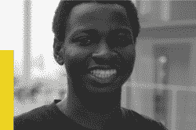
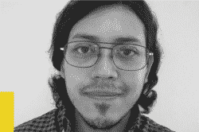
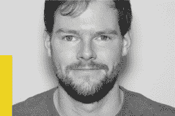
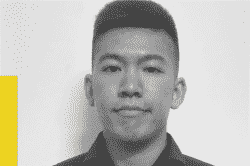
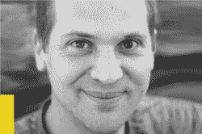

# 梦之队成员宣布角逐 2020 年黑客日奖

> 原文：<https://hackaday.com/2020/07/10/dream-team-members-announced-for-the-2020-hackaday-prize/>

梦之队计划是 [2020 Hackaday 奖](https://prize.supplyframe.com/)的一个令人兴奋的新元素，今年夏天有 12 人被接受为我们每个非营利合作伙伴的一个特定问题全职工作。每个三人小组已经深入到工程冲刺阶段来整合设计，为了表彰他们的努力，他们将在为期两个月的项目中每月获得 3000 美元的小额赠款。

休息后加入我们，与每个团队的成员见面，体验他们的工作。我们将跟随他们在梦之队项目页面上发布详细的工作日志。

## 保护 X 实验室梦之队

艾琳·肯尼迪、奥卢瓦托比·奥因罗拉和莱昂纳多·沃德被选入 X 实验室保护梦之队。Erin 是机器人任务的技术创始人，最近完成了国际空间大学的空间研究项目，来自加拿大安大略省。Oluwatobi 是来自尼日利亚伊巴丹的嵌入式系统工程师、发明家和物联网布道者。莱昂纳多是一名从事未来技术研究的电子工程师，住在委内瑞拉的拉瓜伊拉。

他们一起努力应对减少世界海洋中的“幽灵设备”的挑战，这些来自渔业和海洋工业的设备不会回到船上，而是作为污染留在环境中。

## 现场就绪梦之队

Antonio Anaya、Meesha Gupta 和 Thomas Hartley 被选入现场就绪梦之队。Antonio 拥有在偏远和困难环境中调整方法和工具的经验，现居住在墨西哥的 Tuxtla Gutierrez。米夏是一名电气工程师，他致力于制造假肢，住在纽约的斯克内克塔迪。Tom 是一名设计工程师，拥有计算机科学和电子背景，现居英国伦敦。

他们一起应对挑战，确保分布式制造流程的质量控制。当在偏远地区和灾难救援情况下开发现场制造时，一个什么可行什么不可行的反馈回路将成倍增加努力的有效性。

## 地球梦之队

Sameera Chukkapalli、Jason Knight 和 Alex Whittemore 入选了 CalEarth 梦之队。Sameera 是西班牙巴塞罗那 Needlab 的高级建筑师和主任。Jason 是一名产品设计师，对生物制造和设计感兴趣，现居荷兰埃因霍温。Alex 是一名电子工程师，擅长面向制造的设计，住在加利福尼亚州曼哈顿海滩。

他们正在共同应对 SuperAdobe 住宅建筑过程自动化的挑战。进入土制建筑系统的劳动力是这个建筑过程中最昂贵和最耗时的部分，任何效率的提高都意味着以更少的时间和费用建造更多的房屋。

## 洛杉矶联合脑瘫梦之队

Kelvin Chow，Ruben Kackstaetter 和 Nataliya Kosmyna 入选了 UCPLA 梦之队。Kelvin 是来自加拿大多伦多的机械和生物医学工程师。Ruben 是一名嵌入式软件工程师，拥有电气工程背景，住在科罗拉多州的 Frederick。Nataliya 是麻省理工学院的研究员和企业家，拥有计算机科学博士学位，住在马萨诸塞州的波士顿。

他们正在共同应对设计一种新型通用遥控器的挑战，以满足残障人士的需求。一次性无障碍设备贵得惊人，而且需要专业技能才能融入日常生活。这个梦之队将致力于打破成本和可用性的障碍，帮助那些面临各种身体挑战的人。

## 我们希望在 Hackaday 奖中看到您的项目！

祝贺所有梦之队成员，看到来自世界各地的人们聚在一起迎接挑战是令人兴奋的。当然，这就是黑客日奖的意义所在，我们希望看到每个人都花一些时间来解决难题。

您必须在 8 月 31 日之前提交自己的参赛作品，参加 2020 年 Hackaday 奖的[挑战类别。你将解决由今年的非营利合作伙伴](https://prize.supplyframe.com/)强调的[现实世界的问题，并角逐 50，000 美元的大奖和其他九个最高奖项。我们迫不及待地想看看你在做什么！](https://prize.supplyframe.com/#section-challenges)

 [https://www.youtube.com/embed/cXeuMvBzd3c?version=3&rel=1&showsearch=0&showinfo=1&iv_load_policy=1&fs=1&hl=en-US&autohide=2&wmode=transparent](https://www.youtube.com/embed/cXeuMvBzd3c?version=3&rel=1&showsearch=0&showinfo=1&iv_load_policy=1&fs=1&hl=en-US&autohide=2&wmode=transparent)

[hack adayprize 2020](https://prize.supplyframe.com)主办单位: