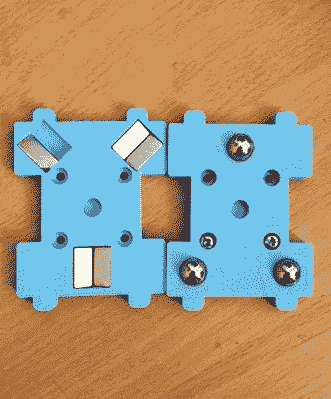

# 更换工具的 3D 打印机不应该破产

> 原文：<https://hackaday.com/2020/07/18/tool-changing-3d-printers-shouldnt-break-the-bank/>

Close-up on the magnetic coupling

桌面 3D 打印的圣杯之一是在多种材料中打印的能力，用于混合颜色或纹理的打印。有带多路热端的打印机，可以更换灯丝的附件，或带工具更换器的打印机，可以根据需要更换热端。[【Amy】已经用她的超立方体](https://github.com/AmyTheCute/The-Doot-Changer)走完了最后一条路，她的 Doot Changer 允许她轻松地打印两种材料。最棒的是，她告诉我们只花了她 20 美元。

对于那些不熟悉超立方体打印机的人来说，他们有一个使用铝挤压制成的大致立方体框架。后部上导轨上有一对带金属定位销的插座，热端装置可插入其中。打印机托架有一个磁耦合，可以随意从其插座中拾取或分离热端，[可以在一个简短的视频剪辑](https://photos.google.com/share/AF1QipMckyPmCH_PquzbEopENf9IaGUuN5aiC5iaxAuRsasSdMLbDzykcTQSmtzGHmWsiQ/photo/AF1QipORwC9Ds5Dc51-eJVjxkg_2k2QpIcJ-JUcrzGg?key=TEJLQzN3THdMVUtMRnc0UXotVEtfU3otSF9jeFpn)中看到。

所有的部分[都可以在 Thingiverse](https://www.thingiverse.com/thing:3914045) 上找到，如果你想看更多，还有一个相册，里面有很多令人赏心悦目的东西。同时，就刀具更换器而言，[我们之前已经深入探讨过了](https://hackaday.com/2019/11/14/jubilee-a-toolchanging-homage-to-3d-printer-hackers-everywhere/)。