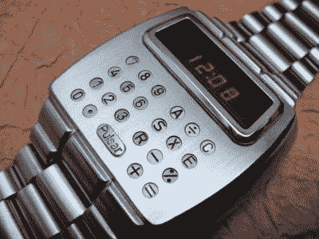

# 1975 年电路板是藏在你手腕上的杰作

> 原文：<https://hackaday.com/2020/07/13/1975-circuit-board-was-a-masterpiece-hidden-on-your-wrist/>

关于电路板应该设计成 45 度角还是 90 度角的争论已经持续多年了。为什么要把它们做成带角的呢？这幅令人惊叹的电路板艺术来自一款大约 1975 年的电子表。

Pulsar Calculator 手表是同类产品中的第一款，配有手写笔来操作微型按钮。电路板的走线应该是手工绘制的，解释了柔和的曲线而不是直线。板上芯片的结构很狂野，硅芯片直接焊接到图中多个芯片上的走线。这个模型上还有一个水银倾斜传感器，当没有被举起来查看时间(或计算你在 Ritz 的小费)时，它会关闭显示器。

我们在网上找到了这款手表的工作模型，售价约为 225-350 美元。考虑到这些的原始标价据报道是 550 美元(考虑到通货膨胀是 2600 美元)，这真是便宜。

PCB 艺术品的美丽被隐藏了起来，不仅仅是在表壳内部，而是被塑料电池外壳所掩盖，右边的标签就焊接在这个外壳上。想想有多少极客有幸拥有其中一个，却从未意识到其内在的美。如果你正在寻找更多这些隐藏的杰作，请查看[Greg Charvat 的]关于收集和修复数字手表的文章。

[via [邪恶疯狂科学家实验室链接转储](https://www.evilmadscientist.com/2020/linkdump-july-2020/)