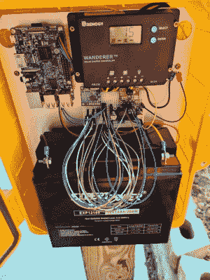

# 太阳气象站监听闪电

> 原文：<https://hackaday.com/2020/07/13/solar-weather-station-listens-for-lightning/>

如今，自定义气象站是一个非常常见的项目，尤其是基于 ESP8266 的项目。把一个传感器接到 MCU 上，用一个旧手机充电器给它充电，你就成功了一半。但是如果你想要一个可以长期远程操作的东西，你必须多花点心思。

 这正是[【BuckarewBanzai】为他的太阳能树莓 Pi 气象站](http://zerogravityantfarm.com/post/a-solar-powered-weather-station-pt1/)所做的。凭借工业级 NEMA 级外壳、结实的 35 瓦光伏电池板和足以让展览持续几天的铅酸电池容量，这一建筑肯定比大多数建筑更坚固。有些人可能会称之为矫枉过正，但我们认为任何曾经在户外部署硬件超过几天的人都知道，当大自然母亲参与进来时，你永远不会太小心。

为了保持 18 Ah 的电池充满电，[BuckarewBanzai]使用 10 安培的 Wanderer 充电控制器。听起来好像他在选定这一个之前已经烧过几个较小的模型了；您自己的离网项目需要考虑的一些事情。然后使用 LM2596 调节器为 Raspberry Pi 提供稳定的 5 V 电压。

除了可以检测温度、湿度和压力的 BME280 环境传感器，还有一个机载 AS3935 闪电传感器，[BuckarewBanzai]说它可以检测 40 公里以外的雷击。所有这些环境数据都被收集并存储在一个本地 SQLite 数据库中，并且每五分钟通过一个 REST API 被推送到异地，以便可以用 Grafana 可视化。

观众中的批评者无疑会注意到位于气象站中心的无焊试验板，但[BuckarewBanzai]说他已经在处理这个案子了。他正在开发一种可以接受各种模块化组件的定制 PCB。他说，这不仅会使电台更加可靠，还会减少“意大利面条”式的布线。尽管从记录来看，这还不算是我们在那个部门见过的最糟糕的违规者。