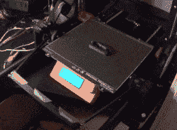

# 自动化零件拆卸随着链生产附加变得严重

> 原文：<https://hackaday.com/2020/07/20/automated-part-removal-gets-serious-with-the-chain-production-add-on/>

赋予 3D 打印机删除自己打印内容的能力意味着它可以自动生产一个又一个零件，而不需要依赖人工操作。[Damien Weber]已经对他的 Prusa MK3/S 打印机做到了这一点，他称之为[链式生产插件](https://github.com/d-weber/prusa-chain-production)。

 【达米安】的方法是我们以前没有见过的。当打印完成时，风扇冷却零件，然后一个手臂(看起来像是以一定角度连接的实用刀片)在床的后面摆动。手臂向前拉动，将印刷品从床上铲起，在此过程中倾倒完成的部分。它全部由 3D 打印部件、铝挤压件和硬件、两个步进电机和一个驱动 PCB 制成。上面链接的 GitHub 储存库保存了所有的设计文件，但是在 PrusaPrinters.org 也有一个项目页面。

不太清楚它是如何工作的？在下面嵌入的视频中观看它的运行。

 [https://www.youtube.com/embed/xZeJeUdq0wY?version=3&rel=1&showsearch=0&showinfo=1&iv_load_policy=1&fs=1&hl=en-US&autohide=2&wmode=transparent](https://www.youtube.com/embed/xZeJeUdq0wY?version=3&rel=1&showsearch=0&showinfo=1&iv_load_policy=1&fs=1&hl=en-US&autohide=2&wmode=transparent)

过去，我们已经看到了许多不同的自动零件移除方法。[真的从床上打出印刷品](https://hackaday.com/2015/06/06/automatic-print-ejector-for-all-3d-printers/)是我们见过的事情，我们也见证了[一个工业机器人手臂处理整个打印场](https://hackaday.com/2016/06/27/automating-3d-printers-with-robots/)。