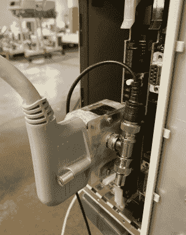

# DIY 加密狗为破损的呼吸机注入生命

> 原文：<https://hackaday.com/2020/07/15/diy-dongle-breathes-life-into-broken-ventilators/>

在新冠肺炎的传奇中，我们有了一个新的英雄，一个波兰的黑客。不管这个人是谁，[他们正在制造盗版加密狗，让通风机翻新者绕过锁定软件](https://www.vice.com/en_us/article/3azv9b/why-repair-techs-are-hacking-ventilators-with-diy-dongles-from-poland)，这样他们就可以修理从二手市场买的坏通风机。

 加密狗是美敦力公司生产的一种产品的 DIY 复制品，当然他们不会卖给任何人。它在病人的监视器、呼吸输送系统和计算机之间建立了一个三方连接，并让技术人员在两台故障机器之间同步软件，这样它们就可以变成一台工作的呼吸机。[该公司在三月底](https://hackaday.com/2020/03/30/professional-ventilator-design-open-sourced-today-by-medtronic/)开源了一款旧机型，但这被广泛视为公关噱头。

这不仅仅是修理权传奇的最新篇章。随着医院挤满了新冠肺炎患者，其中许多人将因无法使用呼吸机而死亡，从锁定的拖拉机和电话开始的事情发生了严重的转变。不仅是通风机短缺，而且许多生产通风机的公司拒绝外部维修技术人员获取手册和零件。

这些公司坚持认为他们自己的内部技术人员是唯一接触机器的人，而且许多人不怕承认，在销售完成后很久，他们认为通风机是他们的财产。可笑的是，他们没有足够的人力去修理所有坏了的通风设备，人们也没有时间去伺候他们。

我们希望能够与读者分享加密狗原理图，但可惜我们没有。希望它能很快出现在 iFixit 上，与所有的呼吸机手册和图表放在一起，这些手册和图表是自疫情起飞后编辑和集中的。与此同时，你可以从我们自己的【鲍勃·巴德利】那里拿[通风器 101](https://hackaday.com/2020/03/25/ventilators-101-what-they-do-and-how-they-work/) ，然后[去了解它们里面装的是什么工程](https://hackaday.com/2020/04/07/real-engineering-behind-ventilators/)。