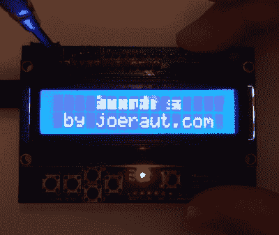

# HD44780 液晶显示器上的平滑文本滚动

> 原文：<https://hackaday.com/2020/07/16/smoother-text-scrolling-on-hd44780-lcds/>

大多数黑客读者可能熟悉由极其常见的日立 HD44780 控制器芯片驱动的字符液晶显示器。如果您正在为您的微控制器项目寻找一种廉价而简单的方法来显示一些数据，它们几乎是首选的解决方案。尽管这些显示器很受欢迎，但不可否认的是，它们在 2020 年开始显得有点过时。这就是为什么约瑟夫·劳滕巴赫正在进行的调整如此有趣的原因。

对于这些显示器中的一个，控制器在每个 5×8 像素块上放置单个字符。还支持创建自定义字符，可用于基本图标。你会受到每块分辨率的限制，但是只要有一点想象力，你通常就能理解这一点。由于显示屏的每个块之间都有一点死空间，所以试图制作“桥接”多个块的图标没有什么意义，因为它们总是被分割的。

Hardware support is not guaranteed.

但是[约瑟夫]意识到，这对于滚动文本来说不是什么问题。所以他写了一些代码，接受一个 ASCII 字符串，并把它分解成部分字母和数字，可以显示为自定义字符。但是控制器只能容纳其中的 8 个字符，所以代码需要不断地遍历字符串，并随着文本位置的变化生成适当的偏移字符。

虽然在休息后的视频中效果看起来很好，但[Joseph]发现现实世界的利用率有点挑剔。他在一个蓝色背景上使用白色文本的显示器上尝试了相同的代码，滚动的文本最终重影在一起，看起来像是胡言乱语。因此，虽然他发布了源代码，让其他人来试验这个技巧，但你的收获可能会有所不同。

这肯定不是我们第一次看到有人在 HD44780 上巧妙利用自定义字符。我们已经看到它被用于*俄罗斯方块* 的[特别小的游戏，康威生命游戏](https://hackaday.com/2016/04/09/tetris-everywhere-character-lcd-edition/)的[重现，甚至](https://hackaday.com/2012/05/26/small-life-on-a-character-lcd/)[一个水平太空射击游戏。](https://hackaday.com/2013/07/23/a-video-game-with-custom-lcd-characters/)

 [https://www.youtube.com/embed/Or9oK5yfja8?version=3&rel=1&showsearch=0&showinfo=1&iv_load_policy=1&fs=1&hl=en-US&autohide=2&wmode=transparent](https://www.youtube.com/embed/Or9oK5yfja8?version=3&rel=1&showsearch=0&showinfo=1&iv_load_policy=1&fs=1&hl=en-US&autohide=2&wmode=transparent)

