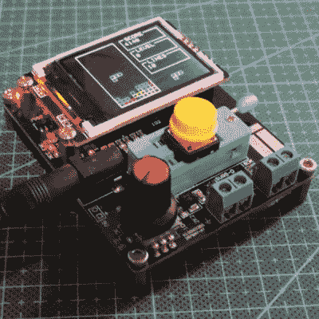

# 最真诚的奉承

> 原文：<https://hackaday.com/2020/07/18/the-sincerest-form-of-flattery/>

在艺术界，人们常说模仿是最真诚的奉承。在开源硬件世界，这种奉承的形式是发现你的开源项目在中国大量生产，并以极低的价格出售。环顾我的实验室，我是这一成功的直接受益者。

 我看到一个 [AVR 晶体管测试仪](https://hackaday.com/2015/04/24/review-transistor-tester/)很久以前花几块钱买的。没有更好的了，它是我测量电感和电容 ESR 的首选设备。由于德国黑客社区[的一些巧妙设计和大规模生产的经济性，7 美元的价格比我支付的价格要高得多。它们如此便宜，以至于我们看到人们重复使用它们](https://www.mikrocontroller.net/articles/AVR_Transistortester#Introduction_.28English.29)[仅仅是为了显示](https://hackaday.com/2019/01/10/transistor-tester-becomes-car-display/)，并且稍加修改[就把它们变成了俄罗斯方块控制台](https://hackaday.com/2019/05/03/play-tetris-on-a-transistor-tester-because-why-not/)。那太酷了。

微控制器板？我的首选是“蓝色药丸”式 STM32F103 分线点，小批量生产时其成本几乎与处理器本身相同。但是这些是第一个非 Atmel Arduino 兼容板的克隆产品:[枫叶迷你](https://www.leaflabs.com/maple/)。Leaf Labs 停止制造主板，但随着设计的出现和中年微控制器价格的下降，这对黑客来说是一个巨大的胜利。我刚买了一个[遥控飞机的多协议遥控器](https://github.com/pascallanger/DIY-Multiprotocol-TX-Module)。我本可以通过采购零件和组装 PCB 自己做一个，但为什么呢？买一个预制的更便宜，我还免费得到了一个漂亮的塑料盒。我目前的 3D 打印机是 Prusa i3 设计和 Prusa Mendel 套件的翻版。前者的费用不到后者的四分之一，尽管结果差不多。为什么？开源设计的中国大规模制造。我可以坚持好几天。

值得注意的是，为所有这些做最初设计工作的人并没有以这种方式得到报酬，这让我很不爽。但是在上述的项目中，只有两个是由他们的发起人生产和销售的。我和 Maple Labs 的麦·安迪谈过，他说他很高兴他们被克隆了:硬件的利润与他们的设计服务收入相比不值一提，而且拥有大量枫树的好处是社区可以很好地维护他们的 libmaple 库，而不需要更多的资源。我知道 Joe Prusa 并不热衷于“克隆”竞争，但他仍然继续做着让他进入这个领域的事情——创新——这让他们的业务保持运转和扩张。

(孟德尔实际上是乔的一个套件，他在 2011 年的一个周末研讨会上帮我组装的，所以我已经直接付钱给他了，我刚刚还把€5 号捐赠给了帕斯卡的 RC 项目。我对这些例子问心无愧。)

像 Sparkfun 和 Adafruit 这样的大公司能够承受被克隆的代价，因为他们真正卖的是创新、教育和文档。再加上客户服务和物流以及所有其他业务。为此，他们获得了应得的利润。(参见 2016 年 Nate Seidle 关于此事的[精彩演讲](https://www.youtube.com/watch?v=aglidIqSrnE)。)但是，做所有这些“生意”需要做大量的工作，对于一个有一些好想法的黑客来说，将想法公之于众并克隆出来可能是将产品送到尽可能多的人手里并使项目变得更好的最简单的途径。

如果留给最初的黑客，晶体管测试仪会卖出几十万台吗？我认为不是。也不是每个项目都是大众市场项目。有大量有趣的设计被发明它们的黑客小批量出售，只要有可能，我就能直接购买它们。(此处插入 Hackaday 的姊妹公司 Tindie 的插头。)

但是对于那些有幸被大规模克隆并最终出现在我工具抽屉里的人，我向你们致敬。这是我黑客心中最真诚的奉承。当我们见面的时候，我会给你买你选择的饮料。

This article is part of the Hackaday.com newsletter, delivered every seven days for each of the last 200+ weeks. It also includes our favorite articles from the last seven days that you can see on [the web version of the newsletter](https://mailchi.mp/hackaday.com/hackaday-newsletter-649368). Want this type of article to hit your inbox every Friday morning? [You should sign up](http://eepurl.com/gTMxQf)!