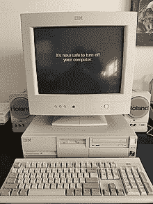
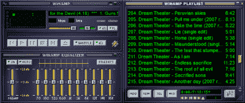
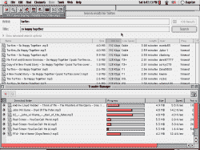
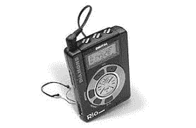

# MP3 已经 25 岁了！

> 原文：<https://hackaday.com/2020/07/27/mp3-is-25-years-old/>

在流媒体时代，音乐可以从各种在线服务中获得，本质上是短暂的，永远不会存在于设备中。然而，随着一种非常特殊的格式的发展，在线音频革命真正开始了。痛苦的说唱和开创性的诉讼的主题，这一来自德国的发展改变了我们所知道的音乐产业。著名的“. mp3”文件名被选中已经 25 年了，让我们来回顾一下它是如何出现的，以及它为什么会风靡全世界。

## 音频大，磁盘小

1995 hard drive prices from an [LA Trade ad in BYTE Magazine](https://archive.org/details/byte-magazine-1995-09/page/n193/mode/2up). The least expensive option rings in at $0.22 per megabyte, which means your 700 MB audio CD would cost $154 to store without compression (10x the cost of buying an album at the time).

通向 MP3 的道路是漫长的。目标是创建一个能够以低比特率编码高质量音频的编解码器。找到一种不损害音频质量的压缩方法是关键。在硬盘以几十或几百兆字节计量的时代，以 CD 质量存储未压缩的数字音频——大约每分钟 10MB 是不切实际的。

在 20 世纪 80 年代，世界各地的研究人员正在研究各种编码方法来解决这个问题。1988 年，当运动图像专家组呼吁制定音频编码标准时，事情开始变得活跃起来。第二年，提交了 14 份提案。成立了四个工作组，开始进一步研究各种编码方法。

Around the time the MP3’s name was decided upon, the Pentium was cutting-edge technology. Desktop computers at the time with clock speeds under 100MHz would struggle to play CD-quality files.

这一过程中产生的主要技术之一是 MUSICAM，它采用了人类听觉的心理声学模型来帮助压缩。这利用了[听觉掩蔽](https://en.wikipedia.org/wiki/Auditory_masking)的效果，这是人类听觉的一种感知限制，其中一些声音掩盖了同时听到的其他声音。通过消除与这些听不到的声音相对应的数据，可以在更小的空间内存储更多的音频，而不会对听者产生任何感知效果。

MUSICAM 技术成为许多原始 MPEG 1 音频层 I 和 II 的基础。弗劳恩霍夫研究所的一组研究人员采用了心理声学编码滤波器组技术，同时混合了从 ASPEC 对 MPEG 的竞争提案中收集的一些想法。目标是创建能够以 128 kbps 的速度提供与第二层 192 kbps 相同质量的第三层编解码器。最终结果于 1993 年以 MPEG 1 标准发布。

随着互联网的飞速发展，Fraunhofer 团队意识到他们的标准有可能成为平台上音频的事实标准。由于它的小文件和高质量，它非常适合在当时的慢速连接上共享。在 1995 年 7 月 14 日的一封决定性的电子邮件中，团队决定他们的文件应该带有现在著名的`.MP3`扩展名。

## 没有一种商业模式能在与敌人的第一次接触中存活下来

MusicMatch Jukebox was a popular CD ripper and MP3 player. MusicMatch are notable for having actually paid Fraunhofer for their MP3 license.

最初的商业计划是通过销售编码器将这项技术货币化。这些产品会以高价卖给那些希望开发能够对 MP3 文件进行编码的软件或硬件的公司。为了推动对该标准的接受，用于播放 MP3 文件的解码器将会便宜或免费，从而鼓励消费者接受。

Winamp was one of the most popular audio players of the MP3 era. Teenagers of the time like yours truly loved it, because it looked like a cool vintage stereo.

虽然这最初似乎可行，但事情很快就分崩离析了，这要感谢弗劳恩霍夫将他们的命运寄托在互联网上。1997 年，一名澳大利亚学生用偷来的信用卡购买了 MP3 编码软件，然后迅速分享到 FTP 服务器上。突然之间，任何人都可以创建自己的 MP3 文件。随着文件的公开，阻止软件传播的呼声被置若罔闻。

在很短的时间内，人们很容易就可以下载免费程序，从 CD 上抓取音频，并以几乎与 MP3 相同的质量存储，而体积却只有 MP3 的十分之一。网站迅速涌现，允许用户自由下载他们选择的音乐。虽然 FTP 服务器是当时事实上的文件共享标准，但 1999 年 Napster 推出，这是一个允许最少技术知识的用户与其他人直接共享他们的数字音乐收藏的平台。音乐产业已经被永远地改变了。

## 猫不会装在袋子里回去

Napster was the progenitor of the file streaming movement. While it lived a short life, it inspired many services to come.

突然之间，花 16.98 美元买一张 CD 的想法看起来很可笑，因为在网上很容易免费获得同样的音乐。唱片公司和艺术家争先恐后地提起诉讼，并起诉音乐迷巨额款项，以阻止下载。[尽管有一些高调的法律诉讼，人们对音乐的态度已经不可逆转地改变了。MP3 播放器也进入了市场，让用户可以随身携带大量的歌曲，而不必摆弄易碎的 CD。](https://ultimateclassicrock.com/metallica-napster-lawsuit/)[这些同样遭遇了法律挑战](https://cyber.harvard.edu/property00/MP3/rio.html)，但是 MP3 的强大威力无法被克服。

即使在 Napster 破产后，其他服务也在它关闭后留下的真空中蓬勃发展。海盗们从这个案例中吸取了教训，权力下放成为避免法律纠纷的关键。这就把犯罪的责任推给了那些共享文件的人，而不是那些运行点对点服务的人，点对点服务仅仅是为了方便文件传输。

The Diamond Rio PMP3000 was one of the earliest MP3 players, attracting the ire of the RIAA on launch.

销售数字音频的服务需要很多年才能繁荣起来。由于高昂的价格和限制性的数字版权管理，最初的产品失败了，这只是给了客户比免费获得的干净、无阻碍的 MP3 更糟糕的体验。

MP3 的主导地位在 2010 年代才开始减弱，当时向流媒体技术和智能手机的过渡开始提供更好的用户体验。用户不必管理数千兆字节的歌曲集，也不必在不同设备间随意播放，而是只需点击一个按钮，就可以调出几乎任何他们想要的音乐。就像脸书打败 Myspace 一样，流媒体的便捷性很快让 MP3 播放器和格式本身成为了过去。

## 这种格式打破了录制音乐的行业

虽然我们中很少有人仍然在文件共享网络上寻找最新的专辑，但 MP3 是永远改变人们对音乐交付方式的预期以及人们愿意支付的价格的关键。

在这个动荡的时代，艺人和唱片公司的薪酬结构发生了翻天覆地的变化。虽然像 iTunes 这样的后 MP3 服务曾经以每首 99 美分的价格出售歌曲，但是现在艺术家们可以从每首歌曲中获得不到 1 美分的收入。然而，至少在理论上，实体媒体的重要性降低也使得艺术家们不需要唱片公司就能在国际上转移产品。像 [Soundcloud rap](https://pitchfork.com/thepitch/how-raps-soundcloud-generation-changed-the-music-business-forever/) 和 [Vaporwave](https://www.esquire.com/entertainment/music/a47793/what-happened-to-vaporwave/) 这样的流派从允许崭露头角的音乐家在线分享他们的音乐的服务中有机地涌现出来。很容易把这种亚文化和 MP3 催生的在线音乐分享联系起来。

虽然弗劳恩霍夫可能没有从这项技术中获得他们想要的商业胜利，但 MP3 无疑永远改变了音乐的面貌。艺术家们可能仍然会为过去几年吝啬的流媒体服务相对于专辑版税的回报减少而哭泣，唱片公司仍然会像自盒式磁带时代以来一样对未经许可的复制感到愤怒。然而，MP3 仍然是一种让音乐的获取和创作大众化的技术，因此，它应该受到称赞。MP3 生日快乐，为又一个 25 年的高质量压缩音乐干杯！