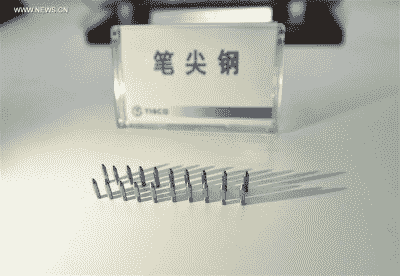
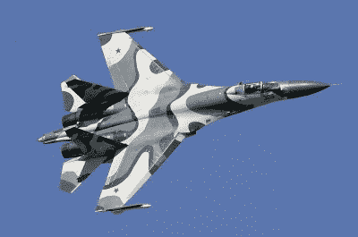
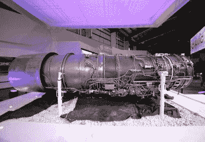

# 发明 80 年了，中国在喷气发动机上苦苦挣扎

> 原文：<https://hackaday.com/2020/07/28/80-years-from-invention-china-is-struggling-with-jet-engines/>

喷气式发动机有着悠久而传奇的历史。它的发展是在 20 世纪早期几个不相关的群体中自发发生的。1930 年，弗兰克·惠特尔提交了一项英国设计专利，而汉斯·冯·奥海因于 1935 年开始在德国探索这一领域。在奥海因工作的基础上，喷气式飞机的第一次飞行是在 1939 年 8 月 27 日。到第二次世界大战结束时，少量的军用喷气式飞机已经服役，就高性能航空而言，螺旋桨已经过时。

随着喷气发动机的发明，人们认为这项技术早已被全世界所掌握是情有可原的。然而，最近的报告显示情况并非如此。中国就是一个很好的例子，它面临着为自己的军用飞机开发喷气发动机的问题。

## 严守的秘密

China’s development of ballpoint pen tips was a national news story in 2017\. Source: Xinhua

在互联网和开源的时代，技术在世界范围内飞速发展。在消费者领域，公司渴望向尽可能多的顾客销售产品，将他们的最新产品运送到世界各地，以免他们的竞争对手抢先一步。对于更依赖于基础设施的产品，我们看到推出速度较慢。[氢动力汽车仅在特定地区有售](https://hackaday.com/2019/09/04/are-hydrogen-cars-still-happening/)，而流媒体等服务可能需要时间来解决在不同国家展示材料的法律问题。在这些情况下，我们通常会看到最多 5-10 年的滞后，假设技术存活到成熟。

在大多数情况下，如果一项技术有市场，就会有人排队出售它。然而，有些可能比其他的更棘手。圆珠笔是我们大多数人认为古怪到平庸的技术的一个例子。然而，尽管中国生产了全球 80%以上的圆珠笔，却无法在国内生产整支圆珠笔。中国制造的圆珠笔尖表现不佳，结果字迹潦草。这引起了政府官员的注意，从而推动了本土圆珠笔技术的改进。2017 年，他们成功了，[首次生产出高质量的圆珠笔。](https://www.washingtonpost.com/news/worldviews/wp/2017/01/18/finally-china-manufactures-a-ballpoint-pen-all-by-itself/)

创造合适的钢，并将其加工成适合写作的光滑滚动球的秘密是复杂而多样的。向中国提供圆珠笔尖的日本、德国和瑞士公司从这笔交易中获利颇丰。分享内部知识只会破坏他们自己的生意。因此，中国不得不单干，花了 5 年时间来解决这个问题。

钢笔制造商没有改进产品的动力；中国消费者更关注价格而非质量。一旦政府把它作为一种民族自豪感，事情就发生了变化。然而，对于喷气式发动机来说，情况有些不同。

## 你在别的地方买不到这些

China has primarily relied on Russian fighter aircraft in recent years, like the Sukhoi Su-27\. Source: Dmitriy Pichugin

近几十年来，中国在重大军事采购上与俄罗斯紧密结盟。多年来，随着苏联解体后两国关系日益密切，中国为中国人民解放军空军采购了苏霍伊 Su-27 等军用飞机。中国也在追求自己的战斗机发展项目，这些年来生产了像 J-10 和 JF-17 这样的飞机。虽然中国在空气动力学和航空电子设备发展方面似乎没有什么问题，但可靠的世界级喷气发动机迄今仍令他们望尘莫及。

俄罗斯不愿直接出售战斗机发动机，而是倾向于出售整架飞机，这阻碍了为中国飞机设计提供动力的努力。这一年来，由于中国对外国设计进行逆向工程，两国关系进一步紧张。在签署了在当地生产 200 架苏-27 飞机的协议后，中国仅生产了 100 架就停止了生产线。选择学习和改变设计，随后的 J-11 竖起羽毛作为一个未经许可的副本。

类似的努力被用来加速喷气发动机的发展，通过复制海外制造商的发动机。报道暗示，1980 年代从美国购买的 CFM-56 可能是 WS-10 设计的起点。尽管有了硬件，但进展缓慢。缺乏人力资本、内部知识以及生产硬件和材料会使复制一个复杂的设计变得困难甚至不可能。WS-10 发动机的早期版本远远没有达到设计目标，即在推力输出和可靠性方面与苏-27 的 AL-31 发动机相当。每 30 小时就需要大修一次，而俄罗斯的基准是 400 小时。轶事证据表明 WS-10 也需要更长的时间来产生推力。

The troubled Liming WS-10 jet engine. Thus far, the engine has struggled to meet the benchmark set by the Saturn AF-31 sold by Russia. Source: GlobalSecurity.org

问题主要出在材料和加工上。喷气发动机部件必须承受巨大的温度和压力，同时以高转速连续旋转数小时。对于所用的材料，必须考虑热循环和裂纹扩展等因素，以免发动机提前损坏。可靠性和性能一样重要，因为如果飞机每次飞行后都需要更换发动机，那么世界上所有的推力都是无用的。生产原材料以及制造高公差最终零件的关键是受到严格保护的国家机密。航展上很容易拍摄间谍照片，蓝图也很容易被窃取——[就像搜索 CAD 文件并把它们寄回家一样简单。关于冶金、材料和生产过程的数据可能更难获得。](https://www.zdnet.com/article/report-espionage-malware-sends-data-to-china/)

在花了 25 年时间试图建造一个有竞争力的战斗机发动机后，中国仍在努力赶上一个起源于 20 世纪 70 年代的设计的性能。中国最新的 J-20 隐形战斗机的初始生产模型使用了升级的 WS-10B[，但是生产模型似乎仍然依赖俄罗斯土星 AL-31 发动机](https://www.forbes.com/sites/sebastienroblin/2020/07/13/agile-j-20b-stealth-jets-with-thrust-vector-controls-enter-production-according-to-chinese-media/#237138611fbc)。中国生产的 WS-15 预计将在几年内服役，但在此之前，J-20 将处于其对手的推力赤字。在战斗机战斗中，能量就是一切，这是中国急于解决的一个严重缺陷。更糟糕的是，在更高推力的 WS-15 发动机成熟之前，J-20 也无法超巡航，这意味着它必须使用加力来达到超音速。在这种情况得到纠正之前，中国首要的空中优势战斗机将努力跟上第五代战斗机。

只要提供难以复制的高质量零件还能赚钱，中国就不太可能买到它需要的信息。取而代之的是，它将不得不走一条艰难的道路，就像圆珠笔一样。要复制别人 30 年后取得的成果，需要多年的昂贵研究和本土技术开发。在军事领域，就像在企业领域一样，这就是做生意的代价。