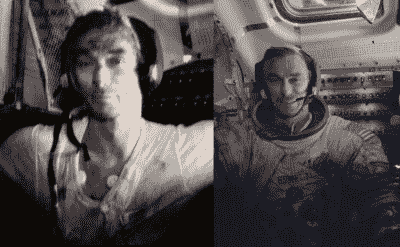

# 太空的味道

> 原文：<https://hackaday.com/2020/08/05/the-smell-of-space/>

外星人的口号是，在太空中，没有人能听到你的尖叫。有史以来最令人难忘的电影宣传之一，它指的是空间真空对人类感官需要一个氛围才能体验的事物的影响。这是一个教训，乔斯·韦登曾经在 *Firefly* 中用[的 *Serenity* 的无声引擎点亮](https://www.youtube.com/watch?v=TAuA-QYGWoQ)，而*星球大战*完全忽略了它，给我们带来了[太空战斗](https://www.youtube.com/watch?v=AA_D__HMuFw)中不可思议的武器噪音。

声音可能无法穿过真空的空间，但这并不是说除了光之外没有其他东西可供感官感知。阿波罗宇航员报告说，一旦暴露在着陆器内的大气中，[月球尘埃释放出一种他们描述为类似于燃烧过的火药的气味](https://science.nasa.gov/science-news/science-at-nasa/2006/30jan_smellofmoondust)，现在你可能已经听说过有一个名为[的 Kickstarter，旨在将这种气味再现为一种香味](https://www.kickstarter.com/projects/eaudespace/what-does-outer-space-smell-like-nasa-designed-fragrance/description)。它会取代充斥高中男生更衣室的*斧头*或*非洲猞猁*身体喷雾的令人作呕的墙壁，还是仅仅是一种新奇？

The Apollo astronaut Gene Cernan, liberally coated with moon dust after returning to the Lunar module. [NASA](https://www.nasa.gov/exploration/humanresearch/multimedimg/hrpg_img_06.html) / [Public Domain](https://www.nasa.gov/multimedia/guidelines/index.html)

## 闻起来像月球尘埃

阿波罗号机组人员感受到的火药味很可能是由月球尘埃中的氧敏感化合物引起的，这些化合物在我们的卫星受到太阳风的冲击后积累了数十亿年，首次暴露在大气中时被氧化。当样本到达地球科学家手中时，这一过程早已结束，因此没有气味可供分析。即使是宇航员用来在不受真空影响的情况下收集样本返回地球的真空容器也未能阻止它，人们认为他们的密封受到了灰尘意想不到的普遍性质的影响。因此,“欧·德卢纳”香水将只是基于宇航员的回忆，而不是对他们所体验的气味的分析。

## 就像轨道上的更衣室

迄今为止，月球尘埃可能是我们人类与另一个天体的唯一相遇，但这并不是说太空中没有其他气味。美国国家航空航天局宇航员杰里·莱恩格尔描述了从太空返回后，苏联/俄罗斯和平号空间站的气闸室中有一种明显的烧焦的气味，这可能类似于月球的气味。但是来自和平号和其他空间站的居民的许多描述谈到了来自完全不同来源的气味；宇航员们自己。

在空间站中，不可能打开窗户来获得额外的通风，所以随着早期的空间站让位给持续载人的模块化前哨站，这些前哨站在空中停留多年，它们的大气反映了宇航员带给它们的所有累积的生物群落。据说和平号在接近其寿命结束时布满了霉菌和真菌，2019 年[有人担心同样的命运会降临到国际空间站](https://www.independent.co.uk/news/science/international-space-station-bacteria-fungi-disease-iss-a8858846.html)上。据说，失重状态下的液体置换效应会对人类的嗅觉产生不利影响，这对那些不得不忍受失重的人来说也许是件好事。

因此，太空香水可能仍然是我们大多数人最接近离开大气层的东西，因此它可以闻到任何东西的味道，我们没有人会闻到真实的东西，如果它不匹配，可以要求退款。但是，对于并不拥有一切的黑客来说，这有什么关系呢？毫无疑问，我们会在明年的某个活动中闻到打开气闸的气味。