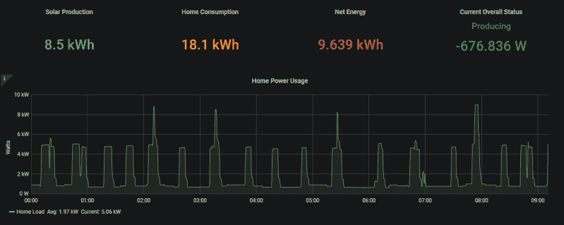

# 完整的 Raspberry Pi 电源监控系统

> 原文：<https://hackaday.com/2020/07/24/a-complete-raspberry-pi-power-monitoring-system/>

随着世界变得更加环保，我们已经看到监控或控制家庭能源使用的项目越来越多。这些设置中至少有一个涉及微控制器和某种钳式电流传感器，但如果您正在寻找资源来更进一步，[这款由[David00]](https://github.com/David00/rpi-power-monitor) 开发的 Raspberry Pi 能源监控系统将是一个很好的起点。

该项目包括提供软件和硬件，与 Raspberry Pi 一起使用，不仅可以记录家庭能源消耗，还可以记录生产，如果你的家庭有太阳能电池阵列或其他自己发电的方法。数据每 0.5 秒从一个 MCP3008 ADC 中提取，该 ADC 连接到多达~~个~~六个电流传感器，以提供实时利用率统计数据，并通过 Grafana 可视化，以便您可以一目了然地看到所有信息。

虽然[David00]已经通过在开源许可下发布硬件和软件为社区做了很大的贡献，但他也为这个项目制作了一些绝对非凡的文档，这对任何想要推出自己的监控系统的人来说都是非常有价值的资源。他甚至为那些对软件方面的实验比对制造 PCB 更感兴趣的人提供硬件套件。

首页[能源监控项目当然不是什么新鲜事，](https://hackaday.com/2012/07/18/monitoring-your-home-energy-use/)但是我们在过去十年里看到的 DIY 项目可用的硬件和软件类型的令人难以置信的进步[确实推动了最先进技术的发展](https://hackaday.com/2019/07/27/building-a-safe-esp32-home-energy-monitor/)。现在有这么多神奇的资源可用，唯一站在你和你自己家的能源监测仪表板之间的是欲望和一个长周末。