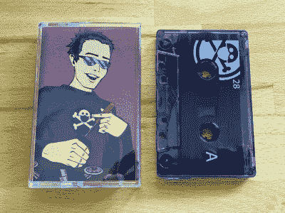
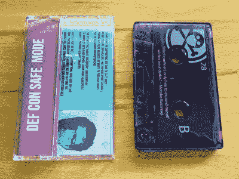
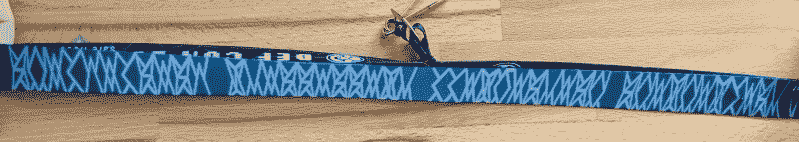
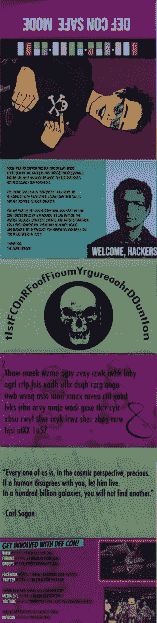
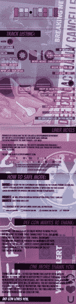

# 实验操作:疫情 DEF CON 徽章是一盒录音带

> 原文：<https://hackaday.com/2020/07/24/hands-on-the-pandemic-def-con-badge-is-an-audio-cassette/>

我的安全模式徽章今天下午刚刚寄到。总部设在拉斯维加斯的会议通常每年举办约 30，000 名与会者，为了响应全球疫情，会议已经转移到网上，而[虚拟活动将于 8 月 6 日至 9 日](https://defcon.org/html/defcon-safemode/dc-safemode-index.html)举行。北美最著名的 infosec con 以创意徽章而闻名，它有一个滴答循环，每年交替使用电子和非电子徽章。在这个小年，徽章是一个默默无闻的弃用媒体:录音带。

这个选择可以追溯到[DEF CON 23 徽章，这是一张黑胶唱片](https://hackaday.io/project/7087-defcon-23-badge-hacking) —我在 2015 年遇到了同样的问题……我无法播放这种古老的媒体。幸运的是[ [骗子](https://twitter.com/Grifter801/status/1286379387386920960)给大家介绍了[互联网档案馆](https://archive.org/details/defcon-28-tape/)的音频内容转储，尽管我知道 DEF CON 的徽章黑客攻击有多激烈，但我对这些文件的可靠性持怀疑态度。你最好的办法是把你 88 年的凯美瑞的防尘罩拉下来，让你自己的磁带在磁带舱里滚动。我也想知道是否有不同版本的磁带。

但足够的猜测，让我们看看什么物理来与 DEF CON 28 徽章。

录音带本身是真货，装在首饰盒里，用塑料热缩包装。由紫色透明塑料制成，每一面都有一个蒙面标志和丝网印刷的数字 28，以及侧面的字母 A 和 B。B 面引用了 *Ghost in the Shell* 中的一句话:

> 我感到被限制了，只能在界限内自由地扩展自己。
> ——草薙本子

在这里看到如此直接的东西有点令人惊讶。我认为奇怪的人物是更大的谜题的一部分。也许这为里面的神秘事物定下了基调，奇怪的标记决不会从包装中消失。

 

绕在你脖子后面的那部分挂绳上写满了奇怪的字符。拍摄起来有点困难，但希望这些照片足以让你开始拼图。折叠到首饰盒支架中的衬垫笔记提供了曲目列表和来自[黑暗切线]的感谢，然后是来自 DEF CON 的长期拼图大师[1o57]的神秘消息。

磁带上的音频无疑是徽章黑客挑战中最精彩的部分。A 面以一组等待解码的音调开始，B 面在开始时听起来像一个数字电台。不要被骗了，大部分录音中都有很棒的音乐，即使你没有参与骗局，也值得一听。

你已经分析过音频了吗？我们希望在下面的评论中听到更多关于它的信息。我已经在 Hackaday.io 上开始了一个项目，为任何想合作解开 DC28 徽章秘密的人服务。任何人都可以[加入到那个项目](https://hackaday.io/messages/room/290272)的公共聊天中，那些积极参与挑战的人可以点击项目页面左侧栏中的“加入这个项目的团队”来获得写权限，让你添加项目日志和图像。

有一件事让这感觉 100%像一个 DEF CON 徽章…我们到底应该如何把挂绳钩到徽章上来佩戴它？