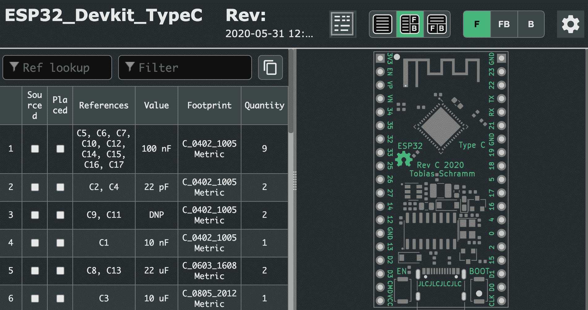

# 更少的毫米使一个有用的 ESP32 开发板

> 原文：<https://hackaday.com/2020/07/31/fewer-millimeters-make-a-useful-esp32-devboard/>

有时候，最有用的方法并不是最炫的，它们是那些改进已经很棒的工具并使之变得更好的方法。通孔元件仍然是构建新电子项目原型的最快、可能也是最令人满意的方式，所以当快乐的黑客发现他们的新 devboard 太宽，无法放入标准试验板时，会格外沮丧。[Tobias]也有同样的想法，[重新设计了标准的 esp 32“node MCU”风格的 devboard](https://github.com/TobleMiner/ESP32-Devkit-Type-C) 几乎完全相同，但更窄。

Interactive BOMs make assembly a snap

不是轻视，但差不多就是这样。我们喜欢它！新设计保留了原始 devboard 的强大支持，但增加了一些不错的调整。很明显，它的尺寸略有变化，可以安装在标准的 5×5 试验板上，两侧都留有接口。即使在这种更小的尺寸[Tobias]设法保留了启动模式和复位按钮，尽管整体引脚略有变化。为了更方便地连接，老式的微型 USB 插座已经换成了时尚的现代 USB-C。你现在有通用标准的电缆，对吗？

你如何得到一个？据我们所知[Tobias]没有出售这些，但该设计是完全开源的，设计、fab 和 BOM 文件都在 github 库中。[Tobias]甚至加入了极其方便的交互式 BOM 来加速手工组装。真正的诀窍是，该板旨在促进我们最喜欢的工厂现在提供的极其便宜的交钥匙组件，5 个运行的示例成本为 8 美元/片。repo 包括一个正确格式化的 BOM 和 fab 文件，使订购它们变得轻而易举。有关订购内容的详细信息，请参见自述文件的底部。