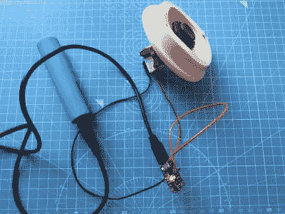

# 紧急按钮是一个视听降落伞

> 原文：<https://hackaday.com/2020/07/29/panic-button-is-an-audio-visual-parachute-out-of-zoom-calls/>

无论是否愿意，今年每个人都在学习如何流式传输。这就产生了尴尬悖论，即在视频会议通话中，你越是迫切需要关掉摄像头和麦克风，就越是困难和耗时。特别是放大功能会用键盘快捷键切换麦克风和摄像头，但当你蹒跚学步的孩子摇摇晃晃地走进房间，在空中挥舞着用过的尿布时，键盘快捷键会显得非常无力。

 [你需要的是一个坚固的按钮，它能尽快发送这两个切换命令](https://simonprickett.dev/making-a-single-button-keyboard/)。西蒙·普里克特的紧急开关就是这样做的。这是一个令人愉快的触觉街机按钮，连接到一个小饰品 M0，可以很容易地模仿键盘作为 Arduino 或 CircuitPython 设备。

这个小键盘不直接发送这些宏，因为那样太冒险了。如果你在看黑客日报，而不是盯着你同事的瓷砖脸，会怎么样？那就不行了，因为变焦是失焦的。

相反，它向电脑发送一个模糊的四键宏来触发 AppleScript。[Simon]的 AppleScript 会检查缩放是否正在运行。如果没有，它让系统宣布这个事实。如果它正在运行，那么脚本发送`cmd+shift+a`和`cmd+shift+v`来直接缩放以切换音频和视频。休息后请欣赏演示。

正如你所料，在过去的几个月里，我们已经看到了一些视频会议生存技巧。需要展示一些东西或用手工作，但只有一个摄像头？你只需要一面镜子、一个晒衣夹和一段电线，就可以进行简单的分屏设置。

 [https://www.youtube.com/embed/3G6DJA5bpWE?version=3&rel=1&showsearch=0&showinfo=1&iv_load_policy=1&fs=1&hl=en-US&autohide=2&wmode=transparent](https://www.youtube.com/embed/3G6DJA5bpWE?version=3&rel=1&showsearch=0&showinfo=1&iv_load_policy=1&fs=1&hl=en-US&autohide=2&wmode=transparent)

