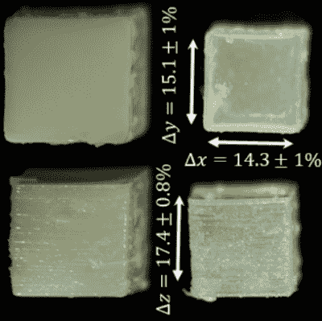

# 3D 打印乳胶现在成为可能

> 原文：<https://hackaday.com/2020/07/27/3d-printing-latex-is-now-possible/>

对于那些开始接触 3D 打印机的人来说，ABS 和 PLA 等热塑性塑料是常态。对于那些希望生产具有一定弹性的零件的人来说，Ninjaflex 等材料是最常见的选择，它们使用热塑性聚氨酯。直到最近，还不可能 3D 打印乳胶橡胶。然而，弗吉尼亚理工大学的一个团队通过结合先进的打印机硬件和一些严肃的化学物质成功实现了这一壮举。

Sample cubes printed with the new process. Note the clarity of the sample at the top right.

这项工作主要是由[Phil Scott]和[Viswanath meenakshissundaram]合作完成的。在配制定制液体乳胶的初步实验失败后，[Scott]试图改进一种市售产品以适应该项目。液体胶乳很难处理，即使配方稍有改变，溶液也会变得不稳定。通过使用分子支架，有可能将液体胶乳改性为可光固化的，因此可以使用 UV 曝光技术进行 3D 打印。

打印机方面也做了大量的工作。在创建了高分辨率的 UV 打印机后，[meenakshissundaram]不得不与液体乳胶树脂散射光抗衡，导致零件畸形。为了解决这个问题，系统中增加了一个摄像头，它可以显示曝光过程，并根据散射情况自动校正曝光模式。

这是一个令人难以置信的先进项目，已经生产出具有先进几何形状和令人印象深刻的机械性能的胶乳橡胶部件。我们怀疑这项技术在未来几年可能会得到快速发展，以生产具有显著强度的定制橡胶部件。与此同时，利用市场上现有的细丝复制柔性部件仍然是可能的。

[途经 phys.org]