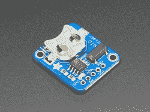
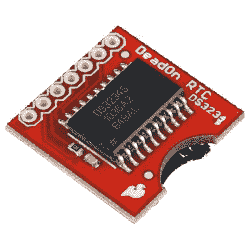
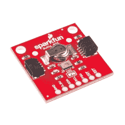

# 为您的项目选择正确的 RTC

> 原文：<https://hackaday.com/2020/09/30/choosing-the-right-rtc-for-your-project/>

当谈到在微控制器上测量时间时，有很多方法可以实现。对于大多数快速和肮脏的目的，如去抖延迟或其他等待状态，只需计算主时钟的几个周期即可。精确到几十毫秒，他们可以毫不费力地完成一般的公用事业工作。

然而，许多项目的要求更加严格。当你在建造一个时钟，或者一个数据记录器，或者任何依赖于几分钟以上的稳定时间感觉的东西时，你会想要一个实时时钟。之所以这么叫，是因为它们处理*实时时间的本性，正如我们人类倾向于设想的那样，这些设备自己承担起提供高度准确的计时服务的责任。我们编写了一份通用零件及其潜在应用指南，让您每次都能一次搞定。*

## 需求是关键

您为给定项目选择的 RTC 将取决于多种因素。电池供电项目将受益于低功耗，而随着时间的推移，科学测量设备可能需要最高的精度。接口也很重要，因为在现有设计中实现 RTC 可能需要选择器件，因为存在 I2C 或 SPI。在这一领域，对于家庭实验者来说，预算通常不是问题，因为零件很便宜，但是数千件的生产量将从更便宜的零件中节省大量成本。一如既往，对项目需求有一个清晰的概念是为工作选择正确组件的关键。

## 我只想知道现在几点了！

*建议零件:DS1307*

The DS-1307 is often the default choice for an RTC. However, if you need advanced features like alarms or square wave outputs, it’s best to look upmarket.

DS1307 有一个令人骄傲的头衔，它是微控制器实验的事实上的 RTC。它采用 5 V 电源供电，备用电池电流为 500 nA，是需要跟踪时间的项目的准系统解决方案。与更先进的解决方案不同，DS1307 依靠外部 32.768 KHz 晶振计时。[根据数据手册，](https://datasheets.maximintegrated.com/en/ds/DS1307.pdf)这意味着由于电容和噪声的变化，计时精度会受到设计实施的一定影响。为此，Maxim 不提供禁止的精度值，但对于一般的时钟构建或基本的数据记录器，DS1307 将达到目的。 [DS1307 模块](https://www.adafruit.com/product/3296)随时可用，而且往往是最便宜的 RTC 解决方案，可在大多数插座。

## 我需要精确的，带警报的东西！

*建议零件:* *DS3231 (I2C)，DS3234 (SPI)*

The DS3234 has the distinction of using an SPI interface instead of I2C. It also packs in 256 bytes of user-addressable RAM.

对于那些需要精度的人来说，集成振荡器的 RTC 是关键。这些设备保证了出厂时的准确性，因为在晶体的安装过程中不可能出现用户设计错误。DS3231 和 DS3234 等器件符合这一要求，其温度补偿晶体振荡器(TCXO)在 0°C 至+40°C 温度范围内的精度高达±2 ppm。这是以牺牲待机电流为代价的，待机电流典型值为 1500 nA，这意味着备用电池不会持续太久。

这些器件更加现代化，能够在 2.3-5.5V 的电压下工作，更易于与各种不同的微控制器配合使用。它们还具有方波和报警输出。这些可以用来为其他硬件产生时钟，或者通过设置为中断的 GPIO 引脚将微控制器从睡眠中唤醒。RTC 通常以这种方式使用，通过将主微控制器保持在低功耗睡眠模式，仅在必要时唤醒，使电池供电项目能够充分利用电池。还有一个额外的温度传感器可以读出，这可能会在一些项目中派上用场。

由于这些模块的准确性，它们在市场上被冠以 DeadOn T1 这样的名称。然而，额外的功能和更复杂的硬件确实需要更高的价格。

## 我需要一个几乎不耗电的 RTC，等等！

*建议零件:RV-1805，RV-3028*

The RV-1805 draws so little power that this Sparkfun module gets by without a backup battery at all. Instead, a supercap keeps time for up to 35 days without external power.

说到电池电量，每一点电量都很重要。对于在野外部署的项目，这甚至更为重要，因为定期更换电池或保证太阳能或风能等替代能源的持续供应通常不太现实。

对于这样的应用，RV-1805 和其更新的替代品 RV-3028 就派上了用场。完成警报和其他高端功能，他们的聚会作品是一个绝对微小的电流吸引。RV-1805 的特殊模式依赖于一个低功耗 RC 振荡器和一个晶体作为校准备份，[在计时模式下仅消耗 22 nA。](https://www.microcrystal.com/fileadmin/Media/Products/RTC/Datasheet/RV-1805-C3.pdf)这足够低，以至于 [Sparkfun 的模块](https://www.sparkfun.com/products/14558)只指定了一个超级电容，它能够保持设定的时间整整 35 天，而其他 RTC 必须依赖电池。RV-3028 将电量提高到 100 nA，皮莫罗尼声称[内置电池的潜在运行时间为 9 年](https://shop.pimoroni.com/products/rv3028-real-time-clock-rtc-breakout)。这些器件的精度也是一流的(2 ppm RV-1805、1 ppm RV-3028)，非常适合在偏远环境中进行精确的数据记录。

## 特别提及:树莓 Pi 模块

The RTC Pi, a cheap and simple solution to keeping the Pi in sync when away from the Internet.

Raspberry Pi 和 20 世纪 80 年代的许多电脑一样，没有实时时钟。这消除了对电池的需要，但是也可能对系统日志和其他任务造成破坏，特别是在非网络环境中。幸运的是，上面列出的许多 RTC 设备都可以在为 Raspberry Pi 的特殊外形设计的特殊模块中使用。它们各种各样，从不起眼的 DS1307 到锋利的 DS3231，应有尽有。

安装这些需要一些工作。绝大多数都通过 I2C 进行交流，这对于已经将该接口用于其他目的的项目来说是一个令人头疼的问题。还需要安装一个实用程序来与 RTC 通信，并在必要时使用它来正确更新系统时间。

## 结论

无论你是想为你的休息室做一个可爱的计时器，还是为一个复杂的系统维护准确的调试日志，准确的计时是关键。由于现代硬件的可用性，它不必太难。我们希望这个指南能帮助你，当你的项目完成后，一定要给我们写信。黑客快乐！