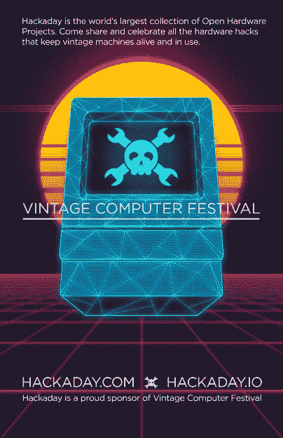

# 周六:西部复古电脑节

> 原文：<https://hackaday.com/2020/07/30/saturday-vintage-computer-festival-west/>

西部老式计算机节是一年一度的聚会，庆祝开创信息时代的令人敬畏的硬件。通常在加州山景城的计算机历史博物馆举行，今年[VCF·韦斯特虚拟世界将于周六开始](http://vcfed.org/wp/festivals/vintage-computer-festival-west/)！

[系列讲座看起来很棒](http://vcfed.org/wp/festivals/vintage-computer-festival-west/vcf-west-exhibits/)，涵盖了一切，从操作阿波罗 DSKY 显示面板和如何恢复磁带到 ENIAC 技术手册错误和 6502 的起源。最后一个是由 Bill Mensch 提出的，他是最初创建 6502 的团队成员。他将加入 Hackaday 自己的 Bil Herd(他自己是[一个著名的准将](https://hackaday.com/2013/12/09/guest-post-the-real-story-of-hacking-together-the-commodore-c128/)和 [MOS 校友](https://hackaday.com/2014/09/02/30-years-later-ted-finds-his-voice-a-commodore-story-part-i/))和 Eric Schlaepfer(你可能记得[他的怪物 6502 项目](https://hackaday.com/2017/05/20/dis-integrated-6502-running-programs-acting-like-computer/))。今年，你可能无法逛逛展览，玩玩老式的硬件，但你可以听到很多人花了几年时间来学习让这些系统运行的技巧和怪癖。

Hacakaday 很荣幸再次赞助 VCF 西。你不需要门票，会议将在他们的 YouTube 频道上为所有感兴趣的人直播。我们在下面嵌入了直播流，以及 Joe Kim 制作的在电影节上展示的精彩海报。

 [https://www.youtube.com/embed/7YoolSAHR5w?version=3&rel=1&showsearch=0&showinfo=1&iv_load_policy=1&fs=1&hl=en-US&autohide=2&wmode=transparent](https://www.youtube.com/embed/7YoolSAHR5w?version=3&rel=1&showsearch=0&showinfo=1&iv_load_policy=1&fs=1&hl=en-US&autohide=2&wmode=transparent)

