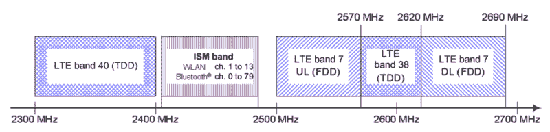

# 频谱共存攻击打破了 WiFi 和蓝牙的隔离

> 原文：<https://hackaday.com/2020/08/07/separation-between-wifi-and-bluetooth-broken-by-the-spectra-co-existence-attack/>

今年，在 DEF CON 28 DEF CON 安全模式大会上，安全研究人员【Jiska Classen】和【Francesco Gringoli】[发表了一篇关于使用无线共存机制的芯片间权限提升的演讲](https://www.youtube.com/watch?v=GZd66uVGKn8)。当然，标题很吸引人，但是这到底是关于什么的呢？

为了理解这个安全缺陷或一组安全缺陷，我们首先需要知道什么是无线共存机制。现代设备可以同时支持蜂窝和非蜂窝无线通信标准(LTE、WiFi、蓝牙)。考虑到我们的设备需要小型化，支持这些通信技术的不同子系统必须在设备内物理上非常接近(设备内共存)。所产生的高水平的相互泄漏有时会引起相当大的干扰。

有几种可能发生干扰的情况，主要有:

*   两个无线电系统占用相邻频率，并且发生载波泄漏
*   一个发射机的谐波落在另一个系统使用的频率上
*   两个无线电系统共享相同的频率

为了解决这类问题，制造商不得不实施一些策略，使无线芯片设备能够共存(有时甚至共享同一天线)，并将干扰降至最低。它们被称为共存机制，能够在交叉频带上实现高性能通信，因此，它们对于任何现代移动设备都是必不可少的。尽管存在开放的解决方案，例如移动无线标准，但是制造商通常实施专有的解决方案。

## 光谱

Spectra 是本次 DEF CON talk 演示的一个新的攻击类，重点是 Broadcom 和 Cypress WiFi/蓝牙二合一芯片。在 combo 芯片上，WiFi 和蓝牙在独立的处理内核上运行，共存信息使用串行增强共存接口(SECI)在内核之间直接交换，而不通过底层操作系统。

Spectra class 攻击利用无线内核之间接口的缺陷，其中一个内核可以在另一个内核上实现拒绝服务(DoS)、信息泄露甚至代码执行。从攻击者的角度来看，这里的理由是利用蓝牙子系统远程代码执行(RCE)来执行 WiFi RCE，甚至可能是 LTE RCE。请记住，这种远程代码执行发生在这些 CPU 核心子系统中，因此对于主设备 CPU 和操作系统来说是完全不可见的。

在下面的讲座中，我将深入探讨 Spectra 攻击的拒绝服务、信息泄露和代码执行主题。

 [https://www.youtube.com/embed/GZd66uVGKn8?version=3&rel=1&showsearch=0&showinfo=1&iv_load_policy=1&fs=1&hl=en-US&autohide=2&wmode=transparent](https://www.youtube.com/embed/GZd66uVGKn8?version=3&rel=1&showsearch=0&showinfo=1&iv_load_policy=1&fs=1&hl=en-US&autohide=2&wmode=transparent)

### 拒绝服务

当一个无线核心拒绝向另一个核心传输时，就会发生这种情况。如果一个内核能够占用另一个内核的频谱资源，DoS 攻击就有可能发生。由于这是任何共存接口的基本工作原理，根据定义，所有这些接口都是易受攻击的，只要一个核心不断地为自己要求资源。其他 DoS 机会来自一个无线内核能够通过滥用共享 RAM 使另一个内核崩溃。

### 信息披露

一个无线核可以推断另一个核的数据或动作。一个例子是当连接像键盘这样的 HID 设备时。可以在接收按键的主机上观察按键的计时和内容。然而，一个只在 WiFi 芯片上执行代码的攻击者应该无法做出这样的观察。当按键的内容丢失时，WiFi 芯片上运行的代码有可能推断出蓝牙侧按键的计时统计信息。这对于推断密码和密码长度变得很有趣。

### 代码执行

一个无线内核可以在另一个内核中执行代码。安全研究人员证明，可以通过蓝牙执行带有受控内容的任意 WiFi 地址。发生这种情况是因为当两个内核都在运行时，它们共享一个 RAM 区域，其中包含一个大型函数表以及其他信息。通过覆盖特定地址，可以控制 WiFi 核心程序计数器。这意味着蓝牙子系统漏洞可能转变为 WiFi 漏洞。此外，写入 WiFi 缓冲区和执行地址会在 Android 和 iOS 上产生各种内核崩溃，这表明进一步升级到主机是可能的，并且可能只是时间问题，直到有人弹出 calc。

## 结论

虽然研究集中在 Broadcom 和 Cypress combo 芯片(顺便说一下，涵盖了所有 iPhones、MacBooks、iMacs、旧的 Apple Watches、Samsung S 和 Note 系列、一些 Google Nexus、Raspberry Pi 等等……)上，但也向英特尔、联发科、高通、德州仪器(Texas Instruments)、Marvell、恩智浦(NXP)发出了咨询，他们都提到了自己设备中类似的共存接口。因此，加以必要的修正，并且由于其本质，其他供应商也可能存在一些 Spectra 类漏洞。

由于[Jiska]有破解无线内容的历史,我们可能会期待这项研究和这类芯片间权限提升漏洞的后续研究。等不及了！