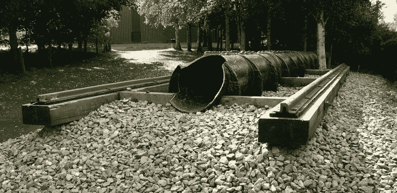
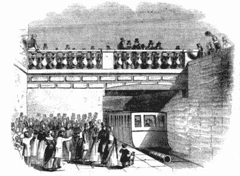
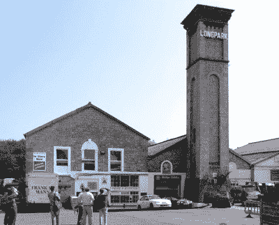

# 最被遗忘的大气铁路的故事

> 原文：<https://hackaday.com/2020/08/17/the-mostly-forgotten-story-of-atmospheric-railway/>

不管你知道它是一条铁路，一条铁路，一条铁路，还是一条铁路铁路这是一个相当确定的事实，你住的地方附近的火车很可能是由柴油机车或电力机车驱动的。从第一辆马拉的有轨电车到今天的这些年里，没有多少其他方式来驱动火车，由于蒸汽机车在 21 世纪基本上是博物馆的保留物，这两个仍然是镇上仅有的两种游戏。

但是回到铁路时代的初期，情况就完全不同了。把那些 19 世纪早期的铁路工程师大亨想象成他们那个时代的埃隆·马斯克和杰夫·贝索斯，他们的游乐场不是太空和 hyperloop 创业公司，而是铁路运输。正如今天的科技创业公司会谈论一些疯狂的想法一样，早期的铁路也是如此。其中最著名的一个甚至出现在了一些真正的铁路上，我说的当然是大气铁路。

这些火车不是由机车推动的，而是由铁轨之间部分抽空的管道中的空气压力推动活塞。

## 这条铁路糟透了

看看 20 世纪的蒸汽机车，它们构成了保存下来的大部分，这似乎很奇怪，当蒸汽在牵引火车方面做得如此出色时，这样的系统可能会受到青睐。但是 19 世纪 30 年代和 40 年代铁路时代初期的机车没有它们后来的同类机车的动力或牵引力，当面对任何重大坡度时，往往无法应对。

大气系统承诺通过将机车上相对较小的移动蒸汽机替换为轨道旁更大的蒸汽机来解决这个问题，并从等式中完全去除那些早期机车的单个驱动轮之间的有限附着力。大气压力这只看不见的手会简单地把火车拉上坡，这似乎对早期的铁路公司很有吸引力，这些公司并不热衷于挖掘昂贵的路堑和隧道来取代斜坡。

A Piece of the South Devon Railway’s atmospheric tube. Chowells. ([CC BY-SA 3.0](https://commons.wikimedia.org/wiki/File:Brunel%27s_Atmospheric_Railway.jpg))

大气管道由铸铁部分制成，用螺栓固定在一起，安装在轨道之间。沿着管子的顶部有一个供活塞杆穿过的槽，槽上装有厚厚的涂了油脂的皮片，皮片设计成在活塞通过时分离，但在其他时间提供真空密封。它非常成功，被当时的几条铁路线采用，但为什么我们今天没有听说它呢？答案是一个有几个层次的问题，最好的答案是看那些将系统付诸实践的线。

## 并非所有的大气铁路都是失败的

The Dalkey Railway as seen by the *Illustrated London News* (Public domain).

第一条成功的大气铁路是在爱尔兰，连接都柏林附近的金斯敦港(现在的 Dún Laoghaire)和达尔基定居点，全长 1.74 英里。它于 1843 年开通，作为现有都柏林和金斯敦铁路的延伸，并继续运营，直到 19 世纪 50 年代中期，其牵引被更传统的蒸汽机车取代。它的成功为巴黎至圣日耳曼铁路的大气牵引提供了灵感，该铁路的最后 1.5 公里路段对机车来说坡度太大。它于 1847 年开通，像达尔基线一样继续使用，直到 1860 年合适的蒸汽牵引取代了它。

之前的两条线路都是很短的路段，很快就成为他们城市的居民郊区的一部分，但随后的线路试图将大气牵引带到更长距离的旅行中。伦敦和克罗伊登铁路是一条 8.75 英里长的线路，其本地交通与另一家公司的特快列车共享轨道，有人提议在这些本地列车的主线旁边铺设另一条轨道，这将使用大气动力。第一部分于 1846 年开放，并在测试中显示出前景，但不久后遭受了一系列灾难性的泵送发动机故障，导致其在 1847 年放弃，转而采用蒸汽动力。

One of the most visible remnants of the South Devon Railway’s atmospheric traction, the pumping house at Torquay. Geof Sheppard ([CC BY-SA 4.0](https://commons.wikimedia.org/wiki/File:Torquay_engine_house.jpg))

也许最著名和最雄心勃勃的大气铁路是南德文铁路，著名的伊桑巴德·金德姆·布鲁内尔是它的工程师，也是他的大西部帝国的一部分。按照计划，埃克塞特和普利茅斯之间的 52 英里线路将全部使用大气系统，但 1847 年完成的第一段是从埃克塞特到泰格茅斯，大约 13 英里的距离。它受到一系列问题的困扰，比如冬天冻住了，夏天变干了，以及安装在生产线旁边的一系列泵送发动机动力不足。它在 1848 年因蒸汽牵引而被放弃，今天仍然是通往英国西部的主要线路的一部分。正是这条铁路将大气牵引的公共历史定义为伟大的布鲁内尔的失败之一，使其在法国和爱尔兰的成功黯然失色。

在工程史上，大气铁路仅仅是一个脚注，它们与磁悬浮列车等其他有趣的想法并存。很明显，这是一个有潜力的想法，可以肯定的是，使用氯丁橡胶或硅胶密封的相同管道的现代版本可能会更加成功。但也许它的时代只是来了又去，虽然这是一个好主意，但它只是不幸地没有机车好，一旦机车技术足够发达。这种命运发生在比顶部有一条皮革的铁管更伟大的发明上。