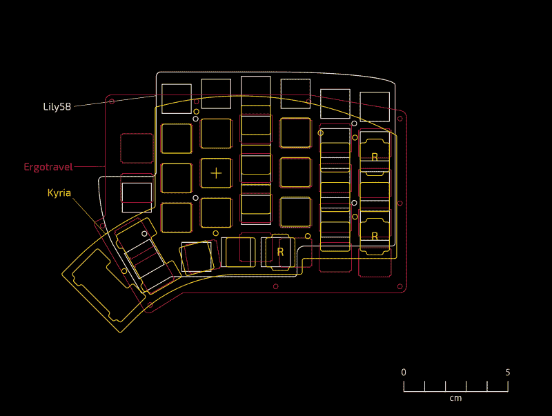

# 分离键盘查找堆叠起来，为您的批准

> 原文：<https://hackaday.com/2020/08/11/split-keyboard-finder-stacks-them-up-for-your-approval/>

厌倦了枯燥的单片键盘？想改变一下，但不知道有哪些选择？好吧，准键盘购物者，今天是你的幸运日。我们在 Hackaday 为渴望键盘购物的人提供了两个很好的资源来促进这个习惯；[【pvinis】的牛逼分体键盘](https://github.com/pvinis/awesome-split-keyboards)和[【jhelvy】的分体键盘对比](https://jhelvy.shinyapps.io/splitkbcompare/)。

正如它的标题所示，awesome-split-keyboards 是一个[awesome list](https://awesome.re/)of split keyboards 50 examples strong。我们遇到的每一个分歧似乎都在这里得到了体现，许多至少有一两张图片，以及更多关于如何制造或购买有问题的模型的链接。如果这还不够，页面底部有丰富的背景信息，关于建立或购买自己的。

但在做出如此重要的决定之前，重要的是要确保所讨论的键盘将是一个合适的手。这就是 [splitkbcompare](https://jhelvy.shinyapps.io/splitkbcompare/) 的用武之地，它提供了许多流行的拆分布局的可视化。如果我们没有发现令人敬畏的分离键盘，这个可过滤的列表和广泛的选择将会是这里的亮点。但最突出的是能够生成 1:1 比例的打印输出，甚至可以将它们堆叠起来进行比较，让潜在的买家能够亲自感受他们正在考虑的东西。

动作不够快吗？最近，我们已经制作了大量的[键盘相关内容](https://hackaday.com/tag/keyboard/)，特别突出的是【Kristina Panos’】系列，名为[输入兴趣](https://hackaday.com/series_of_posts/inputs-of-interest/)。今年夏天早些时候[她甚至建造了自己的 Ergodox split keeb](https://hackaday.com/2020/06/02/inputs-of-interest-ergodox-post-mortem/) 。

[主要图片来源: [HeliDox](https://github.com/pvinis/awesome-split-keyboards/blob/master/img/HeliDox.jpg) by diimdeep]