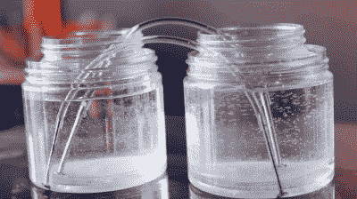

# 给自己倒一杯 10 万伏的

> 原文：<https://hackaday.com/2020/08/05/pour-yourself-a-glass-of-100000-volts/>

你很难找到一个黑客或制造商对高压火花隙诱人的嗡嗡声和噼啪声不情有独钟，但这仍然是我们大多数人不会亲自承担的那种项目。建造一个能够在几英寸的户外发射适当火花的设备是一件很复杂的事情，它包含了奇异的元件和巨大的手绕线圈。另外，没有人想无意中烧掉自己的眉毛。

虽然来自[Jay Bowles]的最新视频可能不会减轻任何人对即兴电解表演的恐惧，但它至少证明了你不需要一个装满设备的实验室来产生六位数的电压。事实上，你甚至不需要太多的电子产品:这个 DIY 马克思发电机的关键部件只需要水和一些家居用品。

 这是因为水的电导率可以根据溶解在水中的物质而改变。直接的自来水是一种很差的导体，它的管子可以用来代替高压电阻器，而添加一些盐和塑料绝缘层[就可以制成一个基本的电容器](https://hackaday.com/2016/10/03/homemade-capacitors-of-a-mad-scientist/)。你仍然需要电线将所有东西连接在一起，还需要一些金属作为火花隙，但没有什么是你在零件箱里找不到的。

当然，水和一些钉子不会自发发电。你需要给它一点启动，为此[Jay]正在使用一个 15000 伏的 DC 反激式电源，它看起来像是用从一台旧的 CRT 电视中回收的组件建造的。虽然单独的反激式变压器肯定会产生一些令人印象深刻的火花，但这个主要是液体的 Marx 发生器会将输入电压放大，从而产生一场严重的灯光秀。

我们总是很高兴看到一个永远快乐的周杰伦的新视频来到我们身边。虽然他的项目从最严格的意义上来说可能并不总是实用的，但它们总能激发出一场关于 T2 对高压的迷人应用的热烈讨论。

 [https://www.youtube.com/embed/WDfZFSay_1A?version=3&rel=1&showsearch=0&showinfo=1&iv_load_policy=1&fs=1&hl=en-US&autohide=2&wmode=transparent](https://www.youtube.com/embed/WDfZFSay_1A?version=3&rel=1&showsearch=0&showinfo=1&iv_load_policy=1&fs=1&hl=en-US&autohide=2&wmode=transparent)

